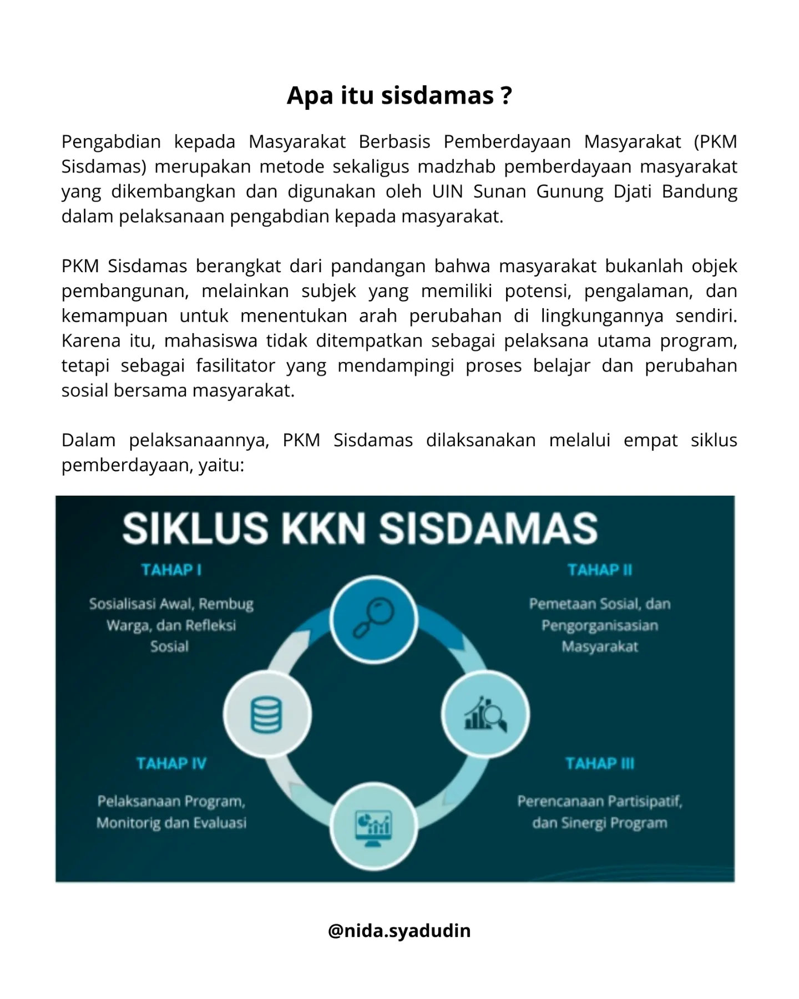
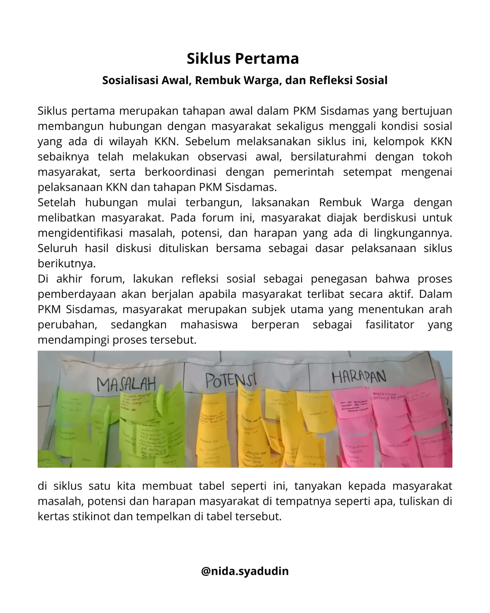
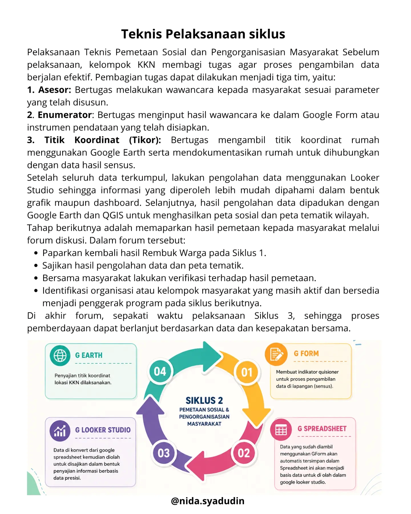
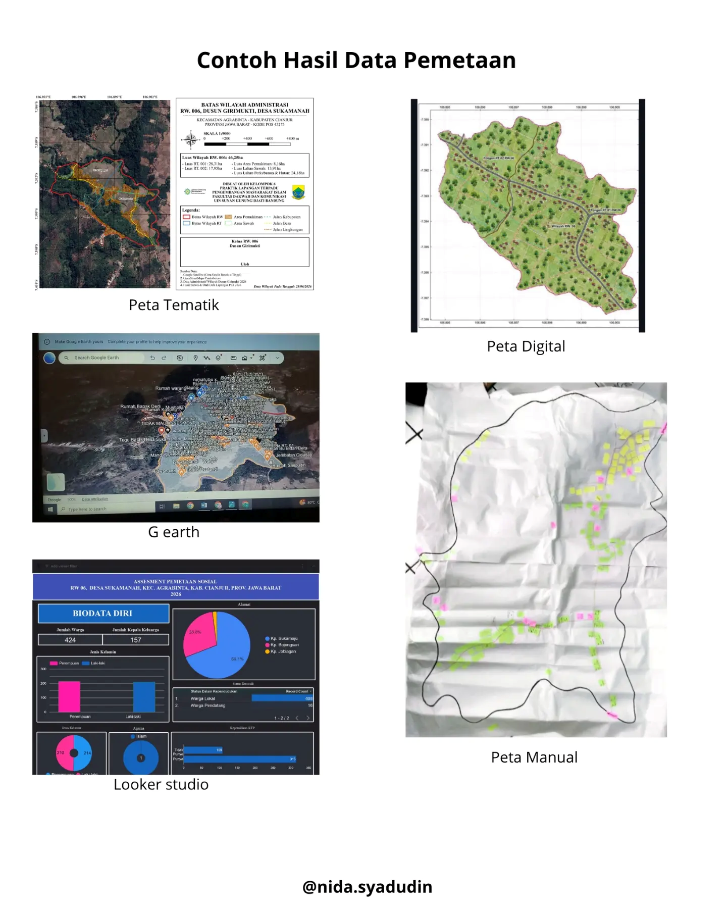
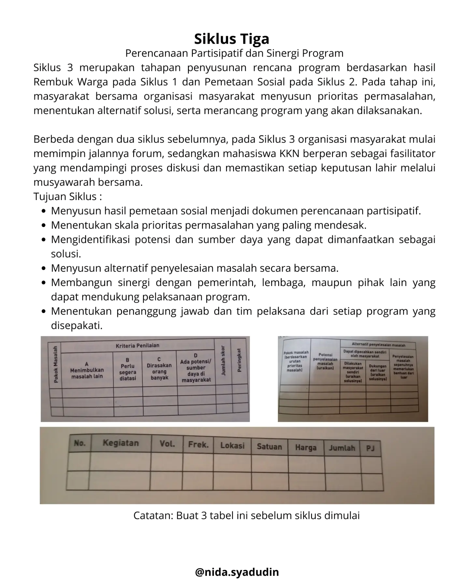
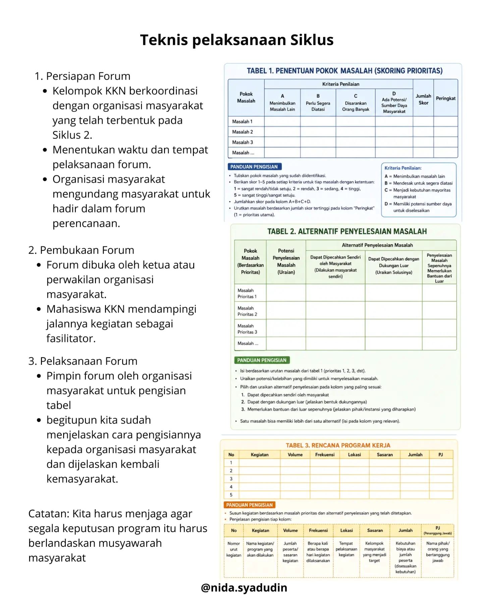
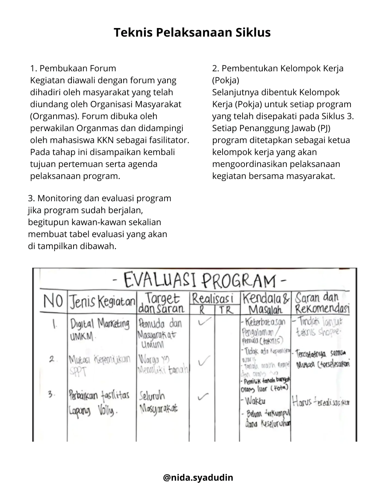

# KAMU MAU KKN ?

**Barangkali Tulisan gak jelas ini bisa membantu kalian untuk memahami SISDAMAS.**

*"Selamat membaca" >>*

---

# PKM SISDAMAS

## Pengabdian Kepada Masyarakat Berbasis Pemberdayaan Masyarakat

Bagi kawan-kawan yang sebentar lagi akan melaksanakan Kuliah Kerja Nyata (KKN) dan masih bertanya-tanya tentang apa yang akan dilakukan selama di lokasi KKN, semoga tulisan sederhana ini bisa menjadi teman belajar bagi kita semua.

Tulisan ini lahir dari proses saya mencoba memahami PKM Sisdamas. Apa yang saya tuliskan bukanlah sesuatu yang paling benar atau paling lengkap, melainkan catatan belajar yang saya rangkum dari berbagai referensi, diskusi, dan pemahaman selama mempersiapkan KKN.

Harapannya, tulisan ini dapat menjadi ruang untuk saling berbagi pemahaman. Jika ada bagian yang kurang tepat, mari kita diskusikan dan saling melengkapi. Sebab, semangat pemberdayaan tidak hanya kita praktikkan di tengah masyarakat, tetapi juga dimulai dari kesediaan kita untuk belajar bersama. Semoga catatan kecil ini dapat membantu kita memasuki proses KKN dengan pemahaman yang lebih baik. Pada akhirnya, KKN bukan tentang siapa yang paling banyak memberi, melainkan tentang bagaimana kita belajar, mendengar, dan bertumbuh bersama masyarakat.

## Apa itu Sisdamas?

Pengabdian kepada Masyarakat Berbasis Pemberdayaan Masyarakat (PKM Sisdamas) merupakan metode sekaligus madzhab pemberdayaan masyarakat yang dikembangkan dan digunakan oleh UIN Sunan Gunung Djati Bandung dalam pelaksanaan pengabdian kepada masyarakat.

PKM Sisdamas berangkat dari pandangan bahwa masyarakat bukanlah objek pembangunan, melainkan subjek yang memiliki potensi, pengalaman, dan kemampuan untuk menentukan arah perubahan di lingkungannya sendiri. Karena itu, mahasiswa tidak ditempatkan sebagai pelaksana utama program, tetapi sebagai fasilitator yang mendampingi proses belajar dan perubahan sosial bersama masyarakat.

Dalam pelaksanaannya, PKM Sisdamas dilaksanakan melalui empat siklus pemberdayaan, yaitu:

---

# Siklus Pertama

## Sosialisasi Awal, Rembuk Warga, dan Refleksi Sosial

Siklus pertama merupakan tahapan awal dalam PKM Sisdamas yang bertujuan membangun hubungan dengan masyarakat sekaligus menggali kondisi sosial yang ada di wilayah KKN. Sebelum melaksanakan siklus ini, kelompok KKN sebaiknya telah melakukan observasi awal, bersilaturahmi dengan tokoh masyarakat, serta berkoordinasi dengan pemerintah setempat mengenai pelaksanaan KKN dan tahapan PKM Sisdamas.

Setelah hubungan mulai terbangun, laksanakan Rembuk Warga dengan melibatkan masyarakat. Pada forum ini, masyarakat diajak berdiskusi untuk mengidentifikasi masalah, potensi, dan harapan yang ada di lingkungannya. Seluruh hasil diskusi dituliskan bersama sebagai dasar pelaksanaan siklus berikutnya.

Di akhir forum, lakukan refleksi sosial sebagai penegasan bahwa proses pemberdayaan akan berjalan apabila masyarakat terlibat secara aktif. Dalam PKM Sisdamas, masyarakat merupakan subjek utama yang menentukan arah perubahan, sedangkan mahasiswa berperan sebagai fasilitator yang mendampingi proses tersebut.

Di siklus satu kita membuat tabel seperti ini, tanyakan kepada masyarakat masalah, potensi dan harapan masyarakat di tempatnya seperti apa, tuliskan di kertas stikinot dan tempelkan di tabel tersebut.

## Teknis Pelaksanaan Siklus

1. Pembukaan dan pengenalan anggota kelompok KKN kepada masyarakat.
2. Pemaparan kegiatan apa saja yang akan dilakukan selama 40 hari (jelaskan siklus).
3. Lanjut pemutaran film dokumenter yang menjelaskan siklus.
4. Pemaparan tabel Masalah, Potensi, dan Harapan diteruskan dengan pembagian stikinot, 1 orang 3 stikinot dengan warna berbeda.
5. Tanyakan kepada masyarakat apa masalah yang ada di kampung tersebut dan tuliskan di stikinot, begitupun langsung ditempelkan di tabel yang sudah disediakan.
6. Begitu pun untuk potensi dan harapannya, sama dengan tabel masalah.
7. Setelah 3 tabel sudah diisi oleh stikinot yang ada tulisannya, langsung kita review kembali dan verifikasi kembali kebenarannya dari setiap tabel.
8. Setelah itu lanjut refleksi sosial, di mana program atau siklus yang akan kita laksanakan itu keberhasilannya tergantung masyarakat itu sendiri. Masyarakat menjadi subjek pemberdayaan, kita hanyalah sebagai fasilitator (pendamping).
9. Sebelum ditutup, forum jadwalkan kembali pertemuan selanjutnya itu mau kapan, dan kembalikan keputusan itu kepada masyarakat.

**Tujuan Siklus:**

- Terjalin hubungan yang baik dengan masyarakat
- Mengetahui kelompok-kelompok masyarakat
- Mengetahui masalah-masalah di masyarakat
- Membangun kesadaran atas akar permasalahan di masyarakat
- Menginterpretasikan harapan-harapan di masyarakat

**Peralatan Siklus:**

- Stikinot
- Karton 2 lembar
- Spidol
- Pulpen 15 pcs
- Infokus
- Laptop

---

# Siklus Kedua

## Pemetaan Sosial dan Pengorganisasian Masyarakat

Setelah masyarakat bersama-sama mengidentifikasi masalah, potensi, dan harapan pada Siklus 1, tahap berikutnya adalah Pemetaan Sosial dan Pengorganisasian Masyarakat.

Pada siklus ini, kelompok KKN melakukan pengumpulan data bersama masyarakat untuk memperoleh gambaran kondisi wilayah secara lebih utuh. Data yang dihimpun dapat mencakup kondisi geografis, kependudukan, tingkat kesejahteraan, pendidikan, kesehatan, potensi sumber daya, hingga berbagai persoalan yang dihadapi masyarakat. Agar hasilnya lebih akurat dan mudah dipahami, data dapat diolah menggunakan perangkat digital seperti Google Form, Looker Studio, Google Earth, dan QGIS.

Hasil pemetaan kemudian dipaparkan kembali kepada masyarakat dalam sebuah forum diskusi. Forum ini bukan hanya untuk menyampaikan data, tetapi juga menjadi ruang bersama untuk memverifikasi hasil pemetaan serta mengidentifikasi organisasi atau kelompok masyarakat yang dapat menjadi penggerak dalam proses pemberdayaan.

**Tujuan Siklus:**

- Memetakan kondisi sosial dan potensi wilayah secara partisipatif.
- Menyajikan data sebagai dasar penyusunan program.
- Mengidentifikasi organisasi atau kelompok masyarakat yang akan terlibat dalam proses pemberdayaan.
- Membangun kesepahaman bersama mengenai kondisi nyata di wilayah KKN.

## Teknis Pelaksanaan Siklus

Sebelum pelaksanaan, kelompok KKN membagi tugas agar proses pengambilan data berjalan efektif. Pembagian tugas dapat dilakukan menjadi tiga tim, yaitu:

1. **Asesor**: Bertugas melakukan wawancara kepada masyarakat sesuai parameter yang telah disusun.
2. **Enumerator**: Bertugas menginput hasil wawancara ke dalam Google Form atau instrumen pendataan yang telah disiapkan.
3. **Titik Koordinat (Tikor)**: Bertugas mengambil titik koordinat rumah menggunakan Google Earth serta mendokumentasikan rumah untuk dihubungkan dengan data hasil sensus.

Setelah seluruh data terkumpul, lakukan pengolahan data menggunakan Looker Studio sehingga informasi yang diperoleh lebih mudah dipahami dalam bentuk grafik maupun dashboard. Selanjutnya, hasil pengolahan data dipadukan dengan Google Earth dan QGIS untuk menghasilkan peta sosial dan peta tematik wilayah.

Tahap berikutnya adalah memaparkan hasil pemetaan kepada masyarakat melalui forum diskusi. Dalam forum tersebut:

- Paparkan kembali hasil Rembuk Warga pada Siklus 1.
- Sajikan hasil pengolahan data dan peta tematik.
- Bersama masyarakat lakukan verifikasi terhadap hasil pemetaan.
- Identifikasi organisasi atau kelompok masyarakat yang masih aktif dan bersedia menjadi penggerak program pada siklus berikutnya.

Di akhir forum, sepakati waktu pelaksanaan Siklus 3, sehingga proses pemberdayaan dapat berlanjut berdasarkan data dan kesepakatan bersama.

### Contoh Hasil Data Pemetaan

---

# Siklus Tiga

## Perencanaan Partisipatif dan Sinergi Program

Siklus 3 merupakan tahapan penyusunan rencana program berdasarkan hasil Rembuk Warga pada Siklus 1 dan Pemetaan Sosial pada Siklus 2. Pada tahap ini, masyarakat bersama organisasi masyarakat menyusun prioritas permasalahan, menentukan alternatif solusi, serta merancang program yang akan dilaksanakan.

Berbeda dengan dua siklus sebelumnya, pada Siklus 3 organisasi masyarakat mulai memimpin jalannya forum, sedangkan mahasiswa KKN berperan sebagai fasilitator yang mendampingi proses diskusi dan memastikan setiap keputusan lahir melalui musyawarah bersama.

**Tujuan Siklus:**

- Menyusun hasil pemetaan sosial menjadi dokumen perencanaan partisipatif.
- Menentukan skala prioritas permasalahan yang paling mendesak.
- Mengidentifikasi potensi dan sumber daya yang dapat dimanfaatkan sebagai solusi.
- Menyusun alternatif penyelesaian masalah secara bersama.
- Membangun sinergi dengan pemerintah, lembaga, maupun pihak lain yang dapat mendukung pelaksanaan program.
- Menentukan penanggung jawab dan tim pelaksana dari setiap program yang disepakati.

*Catatan: Buat 3 tabel ini sebelum siklus dimulai.*

---

# Siklus 4

## Pelaksanaan Program, Monitoring, dan Evaluasi

Siklus 4 merupakan tahap implementasi dalam metode Sisdamas, yaitu pelaksanaan seluruh program yang telah direncanakan dan disepakati bersama masyarakat pada Siklus 3. Pada tahap ini, masyarakat tidak lagi hanya merencanakan, tetapi mulai menggerakkan seluruh sumber daya yang dimiliki untuk melaksanakan program secara partisipatif.

Selain pelaksanaan program, siklus ini juga menjadi tahap pemantauan dan evaluasi, yaitu menilai sejauh mana program telah berjalan sesuai rencana, mengidentifikasi hambatan yang muncul, serta merumuskan rekomendasi untuk perbaikan maupun keberlanjutan program. Dengan demikian, masyarakat menjadi subjek utama dalam pelaksanaan sekaligus evaluasi kegiatan, sedangkan mahasiswa KKN berperan sebagai fasilitator dan pendamping.

**Tujuan Siklus:**

- Melaksanakan program-program hasil perencanaan pada Siklus 3.
- Membentuk Kelompok Kerja (Pokja) sebagai pelaksana setiap program.
- Memobilisasi dan meningkatkan partisipasi serta kesadaran masyarakat dalam pelaksanaan program.
- Melakukan pemantauan dan evaluasi terhadap pelaksanaan setiap kegiatan.
- Menghimpun opini, masukan, dan penilaian masyarakat sebagai dasar penyempurnaan program.

## Teknis Pelaksanaan Siklus

1. **Pembukaan Forum**
   Kegiatan diawali dengan forum yang dihadiri oleh masyarakat yang telah diundang oleh Organisasi Masyarakat (Organmas). Forum dibuka oleh perwakilan Organmas dan didampingi oleh mahasiswa KKN sebagai fasilitator. Pada tahap ini disampaikan kembali tujuan pertemuan serta agenda pelaksanaan program.

2. **Pembentukan Kelompok Kerja (Pokja)**
   Selanjutnya dibentuk Kelompok Kerja (Pokja) untuk setiap program yang telah disepakati pada Siklus 3. Setiap Penanggung Jawab (PJ) program ditetapkan sebagai ketua kelompok kerja yang akan mengoordinasikan pelaksanaan kegiatan bersama masyarakat.

3. **Monitoring dan Evaluasi Program**
   Jika program sudah berjalan, begitu pun kawan-kawan sekalian membuat tabel evaluasi yang akan ditampilkan di bawah.

## Penutup

PKM Sisdamas bukan sekadar rangkaian siklus yang harus diselesaikan untuk memenuhi kewajiban akademik. Lebih dari itu, ia merupakan proses belajar bersama masyarakat, belajar mendengar sebelum berbicara, memahami sebelum bertindak, dan mendampingi tanpa mengambil alih peran masyarakat.

Melalui empat siklus pemberdayaan, mahasiswa diajak menyadari bahwa perubahan sosial tidak pernah lahir dari kerja individu, melainkan dari kesadaran kolektif yang tumbuh melalui dialog, musyawarah, dan partisipasi masyarakat. Karena itu, keberhasilan pengabdian tidak diukur dari banyaknya program yang terlaksana, tetapi dari sejauh mana masyarakat mampu menjadi subjek utama yang melanjutkan proses perubahan setelah mahasiswa kembali ke kampus.

Semoga catatan sederhana ini dapat menjadi bekal awal bagi teman-teman yang akan melaksanakan KKN. Tulisan ini tentu masih memiliki banyak kekurangan dan jauh dari sempurna. Oleh karena itu, kritik, saran, serta berbagai pengalaman lapangan akan menjadi bagian penting untuk terus menyempurnakan pemahaman kita tentang PKM Sisdamas.

Pada akhirnya, KKN bukanlah tentang datang membawa jawaban, melainkan tentang hadir untuk belajar bersama. Sebab masyarakat bukan objek pengabdian, melainkan mitra yang memiliki pengetahuan, pengalaman, dan kekuatan untuk membangun masa depannya sendiri.

Selamat mengabdi, selamat belajar, dan selamat bertumbuh bersama masyarakat.

---

*Catatan: informasi yang ada di tulisan ini bersumber dari buku Riset Aksi dan pengamatan saya selama melaksanakan PLT Prodi Pengembangan Masyarakat Islam 2026.*
