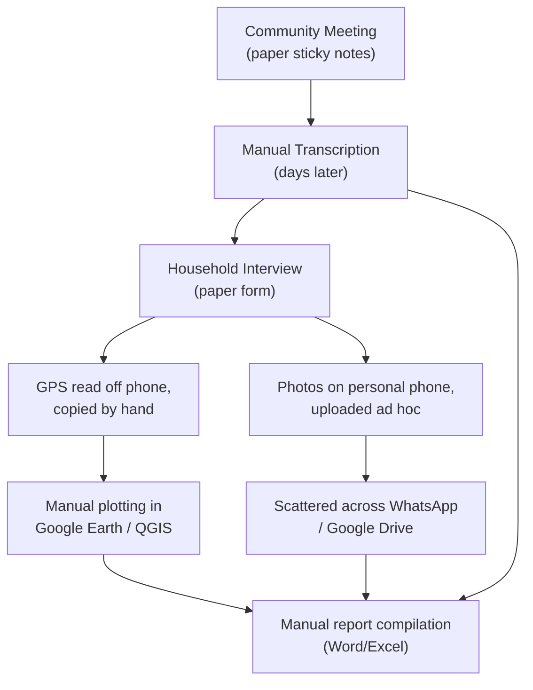
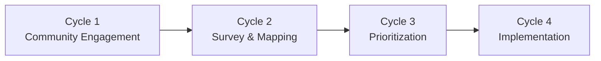
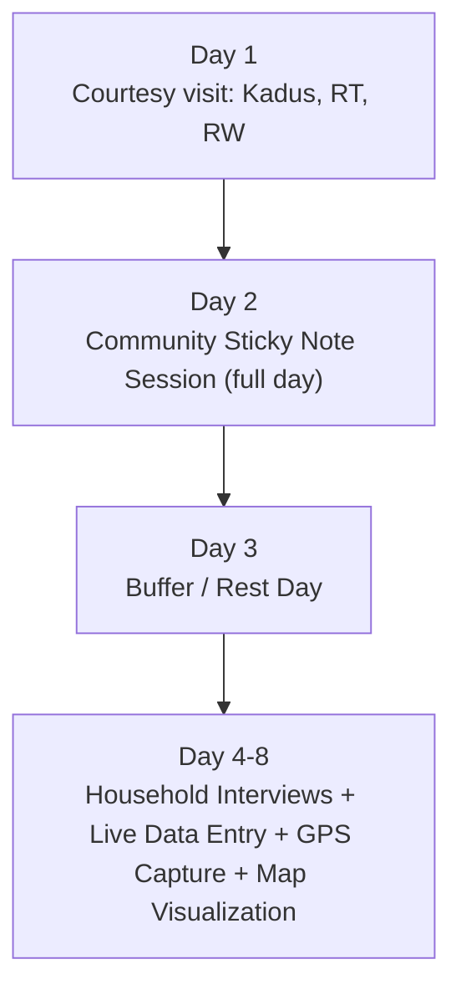
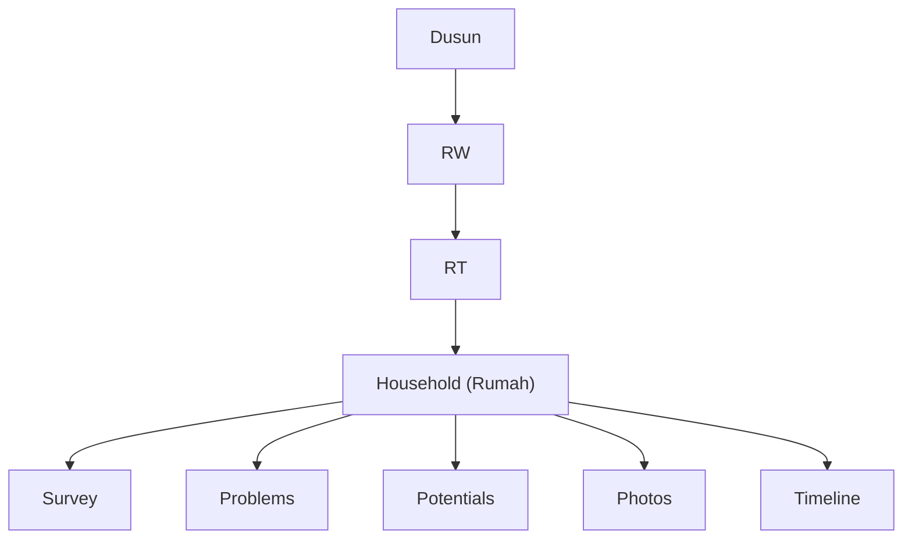

# SISDAMAS Digital Platform
## Project Foundation Document

| | |
|---|---|
| **Version** | 1.0 |
| **Status** | Approved for downstream use (Product Discovery, System Blueprint, PRD) |
| **Prepared For** | KKN Team, UIN Sunan Gunung Djati Bandung — Dusun 2, Desa Sukahaji, Kec. Cipendeuy, Kab. Bandung Barat |
| **Prepared By** | Project Foundation Workshop (Product/GIS/Architecture discovery session) |
| **Document Role** | Single source of truth for all subsequent design, architecture, implementation, and documentation decisions |
| **Language Note** | This document and subsequent technical documents (PRD, Technical Spec, Database Spec, etc.) are written in professional English per project convention. The **deployed platform's user interface** will be in **Bahasa Indonesia**, since end users are Dusun 2 residents, KKN students, and the general public. |

> **Reading guide:** This document strictly separates **Facts** (confirmed during discovery), **Assumptions** (unverified but reasonable working beliefs), **Recommendations** (expert judgment calls), and **Open Questions** (unresolved items). Look for the dedicated sections (18, 22, 23, 24) as the canonical source for each category — inline callouts elsewhere point back to them rather than re-litigating them.

---

## Table of Contents

1. Executive Summary
2. Background
3. Vision
4. Mission
5. Problem Statement
6. Existing Workflow Analysis
7. Current Pain Points
8. Future Vision
9. Business Objectives
10. Scope
11. Out of Scope
12. Stakeholders
13. Stakeholder Analysis
14. User Overview
15. High-Level Workflow
16. High-Level GIS Concept
17. Product Principles
18. Assumptions
19. Constraints
20. Risks
21. Success Metrics
22. Open Questions
23. Suggested Improvements
24. Recommendations
25. Conclusion

---

## 1. Executive Summary

The SISDAMAS Digital Platform digitizes the four-cycle SISDAMAS (Sistem Pemberdayaan Masyarakat) community empowerment process for the KKN team from UIN Sunan Gunung Djati Bandung, operating in **Dusun 2, Desa Sukahaji, Kecamatan Cipendeuy, Kabupaten Bandung Barat**.

Three facts define almost every decision in this document:

- **The build window is extremely short.** KKN begins in approximately **one week**, and the combined Cycle 1 + Cycle 2 field activities (community engagement and household survey) run for **8 consecutive days** immediately after that — with the digital sticky-note tool needed by **Day 2** and the survey + GPS + map tool needed by **Day 4**.
- **The team is one developer.** A single builder is developing this platform, alongside 15 KKN members who will use it as end users, and no dedicated technical backup.
- **The budget is effectively zero.** The stack must run entirely on free tiers (Vercel + Supabase), with a domain purchase as the only anticipated future cost.

Given this, the Foundation deliberately recommends a **narrow, disciplined Phase 1 MVP** (authentication, sticky notes, household survey with GPS/photos, and a simple map) that can realistically be built in under two weeks by one person, with everything else — public website, advanced GIS, reporting exports, task management, Google integrations — pushed to a **Phase 2** built during the remaining ~32 days of KKN. This is a deliberate, explicit trade-off against the full ambition of the original brief, made necessary by the real-world timeline.

This document also formally adopts a **household-centered data philosophy** (Dusun → RW → RT → Household) rather than a resident/individual-centered one, since SISDAMAS surveys interview households, not individuals — a decision that will shape every downstream document, especially the Database Specification.

---

## 2. Background

SISDAMAS is being implemented as part of the KKN (Kuliah Kerja Nyata / Community Service Program) conducted by UIN Sunan Gunung Djati Bandung students in Dusun 2, Desa Sukahaji.

**Current state (Fact):** SISDAMAS implementation today is entirely manual:

- Community aspirations are recorded on paper sticky notes during in-person meetings.
- Household surveys are recorded on paper or ad hoc spreadsheets.
- Documentation (photos, minutes, reports) is scattered across WhatsApp, Google Drive, and personal devices.
- Location data is manually re-entered into Google Earth or QGIS after the fact.
- Program planning is discussed and tracked manually.
- Final reports are compiled by hand from these fragmented sources.

**Project intent (Fact):** The goal is a single integrated digital platform supporting every SISDAMAS cycle for this KKN group, built to be reusable — in principle — by future KKN teams in other villages, without redesigning the core system.

---

## 3. Vision

> Create a modern, integrated, GIS-enabled community empowerment platform that transforms the SISDAMAS process into a transparent, data-driven, collaborative, and sustainable digital ecosystem.

This vision is retained as originally stated. It remains the north star for the platform's eventual, mature state — understanding that the **first working version**, described in this document's Scope section, will realize only a slice of it, prioritized around what Dusun 2 needs in the next 8 days.

---

## 4. Mission

To achieve the vision under real-world KKN constraints, the platform commits to:

1. **Replace paper with structured digital capture** for sticky notes and household surveys, without adding friction to the interview process.
2. **Make location data GIS-ready by default** — every household becomes a mappable object the moment it is surveyed, with no manual re-entry into Google Earth or QGIS.
3. **Give the team live visibility** into survey coverage and community input, so gaps are caught during the 8-day field window, not after.
4. **Preserve every stakeholder's trust** — residents' data is handled with clear consent and appropriate privacy; officials and the DPL get transparent, honest progress information.
5. **Leave a foundation, not just a deliverable** — build the data model so that reuse by future KKN teams is a documentation and configuration exercise, not a rebuild — without letting that future ambition compromise this KKN's 40-day timeline.

---

## 5. Problem Statement

Manual SISDAMAS implementation creates four compounding problems for a KKN team operating on a fixed, short calendar:

1. **Data is fragile.** Paper sticky notes and survey forms can be lost, damaged, or become illegible before they are ever transcribed — and there is no backup until manual transcription happens, often days later.
2. **Data is fragmented.** Photos, GPS points, notes, and spreadsheets live across WhatsApp, personal phones, and multiple Google Drive folders, with no single source of truth and frequent duplication.
3. **GIS work is a bottleneck.** Coordinates must be manually copied into Google Earth or QGIS by whichever team member happens to know those tools, introducing delay and a single point of failure.
4. **Progress is invisible until it's too late.** With only paper trails, the team cannot see — in real time — which households have been surveyed, which RTs are behind, or whether the 5-day survey sprint (Day 4–8) is on pace, until the window has already closed.

For a KKN group with only 8 days to complete Cycles 1 and 2, and 40 days total, these problems are not abstract inefficiencies — they directly threaten whether the fieldwork can be completed at all within the available time.

---

## 6. Existing Workflow Analysis

| Cycle | Activity | Current Manual Method | Tools Used Today | Key Actors |
|---|---|---|---|---|
| 1 | Community meetings & sticky note discussions | In-person meeting; aspirations/complaints written on physical sticky notes | Paper sticky notes, whiteboard/flip chart | KKN students, residents, RT/RW |
| 1 | Recording village potentials | Verbal discussion, handwritten notes | Notebook | KKN students |
| 2 | Household interviews | Face-to-face interview, answers written on paper or typed into a spreadsheet afterward | Paper forms, Excel/Google Sheets | KKN students, households |
| 2 | GPS coordinate collection | Coordinates read off a phone's GPS/maps app and manually copied elsewhere | Google Maps, manual transcription | KKN students |
| 2 | Photo documentation | Photos taken on personal phones, uploaded later, often inconsistently named | Phone camera, WhatsApp, Google Drive | KKN students |
| 2 | GIS visualization | Coordinates manually plotted after the survey period | Google Earth, QGIS | 1–2 GIS-literate members |
| 3 | Problem classification & prioritization | In-person discussion and manual tallying | Paper, whiteboard | KKN students, residents |
| 4 | Program execution, monitoring, reporting | Manual compilation of notes, photos, and spreadsheets into a final report | Word, Excel, WhatsApp groups | KKN students, DPL |

---

## 7. Current Pain Points

| Category | Pain Point | Impact |
|---|---|---|
| Data Loss | Sticky notes can be lost, damaged, or become illegible before transcription | Aspirations and complaints are permanently lost |
| Data Loss | Paper household survey forms have no backup | Households may need re-interviewing, wasting scarce field days |
| Collaboration | Data is scattered across WhatsApp, Drive, and personal devices | No single source of truth; duplicated or conflicting records |
| GIS | Coordinates are manually copied into Google Earth/QGIS | Slow, error-prone, and bottlenecked on whichever member knows GIS tools |
| GIS | No real-time visualization during the survey itself | Missed households or coverage gaps aren't visible until it's too late to revisit |
| Reporting | Statistics for the campus LPJ/final report are compiled by hand | Time-consuming, delays reporting, prone to transcription errors |
| Monitoring | No live view of survey progress | Team leadership cannot track daily completion rate against the 5-day survey window |
| Monitoring | No audit trail of who collected which data | Accountability and data-quality issues if discrepancies arise later |

**Suggested improvements arising from this analysis** are consolidated in Section 23 rather than listed here, to keep facts and recommendations separate.

---

## 8. Future Vision

Once deployed, Dusun 2 becomes the platform's first "living" digital record: every household is a structured, mappable object; every sticky note and survey answer is captured once and reused everywhere (dashboard, map, reports); and the KKN team can see coverage and progress in real time throughout the 8-day field window.

**Important scope clarification (confirmed during discovery):** the platform will **not** be built as a multi-village, multi-tenant system in this iteration. The long-term vision of "any future KKN team can spin up a new project for a new village" remains the platform's stated direction and will be **documented** (in the System Blueprint and Architecture Decision Records) as a deliberate future path — but it will not be implemented or exposed in the UI now. This keeps the immediate 40-day build achievable for a solo developer.

---

## 9. Business Objectives

1. Digitize **100%** of Cycle 1 community aspirations, complaints, and potentials (sticky notes) captured during the Day 2 community session, on the same day they are collected.
2. Achieve full household survey coverage (core data + GPS) for all identifiable households in Dusun 2 by the end of Day 8.
3. Eliminate manual re-entry of survey, photo, or GPS data between field collection and any later reporting or visualization step.
4. Provide the KKN team real-time visibility into survey progress (map + basic dashboard) throughout the Day 4–8 survey sprint.
5. Supply structured statistics and data exports that support — but do not fully author — the mandatory campus LPJ/final report.
6. Establish a household-centered, GIS-ready data foundation that Cycles 3 and 4 can build on without redesign.
7. Document (without necessarily implementing) a credible path to multi-village reuse by future KKN teams.

---

## 10. Scope

Given the timeline reality, scope is split into two phases. **Phase 1 is the actual MVP** for this document's purposes; Phase 2 is directional and will be refined in the Development Roadmap (a later document).

### Phase 1 — Immediate (must exist by Day 2 / Day 4)

| Capability | Why it's Phase 1 |
|---|---|
| Authentication (Super Admin + KKN Team Member login) | Needed before any data entry can be attributed/protected |
| Digital Sticky Notes board | Needed for the Day 2 community session |
| Household Survey (create household, form fields, GPS capture, photo upload) | Needed for the Day 4–8 survey sprint |
| Simple interactive map (pin markers, filter by RT/RW) | Needed to give real-time coverage visibility during the survey sprint |
| Basic progress dashboard (survey count, per-RT completion) | Needed for daily monitoring during the 5-day sprint |

### Phase 2 — Remaining KKN period (Day 9–40, Cycles 3 & 4)

| Capability | Rationale for deferral |
|---|---|
| Priority Matrix (USG scoring) | Not needed until Cycle 3 |
| Program/Task management | Not needed until Cycle 4 |
| Documentation Center + Google Drive integration | Useful, but not blocking the field survey window |
| Reporting/export (PDF/Excel) for LPJ support | Needed later in the KKN period, not Day 1–8 |
| Public website (Village Profile, Gallery, News) | Confirmed lower priority than internal tools during discovery |
| Google Calendar integration | Convenience feature, not field-critical |
| Notifications | Convenience feature, not field-critical |
| Advanced GIS (heatmaps, clustering, drawing tools, GeoJSON/KML export) | Adds engineering complexity not justified for Phase 1 |

---

## 11. Out of Scope

The platform is **not**, at any phase:

- A social media website or a replacement for the KKN team's Instagram/TikTok presence.
- An e-commerce platform.
- A village administration system (e.g., resident ID/civil registry management).
- A financial accounting or budgeting system.
- A replacement for official government information systems.
- A **multi-tenant, multi-village product** in this iteration — that direction is documented, not built (see Section 8 and Section 23).
- A **fully engineered offline-first sync engine** with conflict resolution — given confirmed good signal in Dusun 2, this is deliberately simplified (see Section 18, Section 23).
- A tool that fully auto-generates the campus's formal LPJ/final report — it supplies supporting statistics and exports only.

---

## 12. Stakeholders

- Village Residents (Dusun 2 households)
- KKN Students (15 members, including the solo builder)
- Village Officials (Kadus, RT, RW, Kepala Desa)
- Supervising Lecturer (DPL)
- University (UIN Sunan Gunung Djati Bandung)
- Public Visitors (general public, prospective future KKN teams)

---

## 13. Stakeholder Analysis

| Stakeholder | Goals | Needs | Pain Points | Expected Benefits | Potential Risks |
|---|---|---|---|---|---|
| **Village Residents** | Have aspirations heard; see real problems addressed | A quick, respectful, non-intrusive interview process; trust in how their data is used | Past surveys with no visible follow-through | Direct input into program planning; visible, transparent tracking | Privacy concerns over home photos/GPS; survey fatigue |
| **KKN Students** | Complete all 4 SISDAMAS cycles within 40 days; produce a strong deliverable for evaluation | A fast, reliable, mobile-friendly tool usable with near-zero training | Extremely short survey window (5 days); manual re-entry duplicating field effort | Faster collection & reporting; live visualization of progress | Tool instability during the 8-day window would be worse than no tool; heavy reliance on one builder |
| **Village Officials** (Kadus/RT/RW/Kades) | See the survey and engagement reflect real community needs | Simple, understandable outputs (map, summaries) — confirmed to need no login | Previously received only paper/verbal summaries | Visibility into aggregated results without needing to learn a system | Platform issues during the Day 2 rembug warga could undermine community trust in the process |
| **Supervising Lecturer (DPL)** | Verify SISDAMAS methodology was followed correctly; evaluate group deliverables | Exportable statistics/data to support the mandatory LPJ | Manual, hard-to-verify compiled reports today | Faster, more credible supporting data for the LPJ | Expecting the platform to fully auto-generate the LPJ, when it only supports it with data (see Section 11) |
| **University** | A successful, demonstrable digital-transformation KKN outcome; potential template for future batches | Some continuity beyond a single KKN cycle | Institutional knowledge normally disappears once a KKN group disbands | A documented, reusable foundation for future KKN digitalization efforts | No dedicated maintenance budget/team after this KKN ends — platform could go unmaintained (see Section 20) |
| **Public Visitors** | Learn about Dusun 2 and KKN activities transparently | Simple, no-login public pages — confirmed as a Phase 2, lower-priority item | No public channel existed previously beyond social media | Transparency and visibility into community development | Sensitive data (precise home GPS/photos) must be masked/anonymized before any public exposure |

---

## 14. User Overview

Discovery confirmed that village officials engage only as passive viewers and Day-2 participants — not as active dashboard users. This supports adopting a simple **three-role model**, consistent with what later documents in this pipeline (User Manual, Security Specification) already anticipate:

| Role | Who | Access Level |
|---|---|---|
| **Super Administrator** | The solo builder (one account) | Full system access: user management, master data (RT/RW/Dusun), Google integrations, backups, data locking, audit logs |
| **KKN Team Member** | All 15 KKN students, equal permissions | Fill surveys, capture GPS/photos, view dashboard/map/statistics, manage their own data (edit/delete only what they created) |
| **Public Visitor** (includes Village Officials) | No login required | View public pages, published statistics, and gallery once Phase 2 public features exist; participate in-person during the Day 2 community session |

This is presented here as a **Recommendation** carried forward for confirmation in the Security Specification and User Manual documents, not as a final authorization of permissions detail — those belong to later documents.

---

## 15. High-Level Workflow

### The Four SISDAMAS Cycles (conceptual)

### The Concrete Field Schedule (Fact, as confirmed by the team)

Cycles 1 and 2 are combined into a single 8-day field window immediately after KKN begins:

**Recommendation:** Day 3 should be explicitly protected as a developer stabilization/catch-up day rather than treated as a day off from the platform's perspective — see Section 23.

Cycles 3 and 4 will occur across the remaining ~32 days of the 40-day KKN period; their exact scheduling is not yet fixed and is flagged as an Open Question (Section 22) to be resolved in the Development Roadmap document.

---

## 16. High-Level GIS Concept

**Core decision (adopted in this Foundation, to guide the Database Specification):** the platform is **household-centered**, not individual-resident-centered. SISDAMAS interviews target households (rumah tangga), not every individual living in them. A separate "Warga" (individual resident) entity is explicitly **not** part of the data model.

For Phase 1, the map experience is intentionally simple: pin markers per household, filterable by RT/RW, with a popup showing core survey status. Advanced GIS capability — heatmaps, clustering, drawing tools, GeoJSON/KML export — is explicitly deferred to Phase 2 (Section 10), since it adds engineering complexity that isn't justified against an 8-day field window built by one developer.

Coordinate system, storage format, and whether PostGIS is justified are Database Specification decisions and are intentionally **not** decided here.

---

## 17. Product Principles

| Principle | Why it applies here |
|---|---|
| Transparency | Residents and officials should be able to see how their input is used |
| Data Integrity | A single source of truth eliminates the re-entry and version-conflict problems documented in Section 7 |
| Community Participation | The sticky note and survey tools exist to capture resident voice, not just administrative data |
| Ease of Use | With 15 users and no formal training budget, the tool must be usable in minutes (see Section 21) |
| Scalability | Documented, not built — see Section 8 |
| Maintainability | One developer today; the platform must remain simple enough for someone else to pick up later |
| Accessibility | Varying digital literacy among the 15-person team and village officials |
| GIS-first thinking | Every household becomes a mappable object at the moment of creation |
| Mobile-first experience | Surveyors work on Android phones, one-handed, outdoors |
| Offline-friendly workflows | Simplified for Phase 1 given good signal (see Section 18), retained as a safety net rather than full offline-first engineering |
| **Ethical Data Collection** *(added during discovery)* | Because real households and personal data are involved, consent and appropriate handling of GPS/photos must be built in from the start, not bolted on later |
| **Pragmatic Simplicity Under Time Pressure** *(added during discovery)* | Given the solo-builder, 8-day-critical-path reality, every feature decision should default to the simplest version that meets the immediate need |

---

## 18. Assumptions

*(Unverified but reasonable working beliefs — to be revisited if contradicted by later evidence.)*

- Internet/cellular signal in Dusun 2 will remain consistently good throughout the Day 4–8 survey sprint, as reported — though this may vary in specific spots (dense housing, valleys).
- All 15 KKN team members will be willing and able to use a new digital tool with minimal (near-zero) formal training.
- Vercel's and Supabase's free tiers will be sufficient for the data volumes expected across the 40-day KKN period (household count is not yet known — see Section 22).
- The campus/DPL will accept statistics and data exports as sufficient platform support for the LPJ, rather than expecting a fully auto-formatted report.
- The solo builder will have some availability for development work in the ~1 week before KKN starts, in addition to KKN preparation duties.
- A starter/default taxonomy for problem and potential categories (to be proposed in Section 23) will be an acceptable starting point for the team, refinable later rather than needing to be finalized before Day 4.

---

## 19. Constraints

*(Confirmed facts that bound the design.)*

- **Timeline:** KKN begins in ~1 week; total KKN duration is ~40 days; Cycles 1+2 are combined into a fixed 8-day field window with sticky notes due Day 2 and survey/GPS/map due Day 4.
- **Team:** One solo developer; 15 KKN members as end users; no dedicated technical backup currently identified.
- **Budget:** Effectively Rp0. Vercel (free tier) and Supabase (free tier) are the starting stack; a domain purchase is the only anticipated future cost.
- **Devices:** Surveyors primarily use Android smartphones in the field.
- **Digital literacy:** Varies across the 15-member team and is generally low among village officials and residents.
- **Baseline data:** No existing data on Dusun 2 (household counts, RT/RW structure) is available yet — it will be discovered during Day 1 (courtesy visit) and Day 4–8 (survey).
- **Survey instrument:** No standardized problem/potential category taxonomy exists yet; it must be designed as part of this effort.

---

## 20. Risks

| Risk | Likelihood | Impact | Mitigation |
|---|---|---|---|
| Solo builder cannot keep pace with the 8-day field schedule, especially if also doing fieldwork | High | Critical — MVP may not be ready for Day 2/Day 4 | Lock Phase 1 to the bare minimum in Section 10; nothing else before Day 8 |
| Problem/potential category taxonomy not finalized in time | High | Medium — delays survey form completion | Adopt a starter taxonomy now (Section 23); refine after Day 8 |
| Single point of failure — only one Super Administrator | Medium | High — if unavailable, no one can fix issues or unlock data | Document admin recovery steps; consider a lightweight technical backup among the 15 members |
| Free-tier limits exceeded during heavy photo-upload days | Low–Medium | Medium — failed uploads, potential data loss | Compress photos before upload; monitor usage proactively |
| GPS inaccuracy in dense housing/narrow alleys | Medium | Medium — inaccurate map data | Allow manual coordinate correction as a fallback |
| Scope creep from the platform's very ambitious original brief (heatmaps, drawing tools, exports, multi-tenancy, etc.) | High | High — would consume the entire available timeline | Explicit, enforced Out-of-Scope list (Section 11) from Day 0 |
| DPL/campus expects the platform to fully generate the formal LPJ | Medium | Medium — unmet expectation, reputational risk | Clarify explicitly and early that the platform supports with data/exports only |
| Localized signal issues despite generally good connectivity | Medium | Low–Medium | Retain a lightweight local-draft-and-retry mechanism as a safety net |
| University has no plan to maintain the platform after KKN ends | Medium | Medium (long-term) | Out of scope for this KKN's success criteria, but flagged for the eventual Deployment & Operations / Handover documents |

---

## 21. Success Metrics

| Metric | Target | Why it matters |
|---|---|---|
| Sticky note session digitized | 100% of Day 2 aspirations/complaints/potentials entered same day | Confirms the Cycle 1 tool works before the survey sprint begins |
| Household survey coverage | 100% of identifiable Dusun 2 households surveyed by end of Day 8 | Core Cycle 2 completion goal |
| GPS capture success rate | ≥95% of surveyed households have valid coordinates | Confirms GIS reliability in real field conditions |
| Manual re-entry incidents | 0 | Confirms single-source-of-truth is actually achieved |
| Data loss incidents (lost notes/forms) | 0 | Directly addresses the core motivation for digitizing |
| Report data availability for LPJ | Statistics/exports available within 1 day of a request | Confirms Reporting supports the campus deliverable |
| System availability during Day 2 and Day 4–8 | As close to 100% as achievable | Downtime during these specific days is uniquely high-cost |
| Onboarding time per KKN member | Under 15 minutes | Confirms ease-of-use given no formal training budget |

---

## 22. Open Questions

*(Unresolved items — not to be answered by assumption; require a decision or further input.)*

1. Who will own and finalize the problem/potential category taxonomy, and by what date before Day 4?
2. What is the approximate number of households, RTs, and RWs in Dusun 2? (Currently unknown — expected to be discovered Day 1 and refined through Day 4–8.)
3. What exact format and fields does the campus require for the LPJ/final report? (Needs direct DPL clarification.)
4. Will a domain name be purchased, and if so, when and with what budget?
5. Will any KKN member besides the solo builder be given technical/admin backup capability?
6. Should Village Officials ever receive an actual (even read-only) login, or remain entirely within the Public Visitor experience?
7. What specific consent process will be used before photographing or recording household data? (To be detailed further in the Security Specification.)
8. How will Cycles 3 and 4 be scheduled across the remaining ~32 days? (To be resolved in the Development Roadmap.)

---

## 23. Suggested Improvements

1. Provide a **starter category taxonomy** for problems and potentials (e.g., Infrastruktur, Kesehatan, Pendidikan, Ekonomi, Lingkungan, Sosial-Budaya, Keamanan) that the team refines rather than designs from scratch under time pressure.
2. Scope the database with a lightweight **"project" concept from day one** (even if hardcoded to a single Dusun 2 project for now), so the documented multi-village future vision doesn't require a rebuild later. Low cost now, high payoff later.
3. Treat **Day 3 (buffer/jeda)** as a protected developer stabilization day — reserved explicitly for bug-fixing before the 5-day survey sprint begins, not a day off from the platform's perspective.
4. Adopt a **simplified offline strategy** ("local draft + automatic retry on reconnect") instead of a fully engineered offline-first sync engine with conflict resolution — matches the confirmed good-signal reality while still providing a safety net.
5. Use a proven **UI component library/starter template** (e.g., a Tailwind-based component set) to accelerate delivery, rather than building a custom design system under this timeline.
6. Identify **1–2 relatively tech-comfortable KKN members early** and give them light familiarity with the tool (not admin access), reducing single-point-of-failure risk without expanding the role model.
7. Defer the public website, GIS heatmaps/clustering, drawing tools, and GeoJSON/KML export **entirely to Phase 2**, consistent with the team's own stated priorities.
8. Set expectations with the DPL **now**, explicitly, that the platform supports the LPJ with statistics/exports, not a fully formatted report — avoiding late-stage disappointment.

---

## 24. Recommendations

In priority order, for the immediate week before KKN begins:

1. **Lock the Phase 1 MVP scope immediately**: Authentication + Sticky Notes + Household Survey (GPS + photos) + Simple Map + Basic Dashboard. Nothing else before Day 8.
2. **Draft a starter problem/potential taxonomy this week** so the survey form isn't blocked waiting on category design.
3. **Reserve Day 3 explicitly as a stabilization buffer**, not a rest day, from the platform's perspective.
4. **Build the household hierarchy (Dusun → RW → RT → Household) from day one**; do not create a "Warga" (individual resident) entity.
5. **Keep the offline strategy simple** (draft-and-retry); revisit a full offline-first architecture only if real-world signal problems actually emerge.
6. **Communicate with the DPL now** about what "report support" concretely means, to manage expectations early.
7. **Document, but do not build,** the multi-project/multi-village vision in the System Blueprint and future Architecture Decision Records, so it's ready for future teams without slowing down this KKN.

---

## 25. Conclusion

This Foundation reframes an ambitious original brief into something achievable: a solo-built, free-tier, household-centered platform whose first and most important job is surviving an 8-day field window that starts in roughly one week. Every scope, risk, and recommendation in this document is anchored to that reality rather than the platform's full long-term vision — which remains valid, and is preserved here as a documented direction for Phase 2 and beyond, rather than an immediate requirement.

This document now serves as the single source of truth for the next stage in the pipeline — **Product Discovery** — which will dig deeper into user workflows, GIS opportunities, and automation potential, always subordinate to the constraints and decisions fixed here. It should not be contradicted by later documents without an explicit, explained revision.