# SISDAMAS Digital Platform
## System Blueprint

| | |
|---|---|
| **Document** | 02 — System Blueprint |
| **Version** | 1.0 |
| **Status** | Draft — Pending Review |
| **Predecessor** | 00_PROJECT_FOUNDATION.md · 01_PRODUCT_DISCOVERY.md |
| **Prepared By** | Enterprise Solution Design Team |
| **Platform** | SISDAMAS Digital Platform — KKN Kelompok 56, UIN Sunan Gunung Djati Bandung |
| **Location** | Dusun 2, Desa Sukahaji, Kec. Cipendeuy, Kab. Bandung Barat, West Java, Indonesia |
| **Language** | Documents: English · UI/UX: Bahasa Indonesia |

> **Blueprint philosophy:** Everything visual. Everything interconnected. Everything implementation-ready. This blueprint is the single architectural reference for all downstream documents: UX Spec, Database Spec, API Spec, Security Spec, Technical Spec, Test Plan, Deployment Guide.

---

## Table of Contents

1. [Phase 1 — System Thinking](#phase-1--system-thinking)
2. [Phase 2 — System Landscape](#phase-2--system-landscape)
3. [Phase 3 — Information Architecture](#phase-3--information-architecture)
4. [Phase 4 — Site Map](#phase-4--site-map)
5. [Phase 5 — User Flow](#phase-5--user-flow)
6. [Phase 6 — Low Fidelity Wireframes](#phase-6--low-fidelity-wireframes)
7. [Phase 7 — GIS Blueprint](#phase-7--gis-blueprint)
8. [Phase 8 — Survey Blueprint](#phase-8--survey-blueprint)
9. [Phase 9 — Database Concept](#phase-9--database-concept)
10. [Phase 10 — Google Drive Blueprint](#phase-10--google-drive-blueprint)
11. [Phase 11 — Google Calendar Blueprint](#phase-11--google-calendar-blueprint)
12. [Phase 12 — Statistics Blueprint](#phase-12--statistics-blueprint)
13. [Phase 13 — Mobile Experience Blueprint](#phase-13--mobile-experience-blueprint)
14. [Phase 14 — Design System](#phase-14--design-system)
15. [Phase 15 — Project Visualization](#phase-15--project-visualization)
16. [Phase 16 — Architect Review](#phase-16--architect-review)
17. [Digital Twin Concept](#digital-twin-concept)

---

## Phase 1 — System Thinking

### 1.1 Purpose

The SISDAMAS Digital Platform exists to replace a fragmented, paper-based community empowerment workflow with a single integrated digital system. Its primary job is to survive an **8-day critical field window** (KKN Day 1–8), then grow into a complete platform for Cycles 3 and 4 across the remaining 32 days.

The system must:
- Capture community aspirations in real time (Cycle 1 — Day 2)
- Digitize household surveys with GPS and photos in the field (Cycle 2 — Day 4–8)
- Visualize survey coverage on a live map
- Support problem prioritization (Cycle 3)
- Track program execution and documentation (Cycle 4)
- Supply data exports for the campus LPJ/final report

### 1.2 Actors and System Overview

**Actors:**

| Actor | Count | Access Level |
|---|---|---|
| Super Administrator | 1 (solo builder) | Full system: user mgmt, master data, backups, audit logs, data lock |
| KKN Team Member | 15 students | Fill surveys, GPS/photos, view dashboard/map, manage own data |
| Public Visitor | Unlimited | View public pages, published statistics, anonymized map (Phase 2) |

**External Dependencies:**

| Service | Role | Phase |
|---|---|---|
| Vercel (free tier) | Frontend hosting, edge functions | 1 |
| Supabase (free tier) | PostgreSQL, Auth, File Storage, Realtime | 1 |
| OpenStreetMap | Base map tiles | 1 |
| Leaflet.js | Map rendering library | 1 |
| Google Drive API | Document archiving | 2 |
| Google Calendar API | Schedule synchronization | 2 |

### 1.3 Subsystem Overview

| Subsystem | Cycle | Phase | Priority |
|---|---|---|---|
| Authentication & Authorization | All | 1 | Critical |
| Sticky Notes Board | Cycle 1 | 1 | Critical — Day 2 |
| Household Survey + GPS + Photos | Cycle 2 | 1 | Critical — Day 4 |
| GIS Interactive Map | Cycle 2 | 1 | Critical — Day 4 |
| Basic Dashboard & Statistics | All | 1 | Critical |
| Priority Matrix (USG) | Cycle 3 | 2 | High |
| Program Management | Cycle 4 | 2 | High |
| Documentation Center | Cycle 4 | 2 | Medium |
| Google Drive Integration | All | 2 | Medium |
| Google Calendar Integration | All | 2 | Medium |
| Reporting & Export (PDF/Excel) | All | 2 | Medium |
| Public Website (Landing, Gallery, News) | Public | 2 | Low |
| Notifications | All | 2 | Low |
| Advanced GIS (heatmaps, clusters, KML) | Cycle 2+ | 2 | Low |

### 1.4 System Architecture Diagram

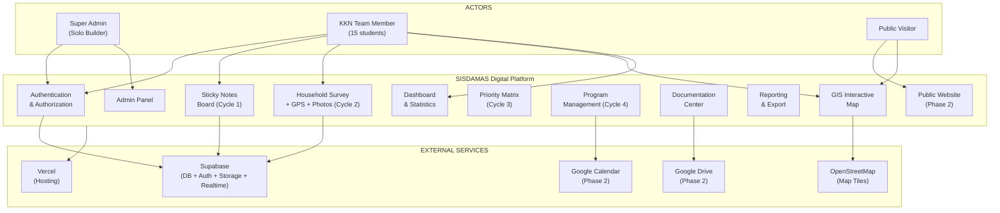

### 1.5 Dependencies Map

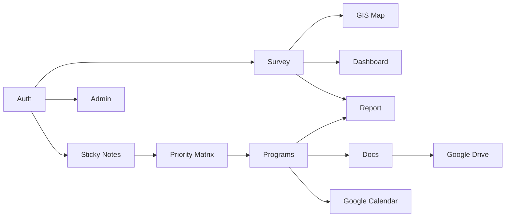

---

## Phase 2 — System Landscape

### 2.1 System Boundary

```
+-----------------------------------------------------------------------+
|                    SISDAMAS DIGITAL PLATFORM                          |
|                                                                       |
|  +-------------+  +--------------+  +-------------+  +------------+  |
|  | Auth Layer  |  | Data Layer   |  | Map Layer   |  | UI Layer   |  |
|  | Supabase    |  | Supabase     |  | Leaflet.js  |  | Next.js /  |  |
|  | Auth        |  | PostgreSQL   |  | + OSM Tiles |  | React PWA  |  |
|  +-------------+  +--------------+  +-------------+  +------------+  |
|                                                                       |
|  +-------------+  +--------------+  +-------------+  +------------+  |
|  | File Store  |  | Business     |  | Reporting   |  | Realtime   |  |
|  | Supabase    |  | Logic        |  | PDF/Excel   |  | WebSocket  |  |
|  | Storage     |  | Edge Fns     |  | Charts      |  | Sub.       |  |
|  +-------------+  +--------------+  +-------------+  +------------+  |
+-----------------------------------------------------------------------+
         |                   |                    |
   +----------+        +-----------+        +----------+
   |  Vercel  |        | Google    |        |   OSM    |
   | Hosting  |        | Drive/Cal |        |  Tiles   |
   +----------+        +-----------+        +----------+
```

### 2.2 High-Level Architecture

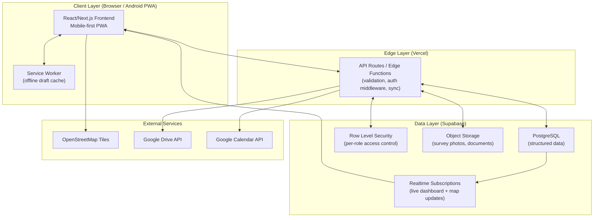

### 2.3 Component Diagram

```mermaid
graph TB
    subgraph FRONTEND["Frontend Components"]
        NAV["Navigation (Sidebar + Bottom Nav Mobile)"]
        AUTH_C["Auth Components (Login, Session)"]
        MAP_C["Map Components (Leaflet, Markers, Popups, Filters)"]
        SURVEY_C["Survey Components (Form, GPS, Camera, Offline Queue)"]
        STICKY_C["Sticky Notes (Board, Card, Column)"]
        DASH_C["Dashboard (Charts, Stats, Progress)"]
        PRIO_C["Priority Matrix (USG Scoring Table)"]
        PROG_C["Program Management (Tasks, Timeline)"]
        ADMIN_C["Admin Panel (Users, Master Data, Logs)"]
        PUBLIC_C["Public Site (Landing, Profile, Gallery)"]
    end

    subgraph BACKEND["Backend / API Layer"]
        AUTH_API["Auth API (Supabase Auth)"]
        SURVEY_API["Survey API (CRUD, GPS, Photo)"]
        MAP_API["Map API (GeoJSON endpoints)"]
        SYNC_API["Sync API (offline queue flush)"]
        REPORT_API["Report API (stats, PDF, Excel)"]
        ADMIN_API["Admin API (users, master data)"]
        DRIVE_API["Drive API (Google Drive proxy)"]
        NOTES_API["Notes API (sticky notes CRUD)"]
        PRIO_API["Priority API (USG score calculations)"]
    end

    AUTH_C --> AUTH_API
    MAP_C --> MAP_API
    SURVEY_C --> SURVEY_API
    SURVEY_C --> SYNC_API
    DASH_C --> REPORT_API
    ADMIN_C --> ADMIN_API
    STICKY_C --> NOTES_API
    PRIO_C --> PRIO_API
```

### 2.4 Deployment Diagram

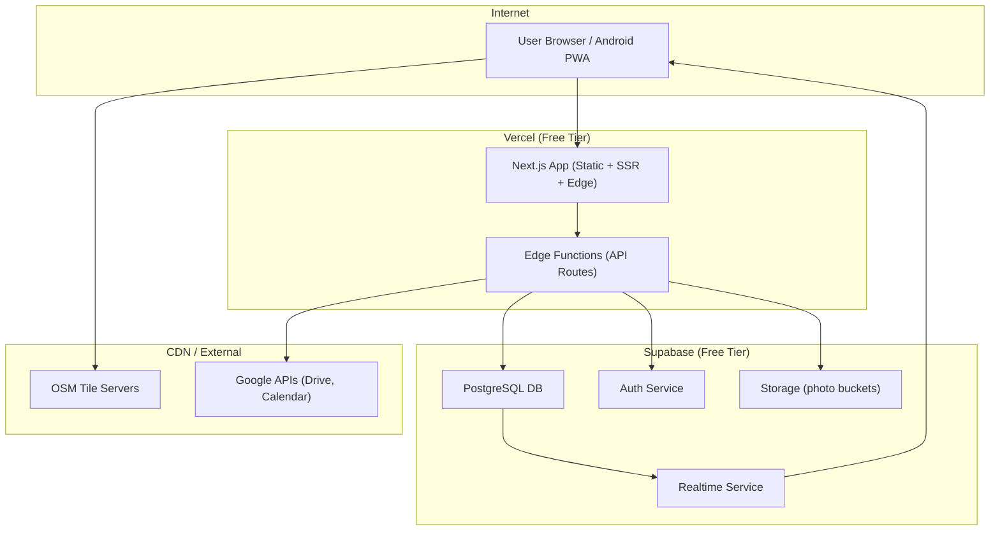

---

## Phase 3 — Information Architecture

### 3.1 Navigation Structure by Role

#### Super Administrator Navigation

```
SISDAMAS Platform (Super Admin)
+-- Dashboard (Overview + System Health)
+-- Sticky Notes (Cycle 1)
+-- Household Survey (Cycle 2)
+-- GIS Map
+-- Statistics
+-- Priority Matrix (Cycle 3)
+-- Program Management (Cycle 4)
+-- Documentation Center
+-- Reports & Exports
+-- Notifications
+-- Administration
    +-- User Management
    +-- Master Data (Dusun/RW/RT)
    +-- System Settings
    +-- Google Integrations
    +-- Audit Logs
    +-- Database Backup
    +-- Data Lock / Publish Controls
```

#### KKN Team Member Navigation

```
SISDAMAS Platform (KKN Member)
+-- Dashboard (Survey progress, my data)
+-- Sticky Notes (Cycle 1)
+-- Household Survey (Cycle 2)
|   +-- New Survey
|   +-- My Surveys
|   +-- Survey Queue (offline drafts)
+-- GIS Map
+-- Statistics (read-only)
+-- Priority Matrix (view + contribute)
+-- Program Management (view + task updates)
+-- Documentation Center (upload + view)
+-- Profile & Settings
```

#### Public Visitor Navigation (Phase 2)

```
SISDAMAS Public Website (No Login)
+-- Landing Page
+-- About Desa Sukahaji
+-- About KKN Kelompok 56
+-- About SISDAMAS
+-- Public Map (anonymized household data)
+-- Public Statistics
+-- Gallery
+-- News & Updates
+-- Contact
```

### 3.2 Page Hierarchy Table

| Level | Page | Role | Phase |
|---|---|---|---|
| L0 | Login / Landing | All | 1 |
| L1 | Dashboard | Admin, Member | 1 |
| L1 | GIS Map | Admin, Member, Public | 1/2 |
| L1 | Sticky Notes Board | Admin, Member | 1 |
| L1 | Household Survey List | Admin, Member | 1 |
| L2 | Survey Form (new/edit) | Member | 1 |
| L2 | Household Detail | Admin, Member | 1 |
| L1 | Statistics | Admin, Member | 1 |
| L1 | Priority Matrix | Admin, Member | 2 |
| L1 | Program Management | Admin, Member | 2 |
| L2 | Program Detail / Tasks | Admin, Member | 2 |
| L1 | Documentation Center | Admin, Member | 2 |
| L1 | Reports & Exports | Admin, Member | 2 |
| L1 | Admin Panel | Admin | 1 |
| L2 | User Management | Admin | 1 |
| L2 | Master Data (Dusun/RW/RT) | Admin | 1 |
| L2 | Audit Logs | Admin | 1 |
| L1 | Public Landing | Public | 2 |
| L1 | Public Map | Public | 2 |
| L1 | Public Statistics | Public | 2 |
| L1 | Gallery | Public | 2 |

---

## Phase 4 — Site Map

```mermaid
graph TD
    ROOT["sisdamas.vercel.app (root)"]

    ROOT --> AUTH_PAGES["Auth"]
    ROOT --> APP_PAGES["App (login required)"]
    ROOT --> PUBLIC_PAGES["Public (no login, Phase 2)"]

    AUTH_PAGES --> LOGIN["Login"]
    AUTH_PAGES --> FORGOT["Forgot Password"]
    AUTH_PAGES --> RESET["Reset Password"]

    APP_PAGES --> DASH["Dashboard"]
    APP_PAGES --> STICKY["Sticky Notes Board"]
    APP_PAGES --> SURVEY["Surveys"]
    APP_PAGES --> MAP_APP["GIS Map"]
    APP_PAGES --> STATS["Statistics"]
    APP_PAGES --> PRIO["Priority Matrix"]
    APP_PAGES --> PROG["Programs"]
    APP_PAGES --> DOCS["Documentation"]
    APP_PAGES --> REPORTS["Reports"]
    APP_PAGES --> ADMIN["Admin Panel"]
    APP_PAGES --> PROFILE["Profile"]

    SURVEY --> SURVEY_LIST["Survey List"]
    SURVEY --> SURVEY_NEW["New Survey Form"]
    SURVEY --> SURVEY_EDIT["Edit Survey"]
    SURVEY --> SURVEY_DETAIL["Household Detail"]
    SURVEY --> SURVEY_QUEUE["Offline Queue"]

    PRIO --> PRIO_BOARD["Priority Board (USG Scoring)"]
    PRIO --> PRIO_RESULT["Prioritization Results"]

    PROG --> PROG_LIST["Program List"]
    PROG --> PROG_DETAIL["Program Detail"]
    PROG --> PROG_TASK["Task Management"]
    PROG --> PROG_MONITOR["Monitoring Log"]

    DOCS --> DOCS_LIST["Document List"]
    DOCS --> DOCS_UPLOAD["Upload Document"]
    DOCS --> DOCS_GDRIVE["Google Drive Sync"]

    REPORTS --> REPORT_SURVEY["Survey Report"]
    REPORTS --> REPORT_PROG["Program Report"]
    REPORTS --> REPORT_EXPORT["Export PDF / Excel / GeoJSON"]

    ADMIN --> ADMIN_USERS["User Management"]
    ADMIN --> ADMIN_MASTER["Master Data (Dusun/RW/RT)"]
    ADMIN --> ADMIN_SETTINGS["System Settings"]
    ADMIN --> ADMIN_GOOGLE["Google Integrations (Drive/Cal)"]
    ADMIN --> ADMIN_LOGS["Audit Logs"]
    ADMIN --> ADMIN_BACKUP["Database Backup"]
    ADMIN --> ADMIN_LOCK["Data Lock Controls"]

    PUBLIC_PAGES --> PUB_HOME["Landing Page"]
    PUBLIC_PAGES --> PUB_DESA["Village Profile"]
    PUBLIC_PAGES --> PUB_KKN["About KKN"]
    PUBLIC_PAGES --> PUB_SISDAMAS["About SISDAMAS"]
    PUBLIC_PAGES --> PUB_MAP["Public Map (anonymized)"]
    PUBLIC_PAGES --> PUB_STATS["Public Statistics"]
    PUBLIC_PAGES --> PUB_GALLERY["Gallery"]
    PUBLIC_PAGES --> PUB_NEWS["News"]
    PUBLIC_PAGES --> PUB_CONTACT["Contact"]
```

---

## Phase 5 — User Flow

### 5.1 Public Visitor Flow (Phase 2)

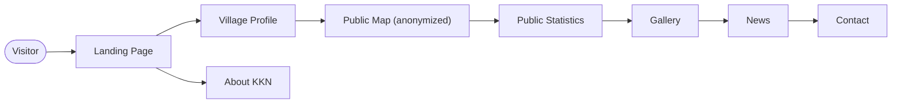

### 5.2 KKN Member — Sticky Notes Flow (Cycle 1, Day 2)

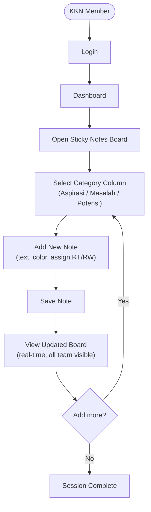

### 5.3 KKN Member — Household Survey Flow (Cycle 2, Day 4–8)

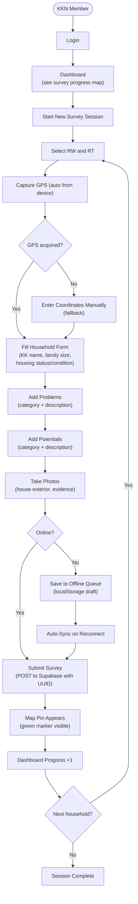

### 5.4 Super Administrator Flow

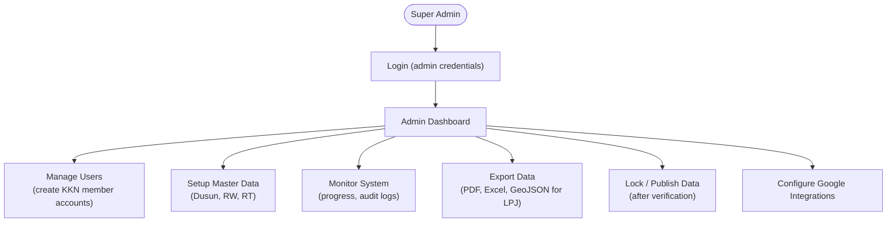

### 5.5 Priority Matrix Flow (Cycle 3)

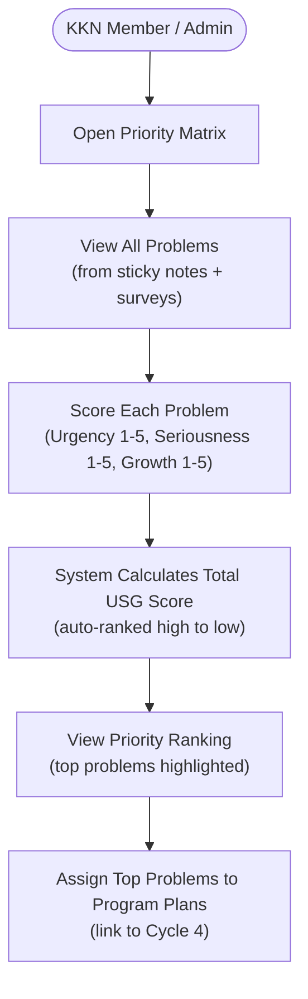

---

## Phase 6 — Low Fidelity Wireframes

### 6.1 Landing Page (Public, Phase 2)

```
+------------------------------------------------------------+
|  [LOGO SISDAMAS]         [Tentang] [Peta] [Kontak]        |
+------------------------------------------------------------+
|                                                            |
|   Platform Digital SISDAMAS                               |
|   KKN Kelompok 56 - Desa Sukahaji                         |
|                                                            |
|   [Lihat Peta Desa]        [Statistik Desa]               |
|                                                            |
+------------------------------------------------------------+
|  [STAT: Rumah Tangga]  [STAT: RT/RW]  [STAT: Program]    |
+------------------------------------------------------------+
|  PROFIL DESA              |  PETA INTERAKTIF              |
|  Desa Sukahaji, Cipendeuy |  [MAP PREVIEW - Leaflet]      |
|  Kab. Bandung Barat       |                               |
+------------------------------------------------------------+
|  GALERI FOTO:  [img] [img] [img] [img]                    |
+------------------------------------------------------------+
|  BERITA TERBARU:  [Card] [Card] [Card]                    |
+------------------------------------------------------------+
```

### 6.2 Dashboard (KKN Member / Admin)

```
+------------------------------------------------------------+
|  [Menu]  SISDAMAS Dashboard            [Bell] [User: Rzk] |
+------------+-----------------------------------------------+
|  SIDEBAR   |  OVERVIEW                                     |
|            |  +--------+ +--------+ +--------+            |
|  Dashboard |  | Survei | | GPS OK | | Sticky |            |
|  Catatan   |  | 45/120 | | 43 vld | | 28 ttl |            |
|  Survei    |  +--------+ +--------+ +--------+            |
|  Peta GIS  |                                               |
|  Statistik |  PROGRESS PER RT                             |
|  Prioritas |  RT 01 [======----] 60%  12/20 rumah         |
|  Program   |  RT 02 [====------] 40%   8/20 rumah         |
|  Dokumen   |  RT 03 [==--------] 20%   4/20 rumah         |
|  Laporan   |                                               |
|  Admin     |  AKTIVITAS TERBARU                            |
|            |  Siti - survei RT01-H12   2 mnt lalu         |
|            |  Budi - survei RT02-H07   5 mnt lalu         |
|            |  Ana  - foto diunggah     8 mnt lalu         |
+------------+-----------------------------------------------+
```

### 6.3 Sticky Notes Board (Cycle 1)

```
+------------------------------------------------------------+
|  Papan Aspirasi Warga - Hari 2 KKN          [+ Tambah]   |
+--------------+--------------+--------------+--------------+
|  ASPIRASI    |  MASALAH     |  POTENSI     |  LAINNYA    |
|  (Harapan)   |  (Keluhan)   |  (Kekuatan)  |             |
|              |              |              |             |
|  +----------+|  +----------+|  +----------+|             |
|  |Perbaikan ||  |Jalan     ||  |Pertanian ||             |
|  |jalan     ||  |rusak di  ||  |padi bisa ||             |
|  |desa [YLW]||  |Blok C[RD]||  |dioptimal ||             |
|  +----------+|  +----------+|  +----------+|             |
|  +----------+|  +----------+|  +----------+|             |
|  |Posyandu  ||  |Sampah    ||  |UMKM      ||             |
|  |lebih     ||  |tidak     ||  |kerajinan ||             |
|  |sering    ||  |terkelola ||  |bambu[GRN]||             |
|  +----------+|  +----------+|  +----------+|             |
|  [+ Catatan] |  [+ Catatan] |  [+ Catatan] |             |
+--------------+--------------+--------------+--------------+
```

### 6.4 Household Survey Form (Mobile)

```
+----------------------------+
|  <- Survei Rumah Tangga   |
|  RT 01 - RW 01            |
+----------------------------+
|  GPS: -6.847, 107.45      |
|  Akurasi: 5m [OK]         |
|  [Perbarui GPS]           |
+----------------------------+
|  INFORMASI KEPALA KELUARGA|
|  Nama KK: [_____________] |
|  No. KK:  [_____________] |
+----------------------------+
|  HUNIAN                   |
|  Jml Anggota: [___]       |
|  Status Rumah:            |
|  (o) Milik Sendiri        |
|  ( ) Sewa  ( ) Numpang    |
|  Kondisi:                 |
|  (o) Baik                 |
|  ( ) Sedang  ( ) Rusak    |
+----------------------------+
|  MASALAH                  |
|  Kategori: [v Pilih]      |
|  Deskripsi: [__________]  |
|  [+ Tambah Masalah]       |
+----------------------------+
|  POTENSI                  |
|  Kategori: [v Pilih]      |
|  Deskripsi: [__________]  |
|  [+ Tambah Potensi]       |
+----------------------------+
|  FOTO                     |
|  [Kamera] [Galeri]        |
|  [img1] [img2]            |
+----------------------------+
|  [     SIMPAN SURVEI    ] |
|  Status: [OFFLINE DRAFT]  |
+----------------------------+
```

### 6.5 Interactive GIS Map

```
+------------------------------------------------------------+
|  Peta GIS Dusun 2                 [Filter RT v] [Search]  |
+----------+-------------------------------------------------+
|  FILTER  |                                                 |
|          |          [MAP AREA - OpenStreetMap]             |
|  Wilayah |                                                 |
|  [x] RW1 |   [G]       [G]                               |
|  [x] RW2 |       [R]      [Y]    [G]                     |
|  [x] RW3 |  [G]    [Y]  [G]        [G]                   |
|          |                                                 |
|  Status  |    LEGEND                                       |
|  [G] Done|    [G] Survei Lengkap                          |
|  [Y] Part|    [Y] Survei Sebagian                         |
|  [R] None|    [R] Belum Disurvei                          |
|          |    [B] Terverifikasi                            |
|  Layer   |                                                 |
|  [ ] Sat |  +---------------------------+                  |
|  [x] OSM |  | RT01-H05                 |                  |
|  [ ] Heat|  | KK: Bpk Suparman         |                  |
|          |  | Status: Lengkap [v]      |                  |
|  Export  |  | [Lihat Detail]           |                  |
|  [GeoJSON|  +---------------------------+                  |
|  [KML]   |                                                 |
+----------+-------------------------------------------------+
```

### 6.6 Priority Matrix — USG Scoring (Cycle 3)

```
+------------------------------------------------------------+
|  Matriks Prioritas USG                                    |
+----+------------------+---+---+---+-------+---------------+
| No | Masalah          | U | S | G | Total | Prioritas     |
+----+------------------+---+---+---+-------+---------------+
|  1 | Jalan rusak      | 5 | 4 | 4 |  13   | #1 (Tertinggi)|
|  2 | Sampah menumpuk  | 4 | 5 | 3 |  12   | #2            |
|  3 | Air bersih kurang| 4 | 4 | 3 |  11   | #3            |
|  4 | Posyandu jarang  | 3 | 3 | 3 |   9   | #4            |
+----+------------------+---+---+---+-------+---------------+
|  Keterangan: U=Urgency S=Seriousness G=Growth (1-5 skala) |
|  [+ Tambah Masalah]  [Simpan Hasil]  [Export PDF]         |
+------------------------------------------------------------+
```

### 6.7 Program Management (Cycle 4)

```
+------------------------------------------------------------+
|  Manajemen Program KKN                   [+ Program Baru] |
+------------------------------------------------------------+
|  PROGRAM AKTIF                                             |
|  +--------------------------------------------------------+|
|  |  Perbaikan Jalan RT 01                                ||
|  |  Prioritas #1  |  14 Jul - 21 Jul 2026               ||
|  |  Progress: [========--] 80%                           ||
|  |  Tugas: 8/10 selesai                                  ||
|  |  [Lihat Detail]  [Edit]  [Laporan]                    ||
|  +--------------------------------------------------------+|
|  +--------------------------------------------------------+|
|  |  Pengelolaan Sampah Terpadu                           ||
|  |  Prioritas #2  |  14 Jul - 28 Jul 2026               ||
|  |  Progress: [====------] 40%                           ||
|  |  Tugas: 4/10 selesai                                  ||
|  |  [Lihat Detail]  [Edit]  [Laporan]                    ||
|  +--------------------------------------------------------+|
+------------------------------------------------------------+
```

### 6.8 Statistics Dashboard

```
+------------------------------------------------------------+
|  Statistik SISDAMAS - Dusun 2              [Unduh Excel]  |
+------------------------------------------------------------+
|  +--------+ +--------+ +----------+ +----------+          |
|  |87/120  | |97.7%   | |132       | |64        |          |
|  |Rumah   | |GPS OK  | |Masalah   | |Potensi   |          |
|  +--------+ +--------+ +----------+ +----------+          |
+------------------------------------------------------------+
|  MASALAH PER KATEGORI   |  SURVEI PER RT                  |
|                         |                                  |
|  [Donut Chart]          |  [Bar Chart]                     |
|  Infrastr: 35%          |  RT01: [========] 85%           |
|  Kesehatan: 22%         |  RT02: [====    ] 45%           |
|  Pendidikan: 18%        |  RT03: [========] 90%           |
|  Ekonomi: 15%           |                                  |
|  Lainnya: 10%           |                                  |
+------------------------------------------------------------+
|  TREN SURVEI HARIAN (Line Chart)                           |
|  15 |        *------*                                      |
|  10 |  *---*          *--*                                 |
|   5 |*                    *                                |
|     +------+------+------+------+------                    |
|     Hari4  Hari5  Hari6  Hari7  Hari8                     |
+------------------------------------------------------------+
```

### 6.9 Admin Panel

```
+------------------------------------------------------------+
|  Admin Panel                          [Super Admin Only]  |
+------------------------------------------------------------+
|  MANAJEMEN PENGGUNA             [+ Tambah Pengguna]       |
|  Nama       | Email            | Role   | Status | Aksi  |
|  Rizki (SA) | rizki@uin.ac.id  | Admin  | [ON]   | [Edit]|
|  Siti       | siti@uin.ac.id   | Member | [ON]   | [Edit]|
|  Budi       | budi@uin.ac.id   | Member | [ON]   | [Edit]|
+------------------------------------------------------------+
|  DATA MASTER                                               |
|  Dusun: Dusun 2  |  RW: 3 RW aktif  |  RT: 9 RT aktif   |
|  [Kelola Dusun / RW / RT]                                 |
+------------------------------------------------------------+
|  LOG AUDIT (24 jam terakhir)                               |
|  13:45  Rizki - Export PDF laporan                        |
|  12:30  Siti  - Submit Survei RT01-H12                    |
|  11:20  Budi  - Login dari Android                        |
+------------------------------------------------------------+
```

### 6.10 Mobile Survey (Android PWA)

```
+------------------+
|  <- Survei RT01  |
|  Online [G] GPS  |
+------------------+
|  GPS: -6.847,    |
|  107.452         |
|  Akurasi: 5m OK  |
+------------------+
|  FORM SURVEI     |
|  (scrollable)    |
|                  |
|  Nama KK:        |
|  [_____________] |
|                  |
|  Jml Anggota:    |
|  [____]          |
|                  |
|  Kondisi Rumah:  |
|  (o) Baik        |
|  ( ) Sedang      |
|  ( ) Rusak       |
+------------------+
|  [Foto] [Voice]  |
+------------------+
|  [  SIMPAN  ]    |
+------------------+
| Home Surv Map St |
+------------------+
```

### 6.11 Documentation Center

```
+------------------------------------------------------------+
|  Pusat Dokumentasi                           [+ Upload]   |
+------------------------------------------------------------+
|  FILTER: [Semua v] [Siklus 1 v] [Jenis v] [Cari...]      |
+------------------------------------------------------------+
|  SIKLUS 1 - PENGGALIAN MASALAH                            |
|  Notulensi Rembug Warga 14 Jul.pdf          [View][DL][x] |
|  Foto Sesi Sticky Notes (12 foto).zip       [View][DL][x] |
|                                                            |
|  SIKLUS 2 - SURVEI                                        |
|  Rekap Survei RT01 - RW01.xlsx              [View][DL][x] |
|  Foto Rumah Tangga RT01 (45 foto).zip       [View][DL][x] |
+------------------------------------------------------------+
|  [Sync ke Google Drive]                                   |
+------------------------------------------------------------+
```

---

## Phase 7 — GIS Blueprint

### 7.1 GIS Architecture

The GIS module is the most critical visual element. Every surveyed household becomes a **dynamic GIS object** visible in real time during the field operation.

**Technology Stack:**
- **Leaflet.js** — open-source map rendering, excellent mobile performance
- **OpenStreetMap** — free base map tiles
- **Supabase (PostgreSQL + Realtime)** — coordinate storage + live updates
- **Phase 2:** PostGIS for spatial queries, heatmaps, boundary polygons

### 7.2 GIS Layer Model

| Layer | Description | Phase |
|---|---|---|
| Layer 7 (top) | Popup Cards (household detail on click) | 1 |
| Layer 6 | Household Markers (color-coded by survey status) | 1 |
| Layer 5 | Drawing Layer (annotations, polygons) | 2 |
| Layer 4 | Heatmap Overlay (problem density visualization) | 2 |
| Layer 3 | RT/RW Boundary Polygons | 2 |
| Layer 2 | Infrastructure (roads, public facilities) | 2 |
| Layer 1 (base) | Base Map (OpenStreetMap or Satellite toggle) | 1/2 |

### 7.3 Marker Color System

| Color | Meaning | Trigger Condition |
|---|---|---|
| Green (#10B981) | Survey Complete | All core fields + GPS valid |
| Yellow (#F59E0B) | Survey Partial | GPS captured, some fields missing |
| Red (#EF4444) | Not Yet Surveyed | Pre-registered, no survey data |
| Blue (#0EA5E9) | Verified / Locked | Admin has verified and locked |
| Gray (#94A3B8) | Needs Revisit | Flagged for follow-up |

### 7.4 GIS Feature Matrix

| Feature | Phase 1 | Phase 2 |
|---|---|---|
| Pin markers per household | YES | YES |
| Filter by RT / RW | YES | YES |
| Popup with household info | YES | YES |
| Real-time marker updates (Supabase Realtime) | YES | YES |
| Coordinate viewer | YES | YES |
| Search by RT / household | YES | YES |
| Marker verification status | YES | YES |
| Satellite base layer toggle | — | YES |
| Heatmap (problem density) | — | YES |
| Marker clustering | — | YES |
| RT/RW boundary polygons | — | YES |
| Drawing tools | — | YES |
| Measurement tools | — | YES |
| GeoJSON export | — | YES |
| KML/KMZ export | — | YES |
| Offline tile pre-caching for Dusun 2 | — | YES |
| Timeline playback | — | YES |
| Layer manager UI | — | YES |

### 7.5 GIS Data Model

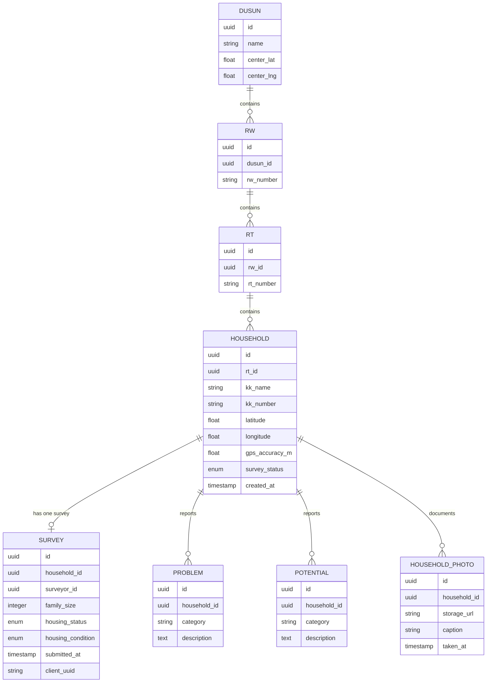

### 7.6 GIS Map Full Layout

```
+------------------------------------------------------------------+
|  Peta GIS Dusun 2 - SISDAMAS    [Jalan] [Satelit] [Hybrid]      |
+----------+-------------------------------------------+-----------+
|  FILTER  |                                           | DETAIL    |
|          |       [MAP AREA - OpenStreetMap]           | PANEL     |
|  Wilayah |                                           |           |
|  [x] RW1 |  [G]       [G]                            | RT01-H023 |
|  [x] RW2 |      [R]       [Y]    [G]                 |           |
|  [x] RW3 |  [G]    [Y]  [G]        [G]               | KK:       |
|          |                                           | Suparman  |
|  Status  |     [R] = Belum disurvei                  | JK: 4 org |
|  [G] Done|     [Y] = Survei sebagian                 |           |
|  [Y] Part|     [G] = Survei lengkap                  | Status:   |
|  [R] None|                                           | Lengkap   |
|  [B] Lock|  Koordinat: -6.8471, 107.4523             |           |
|          |                                           | [Detail]  |
|  Layer   |  [+zoom] [-zoom] [Home] [My Location]     | [Edit]    |
|  [x] OSM |                                           | [Foto: 3] |
|  [ ] Sat |                                           |           |
|  [ ] Heat|                                           |           |
|          |                                           |           |
|  Export  |                                           |           |
|  [GeoJSON|                                           |           |
|  [KML]   |                                           |           |
+----------+-------------------------------------------+-----------+
LEGEND: [G]Lengkap [Y]Sebagian [R]Belum [B]Terverifikasi [W]Revisit
```

### 7.7 Household Popup Card

```
+----------------------------------+
|  RT 01 - Rumah Tangga #023       |
+----------------------------------+
|  Kepala Keluarga: Bpk. Suparman  |
|  No. KK: 3204010010100023        |
|  Anggota Keluarga: 4 orang       |
+----------------------------------+
|  Status Survei: Lengkap [v]      |
|  Surveyor: Siti Nurhalimah       |
|  Tanggal: 16 Jul 2026, 10:23     |
+----------------------------------+
|  Masalah: 2  |  Potensi: 1       |
|  Foto: 3 foto                    |
+----------------------------------+
|  [Lihat Detail]  [Edit Survei]   |
+----------------------------------+
```

---

## Phase 8 — Survey Blueprint

### 8.1 Design Principles for Field Use

- Minimum 48×48px touch targets (gloved hands, one-handed use)
- High contrast text (minimum 4.5:1 ratio — sunlight readability)
- GPS auto-capture on form open (no extra tap required)
- Auto-save draft every 30 seconds to localStorage
- Visual GPS accuracy indicator (good / acceptable / poor)
- Offline queue badge showing pending sync count
- Battery-aware GPS polling (reduced when battery < 20%)

### 8.2 Complete Survey Workflow

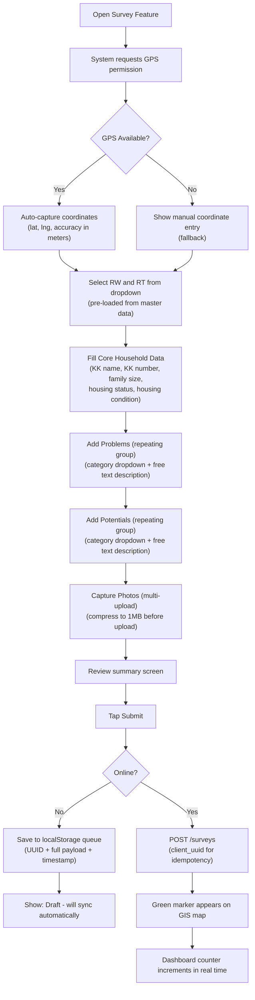

### 8.3 Survey Form Fields

**Core Household Fields**

| Field | Type | Required | Notes |
|---|---|---|---|
| RT | Select (master data) | YES | Pre-filtered per session |
| RW | Auto from RT | YES | Auto-populated |
| KK Name | Text | YES | |
| KK Number | Text | NO | Optional reference |
| Family Size | Number | YES | |
| Housing Status | Radio | YES | Milik Sendiri / Sewa / Numpang |
| Housing Condition | Radio | YES | Baik / Sedang / Rusak |
| Latitude | Decimal (auto GPS) | YES | Manual fallback if GPS fails |
| Longitude | Decimal (auto GPS) | YES | Manual fallback if GPS fails |
| GPS Accuracy (m) | Number (auto) | NO | Quality flag, stored for reference |

**Problem Group (repeating, multiple allowed)**

| Field | Type | Notes |
|---|---|---|
| Category | Select | Infrastruktur / Kesehatan / Pendidikan / Ekonomi / Lingkungan / Sosial-Budaya / Keamanan |
| Description | Textarea | Free text |

**Potential Group (repeating, multiple allowed)**

| Field | Type | Notes |
|---|---|---|
| Category | Select | Same taxonomy as Problems |
| Description | Textarea | Free text |

**Photos (multi-upload, max 10 per household)**

| Field | Type | Notes |
|---|---|---|
| Photo | Camera or Gallery | JPEG, compressed to max 1MB client-side |
| Caption | Text | Optional |

### 8.4 Offline Sync Strategy

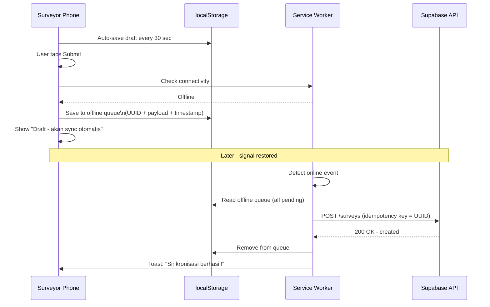

### 8.5 Photo Strategy

- Client-side compression using canvas API before upload
- Target size: ≤1MB per photo
- Storage path: `survey-photos/{household_id}/{timestamp}_{index}.jpg`
- Maximum 10 photos per household (free tier protection)
- Thumbnail generated lazily (crop from full image on first view)
- Upload progress bar per photo
- Failed uploads queued and retried separately

---

## Phase 9 — Database Concept

### 9.1 Entity Relationship Overview

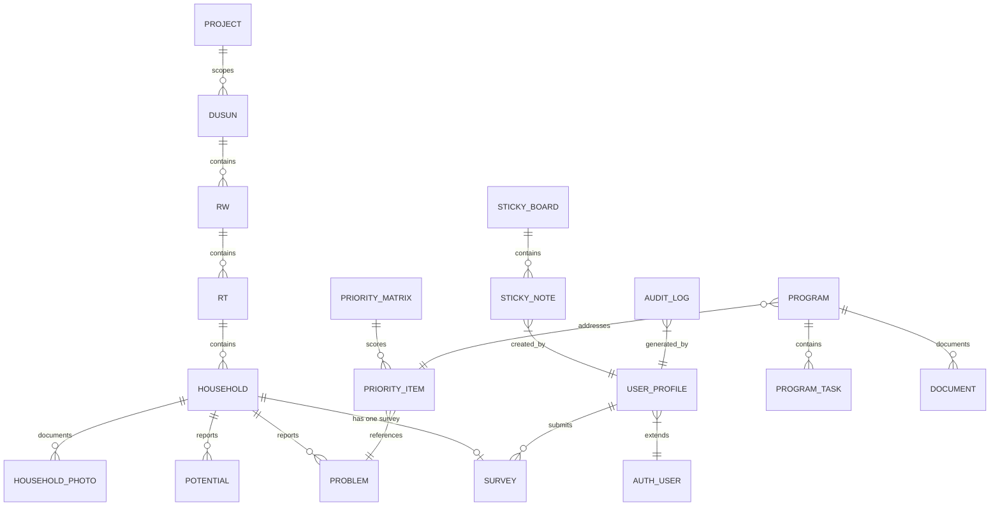

### 9.2 Data Ownership & Lifecycle

| Entity | Creator | Lifecycle | Deletion Policy |
|---|---|---|---|
| Household | KKN Member | Created on survey > Locked by admin | Soft delete only |
| Survey | KKN Member | Draft > Submitted > Verified > Locked | Soft delete; admin can recover |
| Sticky Note | KKN Member | Created Day 2 > Archived after Cycle 1 | Cannot delete if in Priority Matrix |
| Priority Item | Admin/Team | Cycle 3 > Referenced by Programs | Read-only once program assigned |
| Program | Admin | Cycle 4 > Active > Completed > Archived | Archived, never deleted |
| User Profile | Admin | Active > Suspended | Suspended, never deleted |
| Audit Log | System | Auto-generated on every write | Immutable, 90-day retention |

### 9.3 Key Design Decisions

| Decision | Rationale |
|---|---|
| Household-centered (no Warga table) | SISDAMAS surveys households, not individuals — matches methodology |
| Lightweight `project` concept | Allows future multi-village support without redesign |
| Coordinates as decimal pair (not PostGIS) | PostGIS adds migration complexity; Phase 1 pin markers don't need it |
| Soft deletes everywhere | KKN data is academic/legal record; hard deletes unsafe |
| Idempotency UUID on survey sync | Prevents duplicate entries from offline retry storms |
| Row Level Security (Supabase RLS) | Members edit only their own data; admins see everything |
| Sticky Notes as separate entity | Own board model with columns (Aspirasi/Masalah/Potensi) |
| Priority Matrix references Problems | USG scores directly link to Problem records from surveys/sticky notes |

---

## Phase 10 — Google Drive Blueprint

### 10.1 Auto-Created Folder Structure

```
SISDAMAS KKN 56 - Desa Sukahaji 2026  [root folder]
|
+-- Siklus 1 - Penggalian Masalah
|   +-- Sticky Notes & Aspirasi
|   |   +-- Notulensi Rembug Warga 14-Jul-2026.pdf
|   |   +-- Foto Sesi Sticky Notes/
|   +-- Potensi Desa
|       +-- Catatan Potensi.docx
|
+-- Siklus 2 - Survei & Pemetaan
|   +-- Data Survei
|   |   +-- Rekap Survei Dusun 2.xlsx  (auto-exported)
|   |   +-- Data Koordinat GPS.csv
|   +-- Foto Rumah Tangga
|   |   +-- RT01/
|   |   +-- RT02/
|   |   +-- RT03/
|   +-- Peta GIS
|       +-- Peta_Dusun2.geojson
|       +-- Peta_Dusun2.kml
|
+-- Siklus 3 - Prioritas & Rencana
|   +-- Matriks Prioritas USG.pdf
|   +-- Rencana Program.pdf
|
+-- Siklus 4 - Pelaksanaan Program
|   +-- Dokumentasi Kegiatan/
|   +-- Foto Kegiatan/
|   +-- Monitoring/
|
+-- Laporan Akhir
    +-- Laporan LPJ (draft).docx
    +-- Statistik Dusun 2.xlsx
    +-- Presentasi/
```

### 10.2 Synchronization Flow

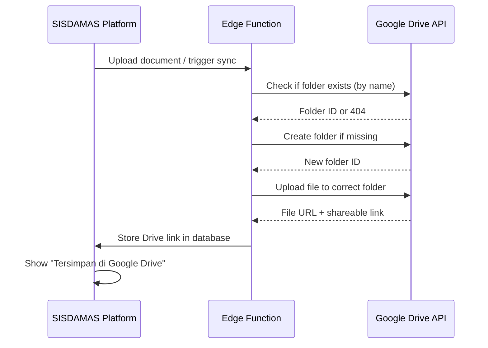

### 10.3 Google Auth Strategy

**Recommendation: Service Account (not per-user OAuth)**

| Aspect | Service Account | Per-User OAuth |
|---|---|---|
| Token expiration | Never (service account key) | 60 days — high risk for 40-day KKN |
| Setup complexity | One-time by admin | Each user must authorize |
| Security model | Platform acts on behalf of team | Individual user consent |
| Recommendation | **YES — use this** | Not suitable for this use case |

- Service account credentials stored as Vercel environment variables
- Service account has write access to the KKN's shared Drive folder only
- Admin can revoke from Google Console immediately if compromised

---

## Phase 11 — Google Calendar Blueprint

### 11.1 Event Types

| Event Type | Trigger | Calendar Entry Format |
|---|---|---|
| Survey Session | Admin creates session | "Survei RT [x] - [date]" |
| Community Meeting | Admin creates meeting | "Rembug Warga - [date]" |
| Program Milestone | Task due date set | "Program: [name] - Deadline" |
| KKN Internal Meeting | Admin creates | "Rapat Tim KKN - [date]" |
| Report Deadline | Admin sets deadline | "Deadline LPJ - [date]" |

### 11.2 Calendar Sync Flow

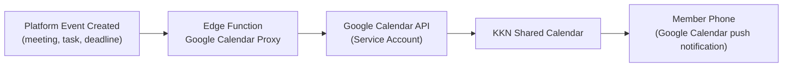

---

## Phase 12 — Statistics Blueprint

### 12.1 Dashboard Statistics Widgets

| Widget | Data Source | Update |
|---|---|---|
| Total Households Surveyed | survey table COUNT | Real-time |
| GPS Capture Rate | valid coords / total | Real-time |
| Coverage by RT (bar chart) | Grouped by rt_id | Real-time |
| Problem Category Distribution (donut) | problem table by category | Real-time |
| Potential Category Distribution | potential by category | Real-time |
| Photos Uploaded | household_photo COUNT | Near real-time |
| Daily Survey Trend (line chart) | survey.submitted_at by date | Daily |
| Top 5 Problems (ranked list) | problem frequency rank | Daily |
| Program Completion Rate | program_task done/total | Real-time |

### 12.2 Statistics Dashboard Layout

```
+------------------------------------------------------------+
|  Statistik SISDAMAS - Dusun 2          [Unduh Excel] [PDF]|
+------------------------------------------------------------+
|  RINGKASAN                                                 |
|  +--------+ +--------+ +----------+ +----------+          |
|  |87/120  | |97.7%   | |132       | |64        |          |
|  |Rumah   | |GPS OK  | |Masalah   | |Potensi   |          |
|  +--------+ +--------+ +----------+ +----------+          |
+------------------------------------------------------------+
|  DISTRIBUSI MASALAH      |  PROGRES PER RT                 |
|  [Donut Chart]           |  [Horizontal Bar Chart]         |
|  Infrastr:   35%         |  RT01: [========] 85%          |
|  Kesehatan:  22%         |  RT02: [====    ] 45%          |
|  Pendidikan: 18%         |  RT03: [========] 90%          |
|  Ekonomi:    15%         |                                 |
|  Lainnya:    10%         |                                 |
+------------------------------------------------------------+
|  TREN SURVEI HARIAN (Line Chart)                           |
|  15 |         *------*                                     |
|  10 |   *---*          *--*                                |
|   5 | *                    *                               |
|     +------+------+------+------+------                    |
|     Hari4  Hari5  Hari6  Hari7  Hari8                     |
+------------------------------------------------------------+
```

### 12.3 Export Formats

| Format | Contents | Primary Use |
|---|---|---|
| Excel (.xlsx) | Full survey data, GPS, problems/potentials | LPJ data appendix |
| PDF | Formatted statistics report with embedded charts | LPJ attachment |
| CSV | Raw GPS coordinates | External GIS tool import |
| GeoJSON | Household points with all attributes | QGIS / Google Earth |
| KML/KMZ | Household points with attributes | Google Earth |

---

## Phase 13 — Mobile Experience Blueprint

### 13.1 Bottom Navigation (Android PWA)

```
+--------------------------------------+
|          [ Page Content Area ]       |
|                                      |
|                                      |
|               [+ FAB]               |
+------+------+----------+------+------+
| Home | Surv |   Peta   | Stat | User |
+------+------+----------+------+------+
```

**Floating Action Button (FAB):** Opens "New Survey" from anywhere in the app.

### 13.2 Mobile UX Principles

| Principle | Implementation |
|---|---|
| Touch targets min 48x48px | All buttons and inputs sized for gloved/outdoor use |
| High contrast (outdoor) | 4.5:1 contrast ratio minimum; tested at 1000 lux simulation |
| One-handed operation | All critical actions in bottom 60% of screen |
| Auto-save drafts | localStorage save on every field change AND every 30 seconds |
| GPS status always visible | Persistent GPS indicator in top bar |
| Sync status always visible | Badge on bottom nav showing pending queue count |
| Offline indicator | Red banner when offline; dismisses on reconnect |
| Battery awareness | Reduce GPS polling frequency when battery below 20% |
| Form state preserved | Survives app backgrounding and screen lock |

### 13.3 Mobile Screen States

```
STATE 1 - ONLINE + GPS ACTIVE
+--------------------+
| SISDAMAS  WiFi GPS |  <- Green icons
| Akurasi: 5m        |
+--------------------+

STATE 2 - OFFLINE (DRAFT MODE)
+--------------------+
| ! OFFLINE MODE     |  <- Red banner
| Draft tersimpan    |
| lokal              |
+--------------------+

STATE 3 - SYNCING
+--------------------+
| [spin] Menyinkron  |  <- Animated
| 2 survei pending   |
+--------------------+

STATE 4 - SYNC COMPLETE
+--------------------+
| [v] Sinkronisasi   |  <- Toast (auto-dismiss)
| 2 survei berhasil! |
+--------------------+
```

---

## Phase 14 — Design System

### 14.1 Color Palette

| Token | Name | Hex | Usage |
|---|---|---|---|
| --color-primary | Indigo | #4F46E5 | Primary CTA buttons, active nav |
| --color-primary-dark | Deep Indigo | #3730A3 | Hover/pressed states |
| --color-secondary | Teal | #0D9488 | Secondary actions |
| --color-success | Emerald | #10B981 | Survey complete, success toast |
| --color-warning | Amber | #F59E0B | Partial survey, caution |
| --color-danger | Red | #EF4444 | Errors, offline indicator, incomplete |
| --color-info | Sky | #0EA5E9 | Verified/locked status markers |
| --color-surface | White | #FFFFFF | Cards, modals, form inputs |
| --color-bg | Near White | #F8FAFC | Page background |
| --color-text | Near Black | #0F172A | Primary text |
| --color-text-muted | Slate 500 | #64748B | Secondary/meta text |

**Map Marker Colors:**

| Status | Color | Hex |
|---|---|---|
| Survey Complete | Emerald | #10B981 |
| Survey Partial | Amber | #F59E0B |
| Not Surveyed | Red | #EF4444 |
| Verified / Locked | Sky | #0EA5E9 |
| Needs Revisit | Slate | #94A3B8 |

### 14.2 Typography

| Token | Font Family | Size | Weight | Usage |
|---|---|---|---|---|
| Display | Plus Jakarta Sans | 36px | 700 | Hero headings |
| H1 | Plus Jakarta Sans | 30px | 700 | Page titles |
| H2 | Plus Jakarta Sans | 24px | 600 | Section headings |
| H3 | Plus Jakarta Sans | 20px | 600 | Card titles |
| Body | Inter | 16px | 400 | Body copy |
| Body Small | Inter | 14px | 400 | Labels, captions |
| Mono | Fira Code | 14px | 400 | GPS coordinates, IDs |

**Google Fonts CDN:**
```html
<link href="https://fonts.googleapis.com/css2?family=Plus+Jakarta+Sans:wght@400;600;700&family=Inter:wght@400;500;600&family=Fira+Code:wght@400;500&display=swap" rel="stylesheet">
```

### 14.3 Spacing Scale

| Token | Value | Use |
|---|---|---|
| xs | 4px | Tight internal padding |
| sm | 8px | Component internal spacing |
| md | 12px | Between related elements |
| lg | 16px | Standard padding |
| xl | 24px | Section padding |
| 2xl | 32px | Large section gaps |
| 3xl | 48px | Hero/banner areas |
| 4xl | 64px | Page-level spacers |

### 14.4 Component Specifications

**Buttons:**
```
Primary:   bg-primary (#4F46E5) text-white rounded-12px px-24px py-12px font-semibold
Secondary: border-2 border-primary text-primary rounded-12px px-24px py-12px
Danger:    bg-danger (#EF4444) text-white rounded-12px px-24px py-12px
Ghost:     text-primary rounded-12px px-24px py-12px hover:bg-primary/10
FAB:       p-16px rounded-full bg-primary text-white shadow-xl fixed bottom-80px right-16px
```

**Cards:**
```
Background: white
Border-radius: 12px
Box-shadow: 0 2px 8px rgba(15, 23, 42, 0.08)
Padding: 16px
Hover: shadow increase + slight Y-translate
```

**Status Badges:**
```
Lengkap:   bg-success/10 text-success rounded-full px-12px py-4px font-medium
Sebagian:  bg-warning/10 text-warning rounded-full px-12px py-4px font-medium
Belum:     bg-danger/10  text-danger  rounded-full px-12px py-4px font-medium
Terkunci:  bg-info/10    text-info    rounded-full px-12px py-4px font-medium
```

**Form Inputs:**
```
Label:    Inter 14px font-medium color-text-muted mb-4px
Input:    border border-slate-300 rounded-8px px-16px py-12px
          w-full min-height 48px on mobile
          focus: border-primary outline-primary/20
Error:    border-danger + text-danger caption below + aria-live
```

### 14.5 Accessibility Standards

- WCAG 2.1 Level AA compliance target
- All interactive elements must have visible focus states
- All icons accompanied by aria-label or visible text
- Color is never the only differentiator (icon or label also used)
- Form validation errors announced via aria-live="polite" regions
- Min 48×48px touch targets on all mobile interactive elements
- Skip-to-content link on all pages

---

## Phase 15 — Project Visualization

### 15.1 Data Journey Map

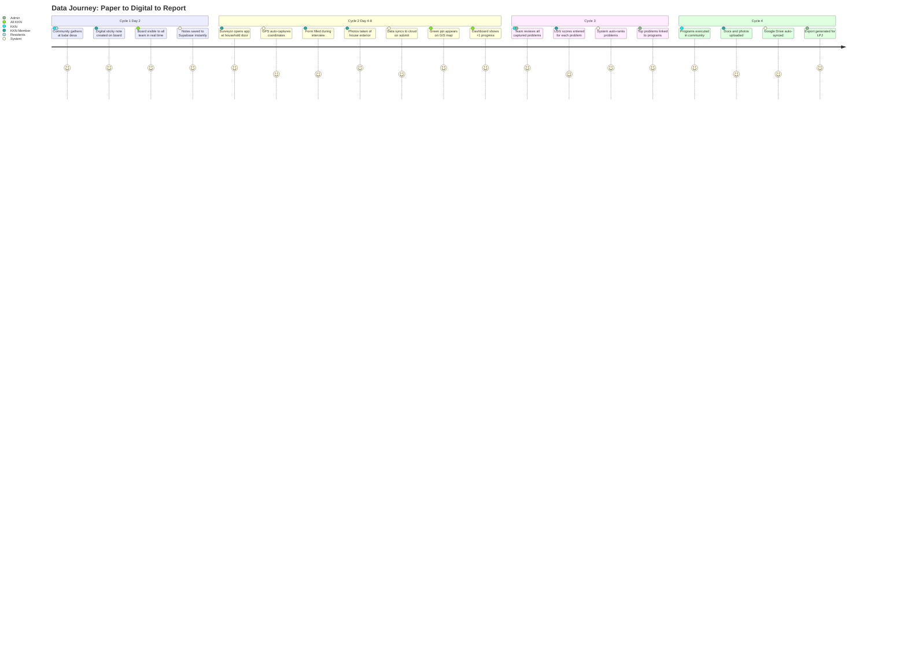

### 15.2 System Interaction Sequence

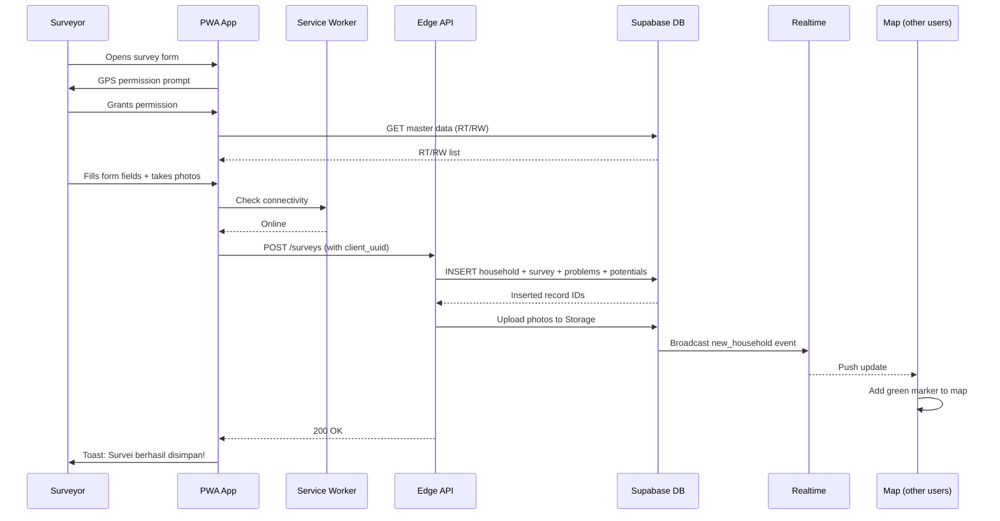

### 15.3 Architecture Decision Tree

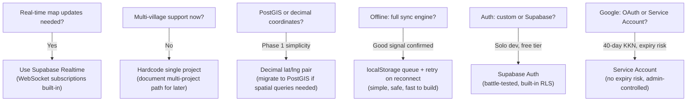

---

## Phase 16 — Architect Review

### 16.1 Architecture Strengths

| Strength | Details |
|---|---|
| Supabase = Auth + DB + Storage + Realtime in one | Dramatically reduces overhead for a solo developer |
| Realtime built-in | WebSocket map/dashboard updates without extra infrastructure |
| PWA = no app store deployment | KKN members install via browser — no Play Store review delay |
| Household-first data model | Perfectly matches SISDAMAS methodology |
| Idempotency on sync | UUID-keyed prevents duplicates on mobile retry — critical for field use |
| Service Account for Google | Eliminates per-user OAuth expiration risk during 40-day KKN |
| Vercel edge functions | Globally distributed, zero cold-start for most regions |

### 16.2 Weaknesses and Mitigations

| Weakness | Impact | Mitigation |
|---|---|---|
| Single Super Admin = SPOF | High — system unmanageable if unavailable | Document recovery steps; brief 1-2 tech-comfortable KKN members |
| Free tier storage/bandwidth limits | Medium — failed uploads on heavy photo days | Compress photos to 1MB; monitor Supabase usage dashboard weekly |
| No PostGIS in Phase 1 | Low — heatmaps and spatial queries not available | Decimal coords sufficient for Phase 1; document migration path |
| localStorage offline strategy | Medium — browser storage cleared by user | Warn users explicitly; consider IndexedDB for more robust storage |
| Vercel edge function cold starts | Low — rare, <500ms | Regional function deployment; Supabase Edge Functions as fallback |
| No conflict resolution on sync | Low — two surveyors edit same household | Enforce single-surveyor-per-household UX policy |

### 16.3 Scalability Path

```mermaid
graph LR
    NOW["Phase 1\nSingle project\nSingle Dusun\nFree tier\n1 developer\n15 users"]
    NEXT["Phase 2\nFull feature set\nAll 4 cycles\nFree tier\nSame team"]
    FUTURE["Future KKN\nMulti-project\nMulti-village\nPaid tier\nNew teams"]

    NOW --> NEXT --> FUTURE
```

**Scaling triggers:**
- Add `project_id` FK to all entities → enables multi-village
- Move to Supabase Pro for larger storage/bandwidth
- Add PostGIS extension for spatial queries
- No frontend code changes needed — data model prepared from day one

### 16.4 UX Risk Review

| UX Risk | Impact | Mitigation |
|---|---|---|
| Training gap among 15 members | High — wrong data entry | First-login onboarding tour + printable 1-page quick guide |
| GPS failure in narrow alleys | Medium — missing coordinates | Manual fallback + GPS accuracy badge + flagging for revisit |
| Form too long on Android | Medium — user drop-off | Section tabs with progress indicator; auto-scroll to first error |
| Photo upload timeout | Medium — lost evidence | Queue-based upload; retry on failure; per-photo progress bar |
| Data loss on battery drain | High — lost field work | Auto-save every 30 seconds; localStorage persists across power cycles |

### 16.5 GIS Risk Review

| GIS Risk | Impact | Mitigation |
|---|---|---|
| OSM tiles unavailable offline | Medium — surveyors lost on map | Phase 2: pre-cache Dusun 2 tile area; Phase 1: accept limitation |
| GPS drift in dense housing | Medium — inaccurate map | Store GPS accuracy value; visually flag readings >20m |
| No official boundary polygon data | Low — no RT/RW outlines on map | Phase 1 uses pin markers only; Phase 2: manually draw polygons |

### 16.6 Priority Recommendations

| Priority | Action | When |
|---|---|---|
| CRITICAL | Build Auth + Sticky Notes + Survey + Basic Map | Before Day 2 |
| CRITICAL | Test GPS capture on actual Android field devices | Before Day 4 |
| HIGH | Setup Supabase + seed master data (Dusun/RW/RT) | Before Day 1 |
| HIGH | Onboard all 15 KKN members with short guided demo | Day 1 |
| MEDIUM | Configure Service Account for Google Drive | Before Phase 2 |
| MEDIUM | Implement photo compression | Before Day 4 (heavy upload risk) |
| LOW | Design public website pages | Phase 2 |

---

## Digital Twin Concept

### Platform as Living Digital Record of Dusun 2

The SISDAMAS platform is architected from day one as the **beginning of a Digital Twin** for community development. Rather than a disposable survey tool, every household becomes a **persistent, dynamic GIS object** that accumulates structured data over time — surviving beyond a single KKN cycle.

### Household Object Data Model

| Attribute Type | Data Stored |
|---|---|
| Core Information | KK name, family size, address, RT/RW |
| Location | GPS coordinates, accuracy, capture timestamp |
| Problems | Category, description, cycle recorded, USG score (if prioritized) |
| Potentials | Category, description |
| Photo Archive | Timestamped photos with captions |
| Survey History | Who surveyed, when, what changed |
| Program History | Which programs addressed this household's problems |
| Monitoring Status | Program outcomes, follow-up visits |
| Linked Documents | Meeting notes, reports referencing this household |
| Status Timeline | Surveyed > Verified > Programs Assigned > Problems Resolved |

### Future KKN Team Reuse Path

```mermaid
flowchart LR
    KKN56["KKN 56 (2026)\nBuilds platform\nCaptures first data\nDusun 2"] --> DATA["SISDAMAS Platform\n(persistent data store)\nAll household records\nAll GPS points\nAll problems/potentials"]
    DATA --> KKN57["Future KKN Team\nLogs in with new project\nSees Dusun 2 history\nAdds new surveys\nTracks resolved problems"]
    KKN57 --> COMPARE["Year-on-Year Analysis\nWhich problems resolved?\nNew problems emerged?\nProgram effectiveness?\nCommunity progress"]
```

**Future teams configure — they do not rebuild.** The `project` concept in the data model allows any future KKN team to:
1. Create a new project scoped to the same or different Dusun
2. Access historical household data as their baseline
3. Add new survey cycles to existing household records
4. Track problem resolution status over multiple KKN periods

### Digital Twin Maturity Levels

| Level | Features | Timeline |
|---|---|---|
| Level 1 (Now — Phase 1) | Static GIS pin per household with survey snapshot | KKN Day 4–8 |
| Level 2 (Phase 2) | Dynamic status (surveyed > program assigned > problem resolved) | Cycle 3–4 |
| Level 3 (Future KKN) | Historical timeline per household across multiple KKN years | Next KKN cycle |
| Level 4 (Long-term) | Predictive analytics — which areas likely need next intervention | 2–3 years |
| Level 5 (Aspirational) | IoT sensors, drone imagery integration, automated monitoring | Future |

---

*This System Blueprint is derived from `02_SYSTEM_BLUEPRINT_PROMPT.md` and is fully subordinate to `00_PROJECT_FOUNDATION.md` and `01_PRODUCT_DISCOVERY.md`. No decision made here contradicts the confirmed constraints, scope decisions, or recommendations in those foundation documents.*

---

**Would you like to revise this System Blueprint before we proceed to generate the Product Requirements Document (03_PRODUCT_REQUIREMENTS_DOCUMENT.md)?**
