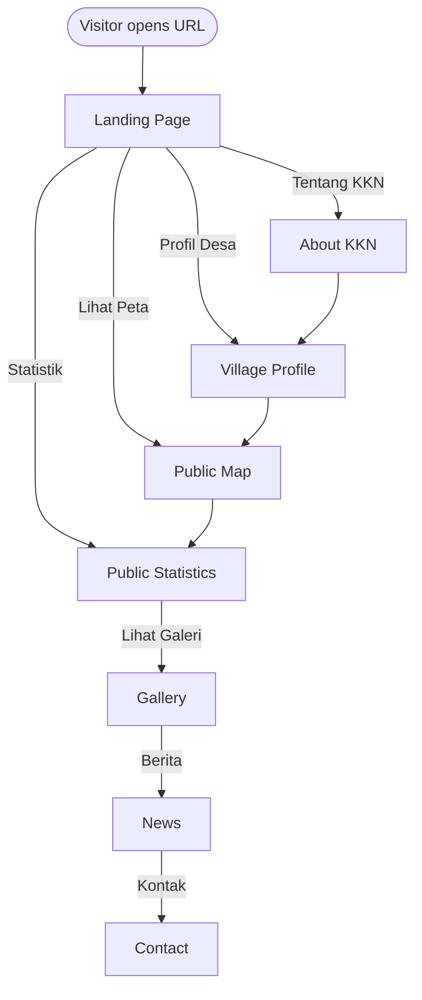
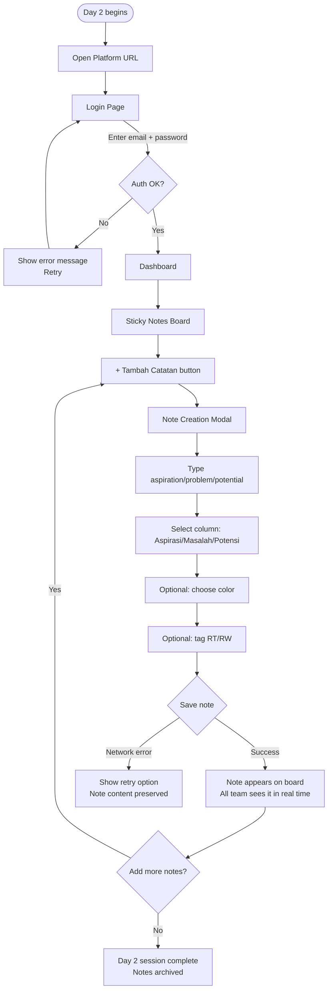
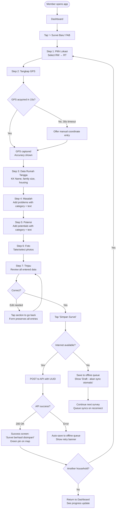
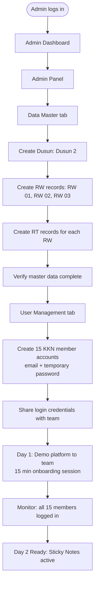
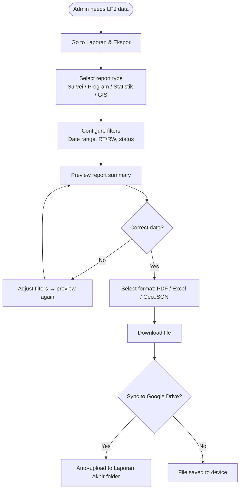

# SISDAMAS Digital Platform
## UX Specification

| | |
|---|---|
| **Document** | 04 — UX Specification |
| **Version** | 1.0 |
| **Status** | Draft — Pending Review |
| **Predecessors** | 00_PROJECT_FOUNDATION · 01_PRODUCT_DISCOVERY · 02_SYSTEM_BLUEPRINT · 03_PRD |
| **Prepared By** | UX Design Team (Principal UX Architect, Senior Product Designer, HCD Expert, Senior UI Designer, Interaction Designer, Information Architect, Accessibility Specialist, GIS UX Specialist, Mobile UX Expert) |
| **Platform** | SISDAMAS Digital Platform — KKN Kelompok 56, UIN Sunan Gunung Djati Bandung |
| **Location** | Dusun 2, Desa Sukahaji, Kec. Cipendeuy, Kab. Bandung Barat, West Java, Indonesia |
| **UI Language** | Bahasa Indonesia (all end-user facing text) |
| **Doc Language** | English (technical specification convention) |

> **Document role:** This UX Specification translates all approved PRD requirements into implementation-ready UX design decisions. It is the primary reference for frontend developers and UI designers. It does NOT redesign the product — it specifies HOW users will experience what was approved in the PRD. Every decision must not contradict the Foundation (00), Discovery (01), Blueprint (02), or PRD (03).

---

## Table of Contents

1. [UX Principles](#1-ux-principles)
2. [Information Architecture Review](#2-information-architecture-review)
3. [Navigation Specification](#3-navigation-specification)
4. [User Flow Diagrams](#4-user-flow-diagrams)
5. [Page Inventory](#5-page-inventory)
6. [Screen Specifications](#6-screen-specifications)
7. [Dashboard Specifications](#7-dashboard-specifications)
8. [GIS UX Specification](#8-gis-ux-specification)
9. [Survey UX Specification](#9-survey-ux-specification)
10. [Form Design Guidelines](#10-form-design-guidelines)
11. [Component Library](#11-component-library)
12. [Design System](#12-design-system)
13. [Mobile Experience Specification](#13-mobile-experience-specification)
14. [Microinteractions](#14-microinteractions)
15. [Accessibility Guidelines](#15-accessibility-guidelines)
16. [Content Design Guidelines](#16-content-design-guidelines)
17. [Field Usability Review](#17-field-usability-review)
18. [UX Review & Recommendations](#18-ux-review--recommendations)
19. [Final UX Checklist](#19-final-ux-checklist)

---

## 1. UX Principles

These principles govern every design decision in this specification. They are derived from the constraints established in the Project Foundation (00) and the product principles in the PRD (03).

### 1.1 Core UX Principles

| Principle | Description | Why It Applies Here |
|---|---|---|
| **Field-First** | Every screen must be usable outdoors, one-handed, in direct sunlight, with Android and intermittent signal | KKN surveyors work in Dusun 2 on foot during the Day 4–8 sprint |
| **Zero-Training Default** | A new KKN member should complete their first survey within 15 minutes of first use, without documentation | 15 users, no formal training budget, Day 1 onboarding only |
| **Offline-Resilient** | The user should never lose work due to losing signal | Field conditions in Dusun 2 have intermittent connectivity |
| **Data Confidence** | Users must always know the status of their data (saved/syncing/synced/error) | Loss of survey data would mean re-visiting households — not acceptable |
| **Minimal Friction** | Every extra tap in the survey flow costs time at each of hundreds of households | Speed during the 5-day survey sprint is a business requirement |
| **Transparent Progress** | Team members and admin must always see how much is done vs remaining | Critical for daily monitoring during the 8-day field window |
| **Inclusive Usability** | Varying digital literacy among 15 KKN members; some village officials watching | Design for the least experienced user, not the most comfortable |
| **GIS-Central** | The map is the heartbeat of the platform; it must be compelling and always accurate | Real-time map coverage is the primary monitoring tool |
| **Ethical Defaults** | Sensitive data (GPS, photos) must require explicit action to make public | Resident privacy per Foundation doc Section 17 |
| **Government-Grade Trust** | The platform will be presented to the DPL and university; it must look professional | Credibility of the KKN team's digital output |

### 1.2 Design Feel

The platform should feel: **Simple. Professional. Modern. Data-focused. Map-centric. Friendly to first-time users. Fast on mobile.**

It must NOT feel: cluttered, slow, consumer-social-media, or overwhelming to someone who has never used a web app.

---

## 2. Information Architecture Review

### 2.1 IA Decision: Two Distinct Surfaces

The platform has two distinct UI surfaces with no shared navigation:

| Surface | Access | Primary Users | Phase |
|---|---|---|---|
| **App (Authenticated)** | Requires login | Super Admin, KKN Members | 1 |
| **Public Site** | No login | Village Officials, Public, Prospective KKN | 2 |

This is a deliberate IA decision: mixing authenticated tool UI with a public website creates cognitive overload and security risk. They share the same domain but are completely separate route trees (`/app/*` and `/` or `/public/*`).

### 2.2 Navigation Depth Policy

| Rule | Rationale |
|---|---|
| Maximum 3 levels of navigation depth in the app | Deeper nesting loses mobile users; survey flow must be linear |
| Primary nav items: max 7 on desktop sidebar | Miller's Law — 7±2 cognitive limit |
| Mobile bottom nav: max 5 items | Thumb reach on Android bottom third |
| No mega-menus or fly-out submenus | Too complex for varying digital literacy; opens/closes accidentally on mobile |
| Breadcrumbs on all pages deeper than L1 | Users must always know where they are |

### 2.3 IA Grouping Rationale

```
App Navigation Groups:

Group 1 — MONITORING (Daily use during field window)
  Home / Dashboard
  GIS Map

Group 2 — DATA COLLECTION (Primary workflow)
  Sticky Notes Board
  Household Surveys

Group 3 — ANALYSIS & PLANNING (Cycle 3-4)
  Priority Matrix
  Program Management

Group 4 — RECORDS & REPORTING
  Documentation Center
  Reports & Export

Group 5 — SYSTEM (Admin-heavy)
  Admin Panel
  Profile & Settings
```

Grouping by user workflow stage (not by data type) reduces navigation errors for users who are in a specific SISDAMAS cycle.

---

## 3. Navigation Specification

### 3.1 Desktop Navigation — Sidebar

**Behavior:**
- Fixed left sidebar, 240px wide on desktop (≥1024px)
- Collapsible to 64px icon-only mode (user preference stored in localStorage)
- Active page highlighted with primary color background + left border accent
- Group labels shown when expanded; hidden (icons only) when collapsed

**Sidebar Item Specification:**

| Item | Icon | Route | Role | Phase |
|---|---|---|---|---|
| Beranda (Dashboard) | 🏠 Home | /app/dashboard | Admin, Member | 1 |
| Peta GIS | 🗺️ Map | /app/map | Admin, Member | 1 |
| Catatan Warga | 📝 StickyNote | /app/sticky-notes | Admin, Member | 1 |
| Survei Rumah Tangga | 🏘️ House | /app/surveys | Admin, Member | 1 |
| Matriks Prioritas | ⚖️ Scale | /app/priority | Admin, Member | 2 |
| Program KKN | 📅 Calendar | /app/programs | Admin, Member | 2 |
| Dokumentasi | 📁 Folder | /app/documentation | Admin, Member | 2 |
| Laporan & Ekspor | 📄 FileText | /app/reports | Admin, Member | 2 |
| Admin Panel | ⚙️ Settings | /app/admin | Admin only | 1 |
| Profil Saya | 👤 User | /app/profile | Admin, Member | 1 |

### 3.2 Mobile Navigation — Bottom Bar

**Behavior:**
- Fixed bottom bar, height 64px, always visible
- 5 primary destinations (most frequently used)
- Active state: filled icon + label + primary color
- Inactive state: outline icon + label + muted gray
- FAB (Floating Action Button) centered above bar for "New Survey" shortcut

**Bottom Bar Items:**

| Position | Label | Icon | Route |
|---|---|---|---|
| 1 | Beranda | 🏠 | /app/dashboard |
| 2 | Survei | 📋 | /app/surveys |
| 3 (FAB) | + Survei Baru | ➕ | /app/surveys/new |
| 4 | Peta | 🗺️ | /app/map |
| 5 | Lainnya | ☰ | Drawer (full menu) |

The "Lainnya" (More) button opens a full-screen drawer with all navigation items that don't fit in the bottom bar.

### 3.3 Global Navigation Elements

| Element | Behavior | Location |
|---|---|---|
| **Platform Logo** | Taps/clicks go to Dashboard | Top-left (desktop sidebar header) |
| **Notification Bell** | Badge count of unread; opens notification panel | Top-right header |
| **Offline Indicator** | Red banner: "Anda sedang offline" when no internet | Full-width top of app shell |
| **Sync Status Badge** | Orange badge on "Survei" nav item: "[n] menunggu sinkronisasi" | Bottom nav / sidebar |
| **User Avatar** | Initials-based; taps open profile dropdown (Edit Profile, Logout) | Top-right header |
| **GPS Status Pill** | Shows GPS accuracy or "GPS Nonaktif" | Visible inside Survey form only |

### 3.4 Contextual Navigation

| Context | Behavior |
|---|---|
| Household Survey Detail | "← Kembali ke Daftar Survei" breadcrumb link |
| Survey Form | Step indicator (Lokasi → Rumah Tangga → Masalah → Potensi → Foto → Tinjau) |
| Admin Panel Sub-pages | Horizontal tabs: Pengguna / Data Master / Log Audit / Pengaturan |
| Program Detail | Tabs: Ringkasan / Tugas / Dokumentasi / Monitoring |
| Sticky Notes Board | No sub-navigation; board is the full page |

### 3.5 Search

- **Global Search:** Search bar in header (desktop); accessible via search icon (mobile)
- **Scope:** Searches across Household names, KK numbers, sticky note content, document filenames
- **Implementation:** Client-side search on loaded data for Phase 1; server-side search for Phase 2
- **Trigger:** Keyboard shortcut Ctrl+K (desktop); tap search icon (mobile)

---

## 4. User Flow Diagrams

### 4.1 Public Visitor Flow (Phase 2)



### 4.2 KKN Member — Complete Day 2 Flow (Sticky Notes)



### 4.3 KKN Member — Full Survey Flow (Day 4–8)



### 4.4 Super Admin — Platform Setup Flow (Pre-Day 1)



### 4.5 Super Admin — LPJ Export Flow (End of KKN)



### 4.6 Failure and Recovery Paths

| Failure Scenario | UX Response | Recovery Path |
|---|---|---|
| Login incorrect password | "Email atau password salah" error inline | Retry; show "Lupa password?" link |
| Survey submit — network timeout | Auto-save to offline queue; toast notification | Auto-retry on reconnect; queue badge shows count |
| GPS permission denied | Instructional overlay with device settings steps | Manual coordinate fallback |
| Photo upload fails | Photo queued separately; survey saves without it | Retry photo upload from survey detail page |
| Session expired mid-form | Form data preserved in localStorage; redirect to login | On re-login, form restored from localStorage draft |
| Supabase Realtime disconnect | Map/dashboard stop live-updating; banner shown | Auto-reconnect; data refreshes on reconnect |
| Page not found (404) | Friendly 404 page with navigation back to Dashboard | Back button or Home link |

---

## 5. Page Inventory

### 5.1 Public Pages (Phase 2)

| Page | Route | Purpose | Key Components |
|---|---|---|---|
| Landing Page | / | Entry point; introduce platform | Hero, Quick Stats, Map Preview, Gallery Strip |
| Village Profile | /desa | About Desa Sukahaji | Profile card, demographics, geography |
| About KKN | /kkn | Introduce KKN Kelompok 56 | Team profiles, objectives |
| About SISDAMAS | /sisdamas | Explain SISDAMAS methodology | Cycle explanation, flowchart |
| Public Map | /peta | Anonymized community map | Leaflet map, aggregated markers, legend |
| Public Statistics | /statistik | Public survey summaries | Charts, KPI cards |
| Gallery | /galeri | Photo documentation | Masonry grid, lightbox |
| News | /berita | KKN activity updates | Article cards, pagination |
| News Detail | /berita/:slug | Single article | Full article, related posts |
| Contact | /kontak | KKN contact information | Contact form, info card |

### 5.2 Authentication Pages

| Page | Route | Purpose | Key Components |
|---|---|---|---|
| Login | /login | Authenticate user | Email input, password input, submit button, forgot password link |
| Forgot Password | /lupa-password | Request reset link | Email input, submit, confirmation message |
| Reset Password | /reset-password | Set new password | New password input, confirm password, submit |

### 5.3 App Pages — Phase 1

| Page | Route | Role | Purpose |
|---|---|---|---|
| Dashboard | /app/dashboard | Admin, Member | Overview of survey progress and recent activity |
| GIS Map | /app/map | Admin, Member | Interactive household map |
| Sticky Notes Board | /app/sticky-notes | Admin, Member | Cycle 1 digital aspiration board |
| Survey List | /app/surveys | Admin, Member | All household surveys with search/filter |
| New Survey Form | /app/surveys/new | Member | Multi-step survey entry form |
| Edit Survey Form | /app/surveys/:id/edit | Member (own) / Admin | Edit existing survey |
| Survey Detail / Household Detail | /app/surveys/:id | Admin, Member | Full household record view |
| Offline Queue | /app/surveys/queue | Admin, Member | View and manage offline drafts |
| Admin Dashboard | /app/admin | Admin | System health and quick actions |
| User Management | /app/admin/users | Admin | Create, edit, suspend user accounts |
| Master Data | /app/admin/master-data | Admin | Manage Dusun/RW/RT hierarchy |
| Audit Logs | /app/admin/audit-logs | Admin | Immutable event log |
| Profile & Settings | /app/profile | Admin, Member | Personal info, password change |

### 5.4 App Pages — Phase 2

| Page | Route | Role | Purpose |
|---|---|---|---|
| Priority Matrix | /app/priority | Admin, Member | USG scoring and problem ranking |
| Priority Results | /app/priority/results | Admin, Member | Ranked priority list |
| Program List | /app/programs | Admin, Member | All KKN community programs |
| Program Detail | /app/programs/:id | Admin, Member | Program info, tasks, monitoring |
| New Program | /app/programs/new | Admin | Create new program |
| Documentation Center | /app/documentation | Admin, Member | Upload and browse documents |
| Reports & Export | /app/reports | Admin, Member | Generate and download reports |
| Statistics Dashboard | /app/statistics | Admin, Member | Full charts and analytics |
| Notifications | /app/notifications | Admin, Member | Notification history |
| System Settings | /app/admin/settings | Admin | Google integrations, system config |
| Google Drive Sync | /app/admin/drive | Admin | Drive connection and sync status |

### 5.5 Special States (All Phase 1)

| State | When Shown | Page/Component |
|---|---|---|
| Empty State | Survey list with 0 surveys | Empty state component (illustration + CTA) |
| Loading Skeleton | Data is fetching | Skeleton card placeholders |
| Offline Banner | No internet connection | Full-width top banner (persistent) |
| Sync Pending | ≥1 draft in offline queue | Badge on nav + queue page |
| Error State | API returns 500/network error | Error card with retry button |
| Success Toast | Survey saved, sync complete | Auto-dismiss toast (3 seconds) |
| Permission Denied | Member tries to access admin page | 403 page with explanation |
| 404 Not Found | Invalid route | Friendly 404 with navigation |
| Session Expired | Token invalid mid-session | Login redirect with "sesi berakhir" message |
| GPS Acquiring | GPS request in progress | Animated GPS indicator on survey form |
| Photo Uploading | Photo upload in progress | Per-photo progress bar |
| Data Locked | Admin locked records | Read-only indicator; edit buttons hidden |

---

## 6. Screen Specifications

### 6.1 Login Page

| Attribute | Specification |
|---|---|
| **Purpose** | Authenticate KKN members and admin |
| **Target Users** | Super Admin, KKN Team Member |
| **Layout** | Centered card on gradient background; single column |
| **Primary Action** | Masuk (Login) button |
| **Secondary Actions** | Lupa Password link |

**Components:**
- Platform logo + name at top of card
- "Selamat datang kembali" heading
- Email input field (type=email, autocomplete=email)
- Password input field (type=password, show/hide toggle)
- "Masuk" button (full width, primary)
- "Lupa password?" text link below button
- Version number in footer

**Validation:**
- Email: Required, valid email format
- Password: Required, minimum 8 characters
- Errors shown inline below each field
- "Masuk" button disabled while request is in-flight (spinner replaces button text)

**Loading Behavior:** Button shows spinner, disabled state during API call.

**Error Handling:**
- Wrong credentials: "Email atau password salah. Coba lagi." below the form
- Account suspended: "Akun Anda telah dinonaktifkan. Hubungi administrator."
- Network error: "Tidak dapat terhubung ke server. Periksa koneksi internet Anda."

**Accessibility:**
- All inputs labeled with visible labels (not placeholder-only)
- Error messages linked to inputs via aria-describedby
- Focus on email field on page load
- Enter key submits form

---

### 6.2 Dashboard Page

| Attribute | Specification |
|---|---|
| **Purpose** | Real-time overview of survey progress during field operation |
| **Target Users** | Admin, KKN Member |
| **Layout** | Desktop: sidebar + main content grid. Mobile: bottom nav + stacked cards |
| **Primary Action** | Navigate to map or start new survey |
| **Update Frequency** | Real-time via Supabase Realtime subscriptions |

**Widget Grid (desktop — 3 columns, mobile — 1 column):**

Row 1 — Stat Cards (4 cards):
- Total Survei: [completed] / [registered]
- GPS Capture Rate: [%] valid koordinat
- Catatan Warga: [total] catatan
- Offline Queue: [n] menunggu sinkronisasi

Row 2:
- Survey Coverage by RT: horizontal progress bars (left 2/3)
- Recent Activity Feed: last 10 events (right 1/3)

Row 3:
- Map Preview Widget: mini interactive map (Phase 2 full; Phase 1 static snapshot)

**Recent Activity Feed Items:**
- Format: "[Avatar] [Name] menambahkan survei [RT-HH] — [relative time]"
- Shows last 10 events, scrollable
- Clicking any event navigates to that household's detail page

**Loading Behavior:** Skeleton cards while initial data loads. Realtime updates inject smoothly without full page reload.

**Offline Behavior:** Last known data shown; banner: "Data mungkin tidak terkini — Anda sedang offline."

**Empty State:** If 0 surveys: "Belum ada survei. Mulai survei pertama Anda!" with "+ Survei Baru" button.

---

### 6.3 Sticky Notes Board

| Attribute | Specification |
|---|---|
| **Purpose** | Real-time collaborative community aspiration board for Day 2 |
| **Target Users** | Admin, KKN Member |
| **Layout** | Horizontal scrollable columns (Kanban-style) |
| **Primary Action** | + Tambah Catatan |

**Board Columns:**
```
[Aspirasi (Harapan)] | [Masalah (Keluhan)] | [Potensi Desa] | [Catatan Lainnya]
```

**Note Card Components:**
- Color swatch at top
- Note content text (wraps, max 200 characters)
- RT/RW tag badge (if assigned)
- Author initial avatar + "oleh [Name]"
- Time ago ("5 menit lalu")
- Edit (pencil) and Delete (trash) icons (visible on hover/long press; own notes only)

**Note Creation Modal:**
- Textarea: "Apa yang disampaikan warga?" (placeholder)
- Column selector: pill button group (Aspirasi / Masalah / Potensi / Lainnya)
- Color picker: 5 swatches (Yellow, Red, Green, Blue, Purple)
- RT tag: optional searchable select
- "Simpan Catatan" button (primary)
- "Batal" text link

**Realtime Behavior:** New notes from other team members appear with a subtle slide-in animation. No page refresh required.

**Accessibility:** Each note card has role="article"; Edit/Delete buttons have aria-labels; Color picker includes text label (not just color).

---

### 6.4 Survey Detail / Household Detail Page

| Attribute | Specification |
|---|---|
| **Purpose** | Full view of a household's survey data |
| **Target Users** | Admin, KKN Member |
| **Layout** | Desktop: two-column (detail left, photos/map right). Mobile: stacked |
| **Primary Action** | Edit Survei (for creator) / Verifikasi (for admin) |

**Sections:**
1. **Header:** Household identifier (RT-HH number), survey status badge, surveyor name + date
2. **Location:** GPS coordinates, accuracy, mini-map showing pin position
3. **Household Data:** KK Name, KK Number, family size, housing status, housing condition
4. **Problems:** Categorized list with descriptions
5. **Potentials:** Categorized list with descriptions
6. **Photos:** Photo grid (3 columns); tap to open full-screen lightbox
7. **Audit Trail:** Created by, last edited by, timestamps (admin only)

---

## 7. Dashboard Specifications

### 7.1 Super Admin Dashboard

**Unique Widgets (additional to base dashboard):**

| Widget | Purpose | Data |
|---|---|---|
| System Health Card | Supabase connection, storage usage, last backup | System metrics |
| User Activity Summary | How many members submitted today | user_id grouped surveys by date |
| Data Quality Flags | Surveys with missing GPS, no photos, etc. | Filtered survey query |
| Offline Queue Monitor | Total pending drafts across all users (admin sees global) | queue table count |
| Google Drive Sync Status | Last sync timestamp, errors | Drive API metadata |
| Storage Usage Bar | Supabase Storage used vs free tier limit | Supabase Storage API |

**Quick Actions Panel:**
- "+ Tambah Pengguna" → /app/admin/users/new
- "Kelola Data Master" → /app/admin/master-data
- "Ekspor Data LPJ" → /app/reports
- "Lihat Log Audit" → /app/admin/audit-logs

### 7.2 KKN Member Dashboard

**Widgets:**

| Widget | Purpose | Data |
|---|---|---|
| My Survey Count | How many surveys I submitted today / total | Filtered by user_id |
| Team Progress | Overall team coverage % | Global survey / total households |
| Progress by RT | Per-RT horizontal progress bars | survey count grouped by rt_id |
| My Offline Queue | My pending drafts count | local localStorage count |
| Sticky Notes Count | Total notes on board | sticky_note COUNT |
| Recent Activity | Last 10 team survey submissions | survey ordered by submitted_at |

**Quick Actions:**
- "Survei Baru" → /app/surveys/new (FAB on mobile)
- "Buka Peta GIS" → /app/map
- "Lihat Papan Catatan" → /app/sticky-notes

### 7.3 Public Statistics Dashboard (Phase 2)

**Widgets (anonymized, aggregated):**
- Total Rumah Tangga Tersurvei
- Distribusi Masalah per Kategori (donut chart)
- Sebaran Potensi Desa (donut chart)
- Coverage per RT (bar chart)
- Program KKN yang Berjalan
- Foto Terdokumentasi

---

## 8. GIS UX Specification

### 8.1 Map Layout Structure

```
+------------------------------------------------------------------+
|  [Page Header: App Nav]                                          |
+----------+------------------------------------------+------------+
|          |                                          |            |
|  FILTER  |       LEAFLET MAP CANVAS                 |  DETAIL    |
|  PANEL   |       (OpenStreetMap base)               |  PANEL     |
|  (left)  |                                          |  (right,   |
|          |   Household marker pins                  |  opens on  |
|  240px   |   Color-coded by survey status           |  click)    |
|  wide    |                                          |  320px wide|
|          |                                          |            |
+----------+------------------------------------------+------------+
|  MAP TOOLBAR: [+] [-] [Center] [My Location] [Fullscreen]       |
+------------------------------------------------------------------+
|  LEGEND: [G] Lengkap  [Y] Sebagian  [R] Belum  [B] Terverifikasi|
+------------------------------------------------------------------+
```

**Mobile Layout:** Filter panel hidden behind "Filter" button (drawer). Detail panel slides up from bottom (bottom sheet pattern). Legend collapsed by default.

### 8.2 Filter Panel Specification

**Filter Options:**

| Filter | Type | Options |
|---|---|---|
| RW | Checkbox multi-select | RW 01, RW 02, RW 03 (from master data) |
| RT | Checkbox multi-select | Filtered by selected RW(s) |
| Survey Status | Checkbox multi-select | Lengkap, Sebagian, Belum, Terverifikasi |
| Surveyor | Select | All team members (admin only) |
| Date Range | Date picker | From - To |

**Filter Behavior:**
- Filters apply immediately on change (no "Apply" button needed for checkbox changes)
- Active filter count shown as badge on filter panel toggle button
- "Reset semua filter" link at bottom of panel
- Filter state persists in URL query params (shareable/bookmarkable)

### 8.3 Marker Interaction Specification

| Interaction | Trigger | Behavior |
|---|---|---|
| Hover (desktop) | Mouse over marker | Tooltip with KK Name + status badge |
| Click / Tap | Single click/tap on marker | Opens detail panel (right on desktop; bottom sheet on mobile) |
| Double-click | Double-click on map | Zoom in 1 level |
| Pinch/spread | Touch gesture | Zoom in/out (standard Leaflet behavior) |
| Drag | Touch drag on map | Pan |
| Long press (mobile) | 500ms press on map | No action (reserve for Phase 2 drawing tools) |

### 8.4 Household Popup / Detail Panel Specification

**Detail Panel Sections:**
1. **Header:** "RT [x] — Rumah Tangga #[n]" + status badge
2. **Key Info:** KK Name, family size, housing condition
3. **Survey Info:** Surveyor name, submitted date/time
4. **Quick Stats:** Problems count, Potentials count, Photos count
5. **GPS:** Coordinates (monospace font) + accuracy in meters
6. **Actions:**
   - "Lihat Detail Lengkap" → opens household detail page
   - "Edit Survei" → if user is creator or admin
   - "Buka di Peta Baru" → opens coordinate in Google Maps (external)

**For Unsurveyed Households (Red Markers — if pre-registered):**
- Show: "Belum disurvei"
- CTA: "Mulai Survei Sekarang" → pre-fills RT from marker

### 8.5 Map Toolbar Specification

| Button | Icon | Action | Shortcut |
|---|---|---|---|
| Zoom In | + | Map zoom +1 | Scroll up |
| Zoom Out | - | Map zoom -1 | Scroll down |
| Center Dusun 2 | 🏠 | Fly to Dusun 2 bounding box | - |
| My Location | 📍 | Pan to device GPS location | - |
| Fullscreen | ⛶ | Toggle fullscreen map | F key |
| Refresh | 🔄 | Force-reload all markers | - |

### 8.6 Phase 2 GIS Features (Deferred — Documented for Handover)

These features are **NOT built in Phase 1** but their UX is pre-specified here so the developer handover is clean:

| Feature | UX Behavior |
|---|---|
| Satellite Toggle | Toggle button in toolbar; switches OSM → Google Satellite (or Esri) |
| Heatmap | Heatmap layer toggleable in Layer Manager; shows problem density |
| Clustering | Automatically clusters when >50 markers in viewport |
| RT/RW Polygons | Toggleable polygon layer; semi-transparent fill, labeled |
| Drawing Tools | Toolbar: polygon, polyline, point, delete; saves to project GIS layer |
| GeoJSON/KML Export | "Ekspor" dropdown in toolbar; exports visible filtered markers |
| Offline Tile Cache | Admin can trigger "Pre-cache Dusun 2 tiles" in Admin settings |
| Timeline Playback | Timeline slider at bottom: shows marker appearance over Day 4–8 |

### 8.7 Touch Gestures (Mobile GIS)

| Gesture | Action |
|---|---|
| Single tap on marker | Open bottom sheet detail |
| Single tap on map | Close bottom sheet (if open) |
| Double tap | Zoom in |
| Pinch | Zoom in/out |
| Two-finger drag | Pan map |
| Long press on map | (Reserved for Phase 2 manual pin drop) |

---

## 9. Survey UX Specification

### 9.1 Survey Form — Multi-Step Design

The survey is divided into **7 sequential steps** displayed as a progress stepper. This reduces cognitive load (user sees only what's relevant at each step) and allows the system to auto-save step-by-step.

**Step Indicator:**
```
[1] [2] [3] [4] [5] [6] [7]
Lok  KK  Msl  Pot  Foto Rev  Smpn
```
- Completed steps: filled circle + checkmark
- Current step: filled circle + step number, primary color
- Future steps: outlined circle, muted color
- Tapping a completed step goes back to it (form data preserved)

### 9.2 Step-by-Step UX Specification

**Step 1 — Pilih Lokasi (Area Selection)**

| Element | Specification |
|---|---|
| Heading | "Pilih Area Survei" |
| RW Select | Full-width dropdown; sorted RW 01, 02, 03; required |
| RT Select | Full-width dropdown; filtered by selected RW; required |
| Helper text | "Pilih RW terlebih dahulu, lalu RT" |
| Next button | "Lanjut →" (disabled until both selected) |

**Step 2 — Tangkap GPS (GPS Capture)**

| Element | Specification |
|---|---|
| Heading | "Lokasi Rumah Tangga" |
| GPS Status Card | Full-width card showing GPS acquisition animation → coordinates when found |
| Animation | Pulsing circle with satellite icon while acquiring |
| Success state | Green check + coordinate display (monospace) + accuracy in meters |
| Accuracy color | Green ≤10m, Yellow 10–30m, Red >30m |
| Manual fallback | "Masukkan koordinat manual" link → shows lat/lng text inputs |
| Retry button | "Coba GPS lagi" if acquisition failed |
| Auto-advance | Automatically moves to Step 3 when GPS acquired (configurable — default ON) |

**Step 3 — Data Rumah Tangga (Household Data)**

| Field | Type | Validation | Notes |
|---|---|---|---|
| Nama Kepala Keluarga | Text input | Required, min 3 chars | Autocomplete=off |
| Nomor KK | Text input | Optional, 16 digits if entered | Input mask: 9999-9999-9999-9999 |
| Jumlah Anggota Keluarga | Number input | Required, 1–20, integer | Increment/decrement buttons on mobile |
| Status Kepemilikan Rumah | Radio group | Required | Milik Sendiri / Sewa / Menumpang |
| Kondisi Fisik Rumah | Radio group | Required | Baik / Sedang / Rusak/Tidak Layak |
| Catatan Tambahan | Textarea | Optional, max 500 chars | Character counter shown |

**Step 4 — Masalah (Problems)**

| Element | Specification |
|---|---|
| Heading | "Masalah yang Dihadapi" |
| Empty state | "Belum ada masalah ditambahkan" with prompt |
| Add Problem button | "+ Tambah Masalah" |
| Problem Card | Category badge + description text + delete icon |
| Problem Form (inline) | Category select (required) + Description textarea (required) + "Tambah" button |
| Categories | Infrastruktur / Kesehatan / Pendidikan / Ekonomi / Lingkungan / Sosial-Budaya / Keamanan |
| Min items | 0 (optional step) |
| Max items | 10 problems |

**Step 5 — Potensi (Potentials)**

Same UX as Step 4 but with "Potensi" terminology. Categories are identical. Optional step.

**Step 6 — Foto (Photos)**

| Element | Specification |
|---|---|
| Heading | "Dokumentasi Foto" |
| Primary button | "📷 Ambil Foto" (opens camera) |
| Secondary button | "🖼️ Pilih dari Galeri" |
| Photo grid | 3-column thumbnail grid; tap to view full size; long-press to delete |
| Upload indicator | Per-photo progress bar while uploading |
| Status per photo | Spinner (uploading) / Checkmark (done) / Retry (failed) |
| Count limit | Max 10 photos; counter "3/10 foto" |
| Compression notice | Subtle helper text: "Foto dikompresi otomatis untuk hemat data" |
| Optional | Yes — survey submittable without photos |

**Step 7 — Tinjau & Simpan (Review)**

| Element | Specification |
|---|---|
| Heading | "Tinjau Survei" |
| Summary sections | All 6 previous steps summarized in collapsed accordion cards |
| Section status | Green checkmark if filled, yellow warning if optional and empty |
| Edit link | Each section has "Edit" link that navigates back to that step |
| GPS display | Coordinate + accuracy displayed prominently |
| Photo count | "3 foto berhasil diunggah" |
| Submit button | "Simpan Survei" (full width, primary, large) |
| Offline indicator | If offline: button text changes to "Simpan ke Antrean Offline" |
| Loading state | Button disabled + spinner while submitting |

### 9.3 Post-Submit States

**Online Success:**
```
+--------------------------------+
|  ✅ Survei Berhasil Disimpan!  |
|  RT 01 — Rumah Tangga #023     |
|  Pin hijau telah muncul di peta|
|                                |
|  [Lihat di Peta]               |
|  [+ Survei Rumah Berikutnya]   |
|  [Kembali ke Dashboard]        |
+--------------------------------+
```

**Offline Queue Saved:**
```
+--------------------------------+
|  📥 Survei Disimpan Lokal      |
|  Akan dikirim otomatis saat    |
|  koneksi internet tersedia     |
|                                |
|  [+ Survei Rumah Berikutnya]   |
|  [Lihat Antrean Offline]       |
+--------------------------------+
```

### 9.4 Offline Queue UI

| Element | Specification |
|---|---|
| Page location | /app/surveys/queue |
| Access | Via badge notification on nav; also in Surveys list |
| List item | Household identifier + RT + date created + "Menunggu sinkronisasi" badge |
| Sync button | "Sync Sekarang" (disabled when offline; enabled when online) |
| Auto-sync indicator | Animated spinner on item being synced |
| Success item | Checkmark + "Berhasil disinkronisasi [time]" (then removed from list) |
| Empty state | "Semua survei telah disinkronisasi 🎉" |

---

## 10. Form Design Guidelines

### 10.1 Validation Rules

| Rule | Behavior |
|---|---|
| Required field indicator | Red asterisk (*) after label |
| Validation timing | On blur (when user leaves field) + on submit |
| Inline errors | Shown directly below the field, not in a separate error summary |
| Error style | Red text, border color changes to red, error icon |
| Error message tone | Specific, actionable. NOT "Invalid input." YES: "Nama harus diisi (min. 3 karakter)" |
| Success feedback | Green border after valid input (only for key fields like GPS coordinates) |
| Disabled submit | Submit button disabled until all required fields are valid |

### 10.2 Auto-Save Behavior

| Trigger | Action |
|---|---|
| Every 30 seconds (timer) | Save all current field values to localStorage |
| Every field change | Save immediately to localStorage (debounced 2 seconds) |
| On step navigation | Save before moving to next/previous step |
| On app background | Save immediately via Page Visibility API |
| On logout | Save with warning "Ada survei yang belum disimpan" |

**Draft restoration:** On opening a new survey form, check localStorage for existing draft. If found: show "Lanjutkan survei yang belum selesai?" dialog. User can restore or discard.

### 10.3 GPS Field Specification

| State | Display |
|---|---|
| Acquiring | Animated pulse + "Mendapatkan lokasi GPS..." |
| Acquired (good, ≤10m) | 🟢 "-6.8471°, 107.4523° — Akurasi 5m" |
| Acquired (acceptable, 10–30m) | 🟡 "-6.8471°, 107.4523° — Akurasi 18m (dapat diterima)" |
| Acquired (poor, >30m) | 🔴 "-6.8471°, 107.4523° — Akurasi 45m (kurang akurat)" |
| Failed / Timeout | "GPS tidak tersedia — masukkan koordinat manual" |
| Manual entry | Two text inputs (Lintang / Bujur) with decimal keyboard |

### 10.4 Photo Upload UX

- "Ambil Foto" opens device camera directly (camera capture attribute)
- "Pilih dari Galeri" opens file picker filtered to images
- Client-side compression happens before upload (transparent to user)
- While compressing: "Memproses foto..."
- While uploading: per-photo progress bar
- Upload failure: retry icon + "Gagal diunggah — Ketuk untuk mencoba lagi"
- Photos can be reordered by drag-and-drop (desktop) or long-press drag (mobile)

### 10.5 Dropdown / Select Specifications

| Type | When Used | Behavior |
|---|---|---|
| Native select | RT/RW selection (short lists) | Uses OS native select for speed |
| Searchable select | Category selection (7 options) | Custom dropdown with search input |
| Radio button group | Housing status/condition (3 options each) | All options visible; no dropdown |
| Chip/pill selector | Note column selection on Sticky Notes | Visual chip buttons, single-select |

### 10.6 Confirmation Dialogs

| Action | Confirmation Required | Dialog Text |
|---|---|---|
| Delete sticky note | Yes (if referenced) | "Hapus catatan ini? Tindakan ini tidak dapat dibatalkan." |
| Delete survey | Yes | "Hapus survei ini? Data akan dipindahkan ke arsip." |
| Logout with unsaved draft | Yes | "Ada survei yang belum disimpan. Keluar sekarang akan kehilangan perubahan yang belum disimpan." |
| Discard draft | Yes | "Hapus draft survei ini? Semua data yang dimasukkan akan hilang." |
| Suspend user (admin) | Yes | "Nonaktifkan akun [Name]? Pengguna tidak dapat masuk sampai akun diaktifkan kembali." |
| Lock data (admin) | Yes | "Kunci data survei? Data tidak dapat diedit setelah dikunci. Lanjutkan?" |

---

## 11. Component Library

### 11.1 Buttons

| Variant | Use Case | Style |
|---|---|---|
| Primary | Main CTA: "Simpan", "Masuk", "Kirim" | Solid primary color, white text, rounded-lg |
| Secondary | Alternative action: "Batal", "Kembali" | Outlined, primary border + text |
| Danger | Destructive: "Hapus", "Nonaktifkan" | Solid danger color, white text |
| Ghost | Tertiary: text links in context | No border, primary text, subtle hover bg |
| Icon Button | Toolbar actions, card actions | Square/circle, icon only + aria-label |
| FAB | "Survei Baru" primary mobile action | Round, elevated, primary color, 56px |
| Loading | Any button while API call in progress | Spinner replaces text; disabled state |

**Touch target:** Minimum 48×48px on all buttons. Padding increases on mobile to meet this.

### 11.2 Cards

| Variant | Use Case | Structure |
|---|---|---|
| Stat Card | KPI numbers on dashboard | Icon + number + label + trend indicator |
| Survey Card | Survey list item | Status badge + KK name + RT + date + actions |
| Sticky Note Card | Board note | Color top + content + author + actions |
| Program Card | Program list item | Name + status + progress bar + date range |
| Photo Card | Documentation grid item | Thumbnail + filename + actions |
| Household Card | Map popup content | Status + key fields + CTA buttons |

**All cards:** 12px border radius, box-shadow level 1, 16px padding, white background.

### 11.3 Tables

| Element | Specification |
|---|---|
| Header row | Gray-50 background, font-semibold, sticky on scroll |
| Data rows | Alternating white / gray-25 for readability |
| Row hover | Light primary tint on desktop |
| Row actions | Visible on hover (desktop); always visible on mobile |
| Pagination | Below table: "Menampilkan 1–20 dari 87" + page buttons |
| Empty state | Centered illustration + message inside table bounds |
| Mobile | Horizontal scroll; or card-per-row transformation |

### 11.4 Status Badges

| Status | Text (Bahasa) | Style |
|---|---|---|
| Lengkap | Lengkap | Green background/text, rounded-full |
| Sebagian | Sebagian | Amber background/text, rounded-full |
| Belum | Belum Disurvei | Red background/text, rounded-full |
| Terverifikasi | Terverifikasi | Sky/blue background/text |
| Terkunci | Terkunci | Gray background/text |
| Draft | Draft (Offline) | Orange background/text |
| Sinkronisasi | Menyinkronkan... | Orange + animated pulse |

### 11.5 Toast / Snackbar Notifications

| Type | Icon | Color | Duration | Dismissible |
|---|---|---|---|---|
| Success | ✅ | Green | 3 seconds | Yes |
| Error | ❌ | Red | Persistent | Yes (manual) |
| Warning | ⚠️ | Amber | 5 seconds | Yes |
| Info | ℹ️ | Blue | 4 seconds | Yes |
| Sync Complete | 🔄✅ | Green | 3 seconds | Yes |

**Position:** Bottom center (mobile), bottom-right (desktop). Stack vertically if multiple.

### 11.6 Progress Components

| Component | When Used | Style |
|---|---|---|
| Progress Bar | Survey coverage by RT, program tasks, photo upload | Horizontal bar, labeled with %, color matches status |
| Step Indicator | Survey multi-step form | Numbered circles connected by line |
| Circular Progress | Dashboard stat cards with % | SVG circle, percentage in center |
| Skeleton Loader | While data is loading | Animated gray gradient shimmer |
| Spinner | Button loading states, page-level loading | Rotating circle, primary color |

### 11.7 Form Components

| Component | Specification |
|---|---|
| Text Input | Height 48px, 16px padding, border rounded-8px, full width |
| Textarea | Min-height 96px, resize vertical only |
| Select (native) | Height 48px, system chevron icon |
| Radio Group | 48px tap area per option; label to the right of radio |
| Checkbox | 24px box; label to the right; 48px tap area |
| Date Picker | Platform native (input type=date) for Phase 1 |
| Photo Upload | Dashed border drop zone (desktop); button only (mobile) |
| Search Input | Icon left, clear button right when value present |

### 11.8 Empty States

Each empty state includes: illustration (SVG), heading, sub-description, primary CTA.

| Context | Heading | Sub-text | CTA |
|---|---|---|---|
| No surveys | "Belum ada survei" | "Mulai survei pertama untuk Dusun 2" | "+ Survei Baru" |
| No sticky notes | "Papan kosong" | "Tambahkan catatan aspirasi warga pertama" | "+ Tambah Catatan" |
| No programs | "Belum ada program" | "Buat program berdasarkan prioritas masalah" | "+ Buat Program" |
| No documents | "Belum ada dokumen" | "Unggah dokumentasi kegiatan KKN" | "Unggah Dokumen" |
| No notifications | "Semua sudah dibaca" | "Tidak ada notifikasi baru" | — |
| Offline queue empty | "Semua tersinkronisasi! 🎉" | "Tidak ada survei yang menunggu" | — |

### 11.9 Map Components (Leaflet)

| Component | Specification |
|---|---|
| Marker | 24px circle SVG, color-coded, drop shadow |
| Marker cluster | Circle with count badge (Phase 2) |
| Popup | 280px wide card with close button |
| Bottom sheet (mobile) | Slides up 60% of screen height; drag handle at top |
| Legend | Fixed bottom-left of map; collapsible |
| Toolbar | Fixed top-right of map; icon buttons |
| Coordinate display | Fixed bottom-right; monospace font; updates on mouse move |

### 11.10 Charts (Phase 2 / Statistics)

| Chart Type | Library | Use Case |
|---|---|---|
| Donut chart | Recharts | Problem/potential category distribution |
| Horizontal bar | Recharts | Survey coverage by RT |
| Line chart | Recharts | Daily survey trend |
| Progress bar | Custom CSS | Program completion, RT coverage |
| Stat card | Custom | KPI numbers with trend |

---

## 12. Design System

### 12.1 Color Palette (consistent with System Blueprint Phase 14)

**Primary Palette:**

| Token | Hex | RGB | Usage |
|---|---|---|---|
| `--primary-50` | #EEF2FF | 238,242,255 | Light hover backgrounds |
| `--primary-500` | #4F46E5 | 79,70,229 | Primary buttons, active states |
| `--primary-600` | #4338CA | 67,56,202 | Pressed states |
| `--primary-700` | #3730A3 | 55,48,163 | Dark hover |

**Semantic Palette:**

| Token | Hex | Meaning |
|---|---|---|
| `--success-500` | #10B981 | Success, survey complete, GPS good |
| `--warning-500` | #F59E0B | Warning, partial survey, GPS acceptable |
| `--danger-500` | #EF4444 | Error, offline, survey missing |
| `--info-500` | #0EA5E9 | Info, verified, locked |
| `--neutral-50` | #F8FAFC | Page background |
| `--neutral-100` | #F1F5F9 | Card hover, table stripe |
| `--neutral-300` | #CBD5E1 | Input borders, dividers |
| `--neutral-500` | #64748B | Secondary text, placeholders |
| `--neutral-700` | #334155 | Body text |
| `--neutral-900` | #0F172A | Headings, primary text |

### 12.2 Typography

**Fonts:** Plus Jakarta Sans (headings) + Inter (body) — loaded from Google Fonts CDN.

| Token | Font | Size | Line Height | Weight | Usage |
|---|---|---|---|---|---|
| `--text-display` | Plus Jakarta Sans | 36px | 44px | 700 | Hero headings |
| `--text-h1` | Plus Jakarta Sans | 30px | 38px | 700 | Page titles |
| `--text-h2` | Plus Jakarta Sans | 24px | 32px | 600 | Section headings |
| `--text-h3` | Plus Jakarta Sans | 20px | 28px | 600 | Card titles |
| `--text-h4` | Plus Jakarta Sans | 16px | 24px | 600 | Sub-headings |
| `--text-body-lg` | Inter | 18px | 28px | 400 | Large body text |
| `--text-body` | Inter | 16px | 24px | 400 | Standard body |
| `--text-body-sm` | Inter | 14px | 20px | 400 | Secondary text, labels |
| `--text-caption` | Inter | 12px | 16px | 400 | Timestamps, meta info |
| `--text-mono` | Fira Code | 14px | 20px | 400 | GPS coordinates, IDs |

### 12.3 Spacing Scale

```
--space-1:   4px
--space-2:   8px
--space-3:  12px
--space-4:  16px  (base unit)
--space-5:  20px
--space-6:  24px
--space-8:  32px
--space-10: 40px
--space-12: 48px
--space-16: 64px
--space-20: 80px
```

### 12.4 Border Radius

```
--radius-sm:  4px   (chips, small badges)
--radius-md:  8px   (inputs, small cards)
--radius-lg: 12px   (cards, modals)
--radius-xl: 16px   (large panels)
--radius-full: 9999px (pills, FAB, avatars)
```

### 12.5 Elevation / Shadow

```
--shadow-sm:   0 1px 2px rgba(15,23,42,0.06)   (inputs, subtle cards)
--shadow-md:   0 2px 8px rgba(15,23,42,0.08)   (standard cards)
--shadow-lg:   0 8px 24px rgba(15,23,42,0.12)  (modals, dropdowns)
--shadow-xl:   0 16px 48px rgba(15,23,42,0.16) (FAB, popovers)
```

### 12.6 Grid

- **Desktop (≥1024px):** 12-column grid, 24px gutter, 64px outer margin
- **Tablet (768–1023px):** 8-column grid, 20px gutter, 32px outer margin
- **Mobile (<768px):** 4-column grid, 16px gutter, 16px outer margin

### 12.7 Breakpoints

```
--breakpoint-sm:  640px
--breakpoint-md:  768px
--breakpoint-lg: 1024px
--breakpoint-xl: 1280px
```

---

## 13. Mobile Experience Specification

### 13.1 Bottom Navigation Bar

**Height:** 64px fixed  
**Background:** White, box-shadow upward  
**Safe area:** Respects `env(safe-area-inset-bottom)` for notch phones

| Position | Tab | Icon | Badge |
|---|---|---|---|
| 1 | Beranda | Home | — |
| 2 | Survei | ClipboardList | Offline queue count |
| 3 (center) | FAB | Plus (floating) | — |
| 4 | Peta | Map | — |
| 5 | Lainnya | Menu | Notification count |

**FAB (Floating Action Button):**
- 56px diameter, elevation shadow-xl
- Primary color background, white plus icon
- Positioned 12px above bottom nav bar center
- Long label "Survei Baru" appears as tooltip on long press

### 13.2 Thumb-Friendly Layout

**Zones for Android (based on typical 6" screen, one-handed grip):**

```
+--------------------+
|  ← TOP DEAD ZONE  |  ← Hard to reach one-handed; use for status only
|  (status, headers) |
|--------------------|
|  MIDDLE ZONE       |  ← Reachable; use for content display
|  (content area)    |
|--------------------|
|  BOTTOM HOT ZONE   |  ← Easiest to reach; use for ALL primary actions
|  (primary actions) |
|  BOTTOM NAV        |
+--------------------+
```

**Implications:**
- "Simpan Survei" button always at bottom of survey form
- Form sections flow top-to-bottom (user scrolls down to progress)
- Photo gallery "Ambil Foto" button fixed at bottom of photo step
- Filters/sort on survey list accessible from bottom-sheet drawer

### 13.3 Outdoor Readability

| Design Decision | Specification | Rationale |
|---|---|---|
| Text contrast | Minimum 7:1 for body text (AAA) | High sunlight washes out low-contrast text |
| Font size minimum | 16px body, 14px labels | Below 14px unreadable outdoors |
| Icon size minimum | 24px for status icons, 20px for decorative | Small icons invisible in glare |
| Button minimum height | 48px | Fat finger / gloved hand accuracy |
| GPS status | Color + icon + text (never color alone) | Color blind users; sunlight |
| Status indicators | Use shape + color + text | Redundant encoding for outdoor clarity |
| Background | Off-white (#F8FAFC) not pure white | Pure white blinds in sunlight |

### 13.4 Network & Battery Awareness

| Condition | Platform Behavior |
|---|---|
| Online → Offline transition | Red banner appears: "Anda sedang offline — data akan disimpan lokal" |
| Offline → Online transition | Green banner: "Koneksi pulih — [n] survei sedang disinkronisasi" |
| Slow connection (2G/3G) | Reduce image thumbnail quality; show text-only list option |
| Battery < 20% | GPS polling frequency reduced from 1s to 10s; user notified |
| Battery < 10% | Toast: "Baterai hampir habis — pastikan survei sudah disimpan" |

### 13.5 Android PWA Requirements

| Requirement | Implementation |
|---|---|
| Add to Home Screen prompt | Web App Manifest with proper icons and display: standalone |
| Splash screen | Logo on primary color background |
| Status bar color | Matches primary color |
| Theme color | Primary #4F46E5 |
| Orientation | Portrait preferred; landscape supported for map |
| Camera access | navigator.mediaDevices.getUserMedia for capture; accept="image/*" for file picker |
| GPS access | navigator.geolocation.watchPosition with timeout and fallback |

---

## 14. Microinteractions

### 14.1 Survey Form Interactions

| Interaction | Animation | Duration |
|---|---|---|
| Step advance ("Lanjut") | Slide current step out left, new step slides in from right | 200ms ease-out |
| Step go back | Slide right-to-left reverse | 200ms ease-out |
| Auto-save indicator | "Disimpan otomatis" fades in, waits 1.5s, fades out | 300ms each |
| GPS acquiring pulse | Concentric circles expanding outward | Continuous, 1.5s cycle |
| GPS acquired | Pulse stops → green checkmark scales in | 300ms spring |
| Problem/potential add | New card slides in from bottom | 200ms ease |
| Problem/potential delete | Card shrinks + fades out | 150ms ease-in |

### 14.2 GPS Acquisition Animation

```
State: Acquiring
  Animated SVG:
  - Center dot (solid primary color)
  - Ring 1: 0.8s opacity 1→0 + scale 1→2.5
  - Ring 2: 0.8s delay 0.4s, same animation
  - Ring 3: 0.8s delay 0.8s, same animation

State: Acquired (success)
  - All rings disappear in 200ms
  - Green checkmark scales from 0→1 (300ms spring)
  - Coordinate text fades in (200ms)
```

### 14.3 Map Interactions

| Interaction | Animation | Duration |
|---|---|---|
| New marker added (realtime) | Pin drops from top with slight bounce | 400ms spring |
| Marker status change | Color transitions smoothly | 300ms |
| Filter applied | Non-matching markers fade out | 200ms |
| Filter removed | Markers fade back in | 200ms |
| Map popup opens | Slides up (mobile) / fades in (desktop) | 250ms |
| Map fly-to (Center button) | Smooth pan + zoom animation | 500ms Leaflet flyTo |

### 14.4 Data Sync Interactions

| Interaction | Animation | Duration |
|---|---|---|
| Offline banner appears | Slides down from top of page | 300ms |
| Offline banner dismisses (on reconnect) | Slides back up | 300ms |
| Sync in progress | Rotating arrows icon on nav badge | Continuous |
| Sync complete toast | Slides up from bottom, hold 3s, slides down | 200ms in, 200ms out |
| Queue item being synced | Horizontal loading bar on queue item | ~2s per item |
| Queue item synced | Green checkmark, item fades after 1s | 500ms |

### 14.5 Button and Card Interactions

| Interaction | Animation |
|---|---|
| Button press (desktop) | 2px Y translate + shadow reduce (50ms) |
| Button press (mobile) | Scale to 0.97 (100ms spring) |
| Card hover (desktop) | Y-translate -2px + shadow increase (150ms) |
| Sticky note card hover | Slight scale 1.02 + shadow (100ms) |
| FAB hover/press | Scale 1.05 + shadow increase |
| Survey completion | Full-screen confetti animation (lightweight CSS) |

### 14.6 Task Completion (Program Management)

When a task is marked "Done":
1. Checkbox fills with checkmark (100ms)
2. Task text gets strikethrough (150ms)
3. Task card background changes to success-50 (200ms)
4. Progress bar increments smoothly (300ms)
5. If all tasks done: "Program Selesai!" toast appears

---

## 15. Accessibility Guidelines

### 15.1 Color Blindness

| Consideration | Implementation |
|---|---|
| Survey status markers | Never rely on color alone; shape (pin style) + color + text label in popup |
| Status badges | Icon prefix + color + text (e.g., ✅ Lengkap, ⚠️ Sebagian, ❌ Belum) |
| Charts | Patterns or labels in addition to colors |
| Error indicators | Red color + ❌ icon + text message |
| Map legend | Symbol + color + text description |

### 15.2 Low Vision / Large Text

| Consideration | Implementation |
|---|---|
| Text scaling | App respects browser font size settings (use em/rem not px for text) |
| Zoom | UI must be functional at 200% browser zoom |
| Focus indicators | Highly visible focus ring (3px, primary color offset) |
| Spacing | Sufficient padding so elements don't merge at large text sizes |

### 15.3 Keyboard Navigation (Desktop)

| Navigation | Behavior |
|---|---|
| Tab order | Follows logical DOM order; skip to main content link |
| Enter/Space | Activate buttons and links |
| Escape | Close modals, dialogs, dropdowns |
| Arrow keys | Navigate within radio groups, dropdown options |
| Ctrl+K | Open global search |
| Ctrl+S | Trigger manual save in survey form |

### 15.4 Screen Reader Support

| Element | ARIA Specification |
|---|---|
| Page title | Unique `<title>` per page |
| Navigation | `<nav aria-label="Navigasi utama">` |
| Main content | `<main>` element |
| Dynamic updates | `aria-live="polite"` on activity feed, toast messages |
| Form errors | `aria-describedby` linking input to error message |
| Modal dialogs | `role="dialog"`, `aria-modal="true"`, `aria-labelledby` |
| Icon buttons | `aria-label` with description (no empty buttons) |
| GPS status | `aria-live="polite"` on GPS status card |
| Map | `aria-label="Peta GIS Dusun 2"` on Leaflet container |
| Progress bars | `role="progressbar"`, `aria-valuenow`, `aria-valuemin`, `aria-valuemax` |

### 15.5 Touch Accessibility

- All interactive elements minimum 48×48px touch target (Apple HIG + Material Design standard)
- Swipe gestures have alternative tap-based equivalents
- Long press actions always have an alternative button
- Focus trapping in modal dialogs (Tab cycles within modal)

---

## 16. Content Design Guidelines

### 16.1 Language Tone

**Bahasa Indonesia — Tone: Friendly, Professional, Clear**

| Principle | Example |
|---|---|
| Use "Anda" not "kamu" | "Simpan data Anda" not "simpan data kamu" |
| Active voice | "Pilih RW terlebih dahulu" not "RW harus dipilih terlebih dahulu" |
| Specific over vague | "Nama harus diisi (min. 3 karakter)" not "Input tidak valid" |
| Action verbs for buttons | "Simpan", "Tambah", "Kirim" not "OK", "Submit", "Confirm" |
| Avoid jargon | "Koordinat GPS" not "Geolocation coordinates" |
| Empathetic errors | "Tidak dapat terhubung ke server. Periksa koneksi internet Anda." |

### 16.2 Button Labels (Bahasa Indonesia Standard)

| Action | Label |
|---|---|
| Submit/Save | Simpan |
| Save survey | Simpan Survei |
| Login | Masuk |
| Logout | Keluar |
| Add | Tambah |
| Edit | Edit |
| Delete | Hapus |
| Cancel | Batal |
| Back | Kembali |
| Continue | Lanjut |
| View detail | Lihat Detail |
| Download | Unduh |
| Upload | Unggah |
| Sync | Sinkronisasi |
| Export | Ekspor |
| Filter | Filter |
| Search | Cari |
| Reset | Reset |
| Confirm | Konfirmasi |

### 16.3 Error Messages (Standard Copy)

| Situation | Message |
|---|---|
| Required field empty | "[Nama field] harus diisi" |
| Invalid email | "Masukkan alamat email yang valid" |
| Password too short | "Password harus minimal 8 karakter" |
| Login failed | "Email atau password salah. Coba lagi." |
| Account suspended | "Akun Anda telah dinonaktifkan. Hubungi administrator." |
| Network error | "Tidak dapat terhubung ke server. Periksa koneksi internet Anda." |
| GPS unavailable | "GPS tidak tersedia. Masukkan koordinat secara manual." |
| File too large | "File terlalu besar (maks. 50MB). Kompres file dan coba lagi." |
| Upload failed | "Unggahan gagal. Ketuk untuk mencoba lagi." |
| Session expired | "Sesi berakhir. Silakan masuk kembali." |
| Permission denied | "Anda tidak memiliki izin untuk mengakses halaman ini." |

### 16.4 Success Messages

| Action | Message |
|---|---|
| Survey saved (online) | "Survei berhasil disimpan! Pin hijau telah muncul di peta." |
| Survey saved (offline) | "Survei disimpan secara lokal. Akan dikirim otomatis saat online." |
| Survey synced | "2 survei berhasil disinkronisasi ke server." |
| Sticky note saved | "Catatan berhasil ditambahkan ke papan." |
| User created | "Akun untuk [Name] berhasil dibuat." |
| Export downloaded | "Laporan berhasil diunduh." |
| Drive synced | "Dokumen berhasil disimpan ke Google Drive." |
| Password changed | "Password berhasil diubah." |

### 16.5 Tooltips and Helper Text

| Element | Helper Text |
|---|---|
| GPS Accuracy | "Akurasi menunjukkan ketepatan koordinat. Di bawah 10m = sangat baik." |
| KK Number field | "Opsional. Nomor Kartu Keluarga 16 digit." |
| Housing condition | "Rusak = dinding/atap berlubang, tidak layak huni." |
| USG Urgency | "Seberapa mendesak masalah ini harus diselesaikan? (1=tidak mendesak, 5=sangat mendesak)" |
| USG Seriousness | "Seberapa besar dampaknya jika dibiarkan? (1=kecil, 5=sangat besar)" |
| USG Growth | "Seberapa cepat masalah ini akan memburuk? (1=lambat, 5=sangat cepat)" |

---

## 17. Field Usability Review

### 17.1 Field Conditions Assumption

Per the Project Foundation (Section 17, Product Principles) and the UX Prompt:

KKN surveyors during Day 4–8 are:
- Standing outdoors, walking between houses in Dusun 2
- Under direct sunlight (morning to afternoon)
- Holding a clipboard or document in one hand
- Using a personal Android smartphone one-handed
- Experiencing intermittent 4G/3G signal
- Battery potentially at 30–50% by afternoon
- Occasionally losing GPS signal in narrow alleys or dense housing

### 17.2 Field Usability Assessment by Workflow

| Workflow Step | Field Risk | UX Mitigation |
|---|---|---|
| Open app and navigate to new survey | Hot sun washes out screen | High contrast design (≥7:1); auto-brightness adjustment note in onboarding |
| GPS acquisition at doorstep | Poor signal in narrow alleys | 15-second timeout + manual fallback; accuracy badge + color |
| Fill KK Name while holding clipboard | One-handed typing | Large text field (48px height); autocapitalize=words; no keyboard shortcuts required |
| Select RT from dropdown | Fat finger errors | Large touch targets (48px min); searchable select |
| Add multiple problems | Repetitive tapping | Streamlined "Add another" flow; no modal — inline expansion |
| Take photos | Camera app switch | In-app camera capture (no app switch); photos auto-return to form |
| Submit survey | Unclear success/failure | Large unambiguous success/failure state; explicit "Pin muncul di peta" confirmation |
| Walk to next house | Phone accidentally closed | Auto-save every 30s; "Lanjutkan survei?" on next open |

### 17.3 Field Usability Improvements (From Review)

The following improvements are recommended based on field condition analysis:

**Improvement 1: "Survei Cepat" Express Mode**
- Problem: 7-step form is comprehensive but slow for simple households
- Solution: Phase 2 feature — "mode cepat" that shows only required fields (RT, KK Name, GPS, condition)
- Status: Phase 2 feature, not Phase 1

**Improvement 2: GPS Pre-warm**
- Problem: GPS takes 10–30s to acquire at each new household
- Solution: App requests GPS permission and starts watching position as soon as the member logs in; coordinate is always ready
- Status: Implement in Phase 1

**Improvement 3: "Mark for Revisit" Quick Action**
- Problem: Some households unavailable during survey (no one home); surveyor needs to note and return
- Solution: Quick action on map marker: "Tandai untuk dikunjungi ulang" — creates Gray marker with note
- Status: Phase 1 (simple flag on household record)

**Improvement 4: Surveyor Progress Card**
- Problem: Member doesn't know their own contribution vs team's
- Solution: Personal progress card on dashboard: "Anda: 8 survei hari ini | Tim: 35 survei total"
- Status: Phase 1 dashboard enhancement

**Improvement 5: Photo Quick Capture**
- Problem: Opening camera each time is 3 taps
- Solution: Camera icon on Step 6 header opens camera immediately; no intermediate screen
- Status: Implement Phase 1

---

## 18. UX Review & Recommendations

### 18.1 Identified UX Issues and Mitigations

| Issue | Severity | Mitigation |
|---|---|---|
| 7-step form may feel long on mobile | Medium | Step progress indicator; auto-advance from GPS step |
| Filter panel hidden on mobile (drawer) | Low | Filter button shows active filter count badge |
| Map popup small on mobile screens | Medium | Bottom sheet replaces popup on mobile (full width) |
| Sticky notes board horizontal scroll unfamiliar | Low | Onboarding tooltip on first visit; swipe hint animation |
| USG scoring page complex for first use | Medium | Contextual help tooltips on U/S/G labels; example scoring shown |
| Admin panel too much info on one page | Low | Tabs split User Mgmt / Master Data / Logs / Settings |
| Session expiry during survey | High | Form data preserved in localStorage; redirect to login; form restored on return |

### 18.2 "Too Many Clicks" Analysis

| Task | Current Clicks | Minimum Possible | Acceptable? |
|---|---|---|---|
| Start new survey from Dashboard (mobile) | 1 (FAB) | 1 | YES |
| Add a sticky note | 2 (+ button → modal → save) | 2 | YES |
| View map from dashboard | 2 (nav → map) | 1 if map widget on dashboard | Acceptable |
| Filter map by RT | 3 (filter button → check RT → auto-apply) | 2 | YES |
| Export data to Excel | 3 (Reports → select type → download) | 3 | YES |
| View household detail from map | 2 (click marker → click "Lihat Detail") | 1 if popup had full inline view | Acceptable |

**Verdict:** Click efficiency is acceptable for Phase 1. No critical over-clicking paths identified.

### 18.3 GIS Usability Recommendations

| Recommendation | Priority |
|---|---|
| Bottom sheet on mobile for household detail (vs popup) — easier to read | HIGH — Phase 1 |
| Default map view on page load: fly to Dusun 2 bounding box | HIGH — Phase 1 |
| "My Location" button is visible and prominent on mobile | HIGH — Phase 1 |
| Legend always visible (not hidden) on mobile — collapsed but accessible | MEDIUM — Phase 1 |
| Cluster markers when zoom out to see district-level (Phase 2) | LOW — Phase 2 |

### 18.4 Offline Usability Recommendations

| Recommendation | Priority |
|---|---|
| Never show a broken/empty state when offline — always show last known data | HIGH — Phase 1 |
| Offline badge on nav is always visible, not hidden | HIGH — Phase 1 |
| Queue page accessible via banner click (not just navigation) | MEDIUM — Phase 1 |
| Battery-saving GPS mode automatically activates at 20% | MEDIUM — Phase 1 |

---

## 19. Final UX Checklist

| Criterion | Status |
|---|---|
| ✅ All PRD requirements are covered | COVERED — Each feature spec references PRD requirements |
| ✅ All user flows complete (Public, Member, Admin) | COVERED — Section 4 |
| ✅ All screens specified | COVERED — Section 6, 7, 8, 9 |
| ✅ All dashboard views defined | COVERED — Section 7 (Admin, Member, Public) |
| ✅ All GIS interactions documented | COVERED — Section 8 (Phase 1 fully; Phase 2 documented) |
| ✅ All survey interactions documented | COVERED — Section 9 (7-step flow fully specified) |
| ✅ All form behaviors defined | COVERED — Section 10 |
| ✅ Mobile-first approach | COVERED — Section 13 (Android-specific) |
| ✅ Accessibility guidelines present | COVERED — Section 15 (WCAG 2.1 AA) |
| ✅ Offline considerations addressed | COVERED — Sections 9.4, 10.2, 13.4, 17 |
| ✅ Field usability requirements met | COVERED — Section 17 |
| ✅ Component library complete | COVERED — Section 11 |
| ✅ Design system defined | COVERED — Section 12 |
| ✅ Content guidelines provided | COVERED — Section 16 (Bahasa Indonesia) |
| ✅ Edge cases documented | COVERED — Per screen spec and form guidelines |
| ✅ Error handling defined | COVERED — Sections 4.6, 6.1, 10.1, 16.3 |
| ✅ Loading/empty states specified | COVERED — Sections 5.5, 11.8, 11.6 |
| ✅ Microinteractions described | COVERED — Section 14 |
| ✅ No contradictions with PRD | VERIFIED — All role names, features, and business rules consistent with PRD (03) |
| ✅ Consistent with System Blueprint IA | VERIFIED — Navigation, routing, and page hierarchy match Blueprint (02) |
| ✅ Consistent with Foundation constraints | VERIFIED — 3 roles only, Phase 1/2 split, free tier, solo dev, mobile-first |

---

*This UX Specification is derived from `04_UX_SPECIFICATION_PROMPT.md`. All design decisions are subordinate to `00_PROJECT_FOUNDATION.md`, `01_PRODUCT_DISCOVERY.md`, `02_SYSTEM_BLUEPRINT.md`, and `03_PRD.md`. The 3-role access model (Super Admin, KKN Team Member, Public Visitor) from the Foundation is used consistently throughout. The Phase 1/Phase 2 scope split from the Foundation is respected — Phase 2 features are documented but not designed as if they are ready to build.*

---

**Would you like to revise the UX Specification before we proceed to generate the Technical Specification (`05_TECHNICAL_SPECIFICATION.md`)?**
