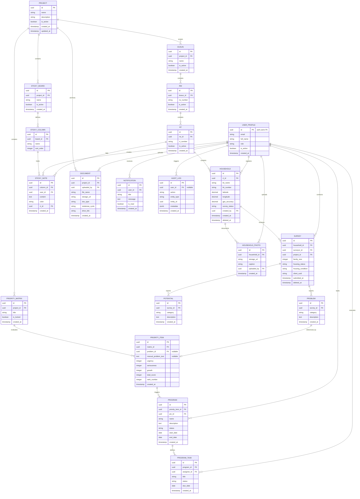

# SISDAMAS Digital Platform
## Database Specification

| | |
|---|---|
| **Document** | 06 — Database Specification |
| **Version** | 1.0 |
| **Status** | Draft — Pending Review |
| **Predecessors** | 00_PROJECT_FOUNDATION · 01_PRODUCT_DISCOVERY · 02_SYSTEM_BLUEPRINT · 03_PRD · 04_UX_SPECIFICATION · 05_TECHNICAL_SPECIFICATION |
| **Prepared By** | Database Architecture Team (Principal Database Architect, PostgreSQL Expert, Supabase Expert, Data Architect, GIS Data Engineer, Backend Engineer, Information Architect) |
| **Platform** | SISDAMAS Digital Platform — KKN Kelompok 56, UIN Sunan Gunung Djati Bandung |
| **Target Engine** | Supabase PostgreSQL (Free Tier) |
| **Constraints** | 1GB free storage limit · Zero budget · No "warga" (individual resident) table · Household-centered design |

> **Document role:** This Database Specification details the conceptual, logical, and structural database design for the SISDAMAS Digital Platform. It translates the requirements of the PRD (03) and the technical architecture decisions of the Technical Spec (05) into detailed tables, relationships, and data dictionaries. In accordance with the prompt constraints, **no SQL commands, Prisma models, or Supabase migration scripts are generated in this document.**

---

## 1. Database Principles

The database design adheres to these core principles to survive the 8-day critical field window and enable long-term sustainability:

1. **Household-Centered Paradigm:** Focus on the household (Rumah Tangga) as the primary unit of observation. Do NOT create an individual resident ("warga") table. This matches the SISDAMAS field survey methodology and prevents data fragmentation.
2. **Strict Normalization (up to 3NF):** Enforce structural normalization to prevent update anomalies and maintain referential integrity. Redundancies must be explicitly justified (e.g., caching metrics for dashboards).
3. **Referential Integrity:** Ensure foreign key constraints are enforced with appropriate delete actions (primarily `RESTRICT` or soft deletes) to prevent orphan records.
4. **GIS-Ready by Design:** Coordinates are stored as decimal numbers (`latitude` and `longitude` pair) with accuracy indicators, ready to be mapped via Leaflet.js. Spatial queries will be enabled via PostGIS extensions later in Phase 2 if necessary, but Phase 1 uses decimal storage for simplicity.
5. **Traceability and Auditability:** Every write operation is logged. Every table contains metadata for auditing (`created_at`, `updated_at`, `created_by`, `updated_by`) and soft deletion (`deleted_at`).
6. **BaaS Optimization:** Designed specifically for Supabase PostgreSQL. Leverage PostgreSQL's native Row Level Security (RLS) and schema-based authorization to secure tables directly at the database level.
7. **Free Tier Compliance:** Structure the tables and index strategy to fit within the 500MB database limit and 1GB storage limit of the Supabase free tier.

---

## 2. Entity Analysis

The following business entities are identified based on the project documents:

### 2.1 Geographic Hierarchy

*   **Project:** A logical container representing a KKN deployment (e.g., KKN 56 Desa Sukahaji). Exists to allow multi-village support later by configuration, without code changes.
*   **Dusun:** Sub-village administrative unit.
*   **RW (Rukun Warga):** Intermediate administrative unit within a Dusun.
*   **RT (Rukun Tetangga):** Local neighborhood unit within an RW. Represents the lowest boundary.

### 2.2 Survey Domain

*   **Household (Rumah Tangga):** The core physical and social unit of the survey. Located in an RT, has coordinates, a head of household name, and a unique identification number (No KK).
*   **Survey:** A completed questionnaire associated with a Household. Stored as a separate entity to support historical tracking over time (e.g., a household surveyed in 2026 can be re-surveyed in 2027 without overwriting history).
*   **Problem:** A community complaint or issue reported by a household during a survey. Categorized (Infrastruktur, Kesehatan, etc.) and linked to the survey.
*   **Potential:** A community strength or asset reported by a household. Categorized and linked to the survey.
*   **Household Photo:** Photo attachments documenting the household's physical condition or evidence of problems.

### 2.3 Community Engagement Domain (Cycle 1)

*   **Sticky Note Board:** A digital container representing the Cycle 1 rembug warga session.
*   **Sticky Note Column:** Represents a category column on the board (Aspirasi, Masalah, Potensi, Lainnya).
*   **Sticky Note:** A collaborative note containing ideas, aspirations, or problems created by KKN members during the community session.

### 2.4 Prioritization and Action (Cycle 3-4)

*   **Priority Matrix:** The matrix containing ranked problems from surveys or sticky notes.
*   **Priority Item:** A specific problem pulled into the matrix, scored using Urgency, Seriousness, and Growth (USG) metrics.
*   **Program:** A KKN program designed to address one or more prioritized problems.
*   **Program Task:** An actionable task assigned to a KKN member within a Program.

### 2.5 Supporting Domains

*   **User Profile:** Extends Supabase auth.users with custom attributes (role, full name, status).
*   **Document:** Files uploaded to the Documentation Center, categorized by SISDAMAS cycle.
*   **Notification:** System-generated alerts for task assignments, deadlines, and sync alerts.
*   **Audit Log:** An immutable history of system events, actions, and data changes.

---

## 3. Relationship Analysis

### 3.1 Geographic Hierarchy (One-to-Many Chain)
`Project (1) ─── {many} Dusun (1) ─── {many} RW (1) ─── {many} RT`
*   **Mandatory:** Yes. Every sub-unit must have a parent.
*   **Cascade:** Deleting a Project cascades to Dusun, RW, and RT. However, in production, deleting master geographical units must be blocked if transactions (households) exist.

### 3.2 Household and Survey (One-to-Many)
`Household (1) ─── {many} Survey`
*   **Mandatory:** A survey must belong to a household. A household does not require a survey (can be pre-registered but not yet surveyed - Red Marker).
*   **Cascade:** Deleting a household cascades to its surveys.
*   **History Support:** A household can have multiple surveys over time, sorted by timestamp. The latest survey is considered the active state.

### 3.3 Survey Details (One-to-Many)
`Survey (1) ─── {many} Problem`
`Survey (1) ─── {many} Potential`
`Household (1) ─── {many} Household Photo`
*   **Mandatory:** Problems and potentials must link to a survey. Photos link directly to the Household (to preserve photo history across surveys).
*   **Cascade:** Deleting a survey cascades to its problems and potentials. Deleting a household cascades to photos.

### 3.4 Sticky Notes Board (One-to-Many)
`Sticky Note Board (1) ─── {many} Sticky Note Column (1) ─── {many} Sticky Note`
*   **Cascade:** Deleting a board cascades to columns and notes.

### 3.5 Prioritization to Programs (One-to-Many)
`Priority Item (1) ─── {many} Program (1) ─── {many} Program Task`
*   **Relationship:** A prioritized item can be addressed by a Program. A Program has multiple Tasks.
*   **Orphan prevention:** A program must have a parent priority item. Tasks must have a parent program.

---

## 4. ER Diagram (Mermaid)



---

## 5. Table Specifications

Every table is designed with fields to satisfy referential constraints, indexing, auditing, and soft deletes. 

### 5.1 System & Admin Group

#### `project`
Stores KKN deployment details. Enabled from day one to support future multi-village reuse.
*   **PK:** `id` (UUID, Default: gen_random_uuid())
*   **Columns:** `name` (VARCHAR, Not Null), `description` (TEXT, Null), `is_active` (BOOLEAN, Default: true), `created_at` (TIMESTAMP, Default: now()), `updated_at` (TIMESTAMP, Default: now())
*   **Constraints:** Name must be unique.
*   **Soft Delete:** No. Hard delete allowed if no sub-elements exist.

#### `user_profile`
Extends the internal Supabase authentication table `auth.users` with metadata.
*   **PK:** `id` (UUID, references `auth.users` on delete cascade)
*   **Columns:** `email` (VARCHAR, Not Null), `full_name` (VARCHAR, Not Null), `role` (VARCHAR, Not Null), `is_active` (BOOLEAN, Default: true), `created_at` (TIMESTAMP, Default: now())
*   **Constraints:** Role must be either 'super_admin' or 'kkn_member'.

### 5.2 Geographic Hierarchy Group

#### `dusun`
*   **PK:** `id` (UUID, Default: gen_random_uuid())
*   **FK:** `project_id` references `project(id)` on delete restrict
*   **Columns:** `name` (VARCHAR, Not Null), `is_active` (BOOLEAN, Default: true), `created_at` (TIMESTAMP, Default: now())

#### `rw`
*   **PK:** `id` (UUID, Default: gen_random_uuid())
*   **FK:** `dusun_id` references `dusun(id)` on delete restrict
*   **Columns:** `rw_number` (VARCHAR, Not Null), `is_active` (BOOLEAN, Default: true), `created_at` (TIMESTAMP, Default: now())
*   **Constraints:** Unique constraint on `(dusun_id, rw_number)`.

#### `rt`
*   **PK:** `id` (UUID, Default: gen_random_uuid())
*   **FK:** `rw_id` references `rw(id)` on delete restrict
*   **Columns:** `rt_number` (VARCHAR, Not Null), `is_active` (BOOLEAN, Default: true), `created_at` (TIMESTAMP, Default: now())
*   **Constraints:** Unique constraint on `(rw_id, rt_number)`.

### 5.3 Survey Domain Group

#### `household`
Represents the target physical home unit.
*   **PK:** `id` (UUID, Default: gen_random_uuid())
*   **FK:** 
    *   `rt_id` references `rt(id)` on delete restrict
    *   `created_by` references `user_profile(id)` on delete set null
*   **Columns:** `kk_name` (VARCHAR, Not Null), `kk_number` (VARCHAR, Null), `latitude` (NUMERIC(10,7), Not Null), `longitude` (NUMERIC(10,7), Not Null), `gps_accuracy` (NUMERIC(5,2), Null), `survey_status` (VARCHAR, Default: 'pending'), `created_at` (TIMESTAMP, Default: now()), `deleted_at` (TIMESTAMP, Null)
*   **Indexes:** Index on `rt_id`, index on `survey_status`, index on `deleted_at` (for filtering active records).

#### `survey`
Stores a specific survey entry. Supports historical survey logs.
*   **PK:** `id` (UUID, Default: gen_random_uuid())
*   **FK:**
    *   `household_id` references `household(id)` on delete cascade
    *   `surveyor_id` references `user_profile(id)` on delete restrict
    *   `project_id` references `project(id)` on delete restrict
*   **Columns:** `family_size` (INTEGER, Not Null), `housing_status` (VARCHAR, Not Null), `housing_condition` (VARCHAR, Not Null), `client_uuid` (UUID, Null), `submitted_at` (TIMESTAMP, Default: now()), `deleted_at` (TIMESTAMP, Null)
*   **Constraints:** Unique constraint on `client_uuid` to enforce sync idempotency.

#### `problem`
*   **PK:** `id` (UUID, Default: gen_random_uuid())
*   **FK:** `survey_id` references `survey(id)` on delete cascade
*   **Columns:** `category` (VARCHAR, Not Null), `description` (TEXT, Not Null), `created_at` (TIMESTAMP, Default: now())

#### `potential`
*   **PK:** `id` (UUID, Default: gen_random_uuid())
*   **FK:** `survey_id` references `survey(id)` on delete cascade
*   **Columns:** `category` (VARCHAR, Not Null), `description` (TEXT, Not Null), `created_at` (TIMESTAMP, Default: now())

#### `household_photo`
*   **PK:** `id` (UUID, Default: gen_random_uuid())
*   **FK:** 
    *   `household_id` references `household(id)` on delete cascade
    *   `uploaded_by` references `user_profile(id)` on delete set null
*   **Columns:** `storage_url` (VARCHAR, Not Null), `caption` (VARCHAR, Null), `created_at` (TIMESTAMP, Default: now())

### 5.4 Sticky Notes Group (Cycle 1)

#### `sticky_board`
*   **PK:** `id` (UUID, Default: gen_random_uuid())
*   **FK:** `project_id` references `project(id)` on delete cascade
*   **Columns:** `name` (VARCHAR, Not Null), `is_active` (BOOLEAN, Default: true), `created_at` (TIMESTAMP, Default: now())

#### `sticky_column`
*   **PK:** `id` (UUID, Default: gen_random_uuid())
*   **FK:** `board_id` references `sticky_board(id)` on delete cascade
*   **Columns:** `name` (VARCHAR, Not Null), `sort_order` (INTEGER, Not Null)

#### `sticky_note`
*   **PK:** `id` (UUID, Default: gen_random_uuid())
*   **FK:**
    *   `column_id` references `sticky_column(id)` on delete cascade
    *   `user_id` references `user_profile(id)` on delete set null
    *   `rt_id` references `rt(id)` on delete set null
*   **Columns:** `content` (TEXT, Not Null), `color` (VARCHAR, Default: 'yellow'), `created_at` (TIMESTAMP, Default: now())

### 5.5 Priority & Action Group (Cycles 3-4)

#### `priority_matrix`
*   **PK:** `id` (UUID, Default: gen_random_uuid())
*   **FK:** `project_id` references `project(id)` on delete cascade
*   **Columns:** `title` (VARCHAR, Not Null), `is_locked` (BOOLEAN, Default: false), `created_at` (TIMESTAMP, Default: now())

#### `priority_item`
Represents problems undergoing USG evaluation.
*   **PK:** `id` (UUID, Default: gen_random_uuid())
*   **FK:**
    *   `matrix_id` references `priority_matrix(id)` on delete cascade
    *   `problem_id` references `problem(id)` on delete set null
*   **Columns:** `manual_problem_text` (TEXT, Null), `urgency` (INTEGER, Not Null), `seriousness` (INTEGER, Not Null), `growth` (INTEGER, Not Null), `total_score` (INTEGER, Not Null), `rank_number` (INTEGER, Null), `created_at` (TIMESTAMP, Default: now())
*   **Constraints:** Check constraints on `urgency` (1-5), `seriousness` (1-5), `growth` (1-5). `total_score` is auto-calculated (`urgency + seriousness + growth`).

#### `program`
*   **PK:** `id` (UUID, Default: gen_random_uuid())
*   **FK:**
    *   `priority_item_id` references `priority_item(id)` on delete restrict
    *   `pic_id` references `user_profile(id)` on delete set null
*   **Columns:** `name` (VARCHAR, Not Null), `description` (TEXT, Not Null), `status` (VARCHAR, Default: 'planned'), `start_date` (DATE, Not Null), `end_date` (DATE, Not Null), `created_at` (TIMESTAMP, Default: now())

#### `program_task`
*   **PK:** `id` (UUID, Default: gen_random_uuid())
*   **FK:**
    *   `program_id` references `program(id)` on delete cascade
    *   `assignee_id` references `user_profile(id)` on delete set null
*   **Columns:** `title` (VARCHAR, Not Null), `status` (VARCHAR, Default: 'todo'), `due_date` (DATE, Not Null), `created_at` (TIMESTAMP, Default: now())

### 5.6 Supporting Group

#### `document`
*   **PK:** `id` (UUID, Default: gen_random_uuid())
*   **FK:**
    *   `project_id` references `project(id)` on delete restrict
    *   `uploaded_by` references `user_profile(id)` on delete set null
*   **Columns:** `file_name` (VARCHAR, Not Null), `storage_url` (VARCHAR, Not Null), `doc_type` (VARCHAR, Not Null), `sisdamas_cycle` (VARCHAR, Not Null), `drive_link` (VARCHAR, Null), `created_at` (TIMESTAMP, Default: now())

#### `notification`
*   **PK:** `id` (UUID, Default: gen_random_uuid())
*   **FK:** `user_id` references `user_profile(id)` on delete cascade
*   **Columns:** `title` (VARCHAR, Not Null), `message` (TEXT, Not Null), `is_read` (BOOLEAN, Default: false), `created_at` (TIMESTAMP, Default: now())

#### `audit_log`
*   **PK:** `id` (UUID, Default: gen_random_uuid())
*   **FK:** `user_id` references `user_profile(id)` on delete set null
*   **Columns:** `action` (VARCHAR, Not Null), `entity_type` (VARCHAR, Not Null), `entity_id` (UUID, Not Null), `metadata` (JSONB, Null), `created_at` (TIMESTAMP, Default: now())

---

## 6. Data Dictionary

The following table comprises the complete business and technical dictionary of the database.

| Table Name | Column Name | Business Meaning | Technical Purpose | Data Type | Nullable | Default Value | Validation / Allowed Values | Display Name (UI) | Editable | Searchable | Filterable | Required | Notes |
| :--- | :--- | :--- | :--- | :--- | :--- | :--- | :--- | :--- | :--- | :--- | :--- | :--- | :--- |
| **project** | `id` | Unique ID | Primary Key | UUID | No | `gen_random_uuid()` | UUID | ID Proyek | No | No | No | Yes | Auto-generated. |
| | `name` | Project Name | Village/deployment context | VARCHAR | No | | Max 100 chars, unique | Nama Proyek | Yes | Yes | No | Yes | e.g. "KKN 56 Desa Sukahaji" |
| | `description` | Description | Notes about deployment | TEXT | Yes | | | Deskripsi | Yes | Yes | No | No | |
| | `is_active` | Status | Activation flag | BOOLEAN | No | `true` | | Status Aktif | Yes | No | Yes | Yes | |
| | `created_at` | Created Time | Audit timestamp | TIMESTAMP | No | `now()` | | Waktu Dibuat | No | No | No | Yes | |
| | `updated_at` | Updated Time | Audit timestamp | TIMESTAMP | No | `now()` | | Waktu Diperbarui | No | No | No | Yes | |
| **user_profile** | `id` | User ID | PK & link to Supabase Auth | UUID | No | | UUID | ID Pengguna | No | No | No | Yes | Matches `auth.users(id)`. |
| | `email` | User Email | Identity & login reference | VARCHAR | No | | Valid email | Email | Yes | Yes | No | Yes | |
| | `full_name` | Full Name | User identifier | VARCHAR | No | | Max 100 chars | Nama Lengkap | Yes | Yes | No | Yes | |
| | `role` | Role | Access privileges | VARCHAR | No | | `'super_admin'`, `'kkn_member'` | Peran | Yes | No | Yes | Yes | Consistent with 3-role model. |
| | `is_active` | Status | User block flag | BOOLEAN | No | `true` | | Status Aktif | Yes | No | Yes | Yes | |
| | `created_at` | Created Time | Audit timestamp | TIMESTAMP | No | `now()` | | Waktu Terdaftar | No | No | No | Yes | |
| **dusun** | `id` | Sub-village ID | Primary Key | UUID | No | `gen_random_uuid()` | | ID Dusun | No | No | No | Yes | |
| | `project_id` | Project Link | Scoping FK | UUID | No | | References `project(id)` | Proyek | No | No | Yes | Yes | |
| | `name` | Dusun Name | Name of sub-village | VARCHAR | No | | Max 50 chars | Nama Dusun | Yes | Yes | No | Yes | e.g. "Dusun 2" |
| | `is_active` | Status | Active indicator | BOOLEAN | No | `true` | | Status | Yes | No | Yes | Yes | |
| | `created_at` | Created Time | Audit timestamp | TIMESTAMP | No | `now()` | | Waktu Dibuat | No | No | No | Yes | |
| **rw** | `id` | RW ID | Primary Key | UUID | No | `gen_random_uuid()` | | ID RW | No | No | No | Yes | |
| | `dusun_id` | Dusun Link | Sub-village parent | UUID | No | | References `dusun(id)` | Dusun | No | No | Yes | Yes | |
| | `rw_number` | RW Number | Rukun Warga identifier | VARCHAR | No | | Max 10 chars | Nomor RW | Yes | Yes | Yes | Yes | e.g. "01", "02" |
| | `is_active` | Status | Active flag | BOOLEAN | No | `true` | | Status | Yes | No | Yes | Yes | |
| | `created_at` | Created Time | Audit timestamp | TIMESTAMP | No | `now()` | | Waktu Dibuat | No | No | No | Yes | |
| **rt** | `id` | RT ID | Primary Key | UUID | No | `gen_random_uuid()` | | ID RT | No | No | No | Yes | |
| | `rw_id` | RW Link | Rukun Warga parent | UUID | No | | References `rw(id)` | RW | No | No | Yes | Yes | |
| | `rt_number` | RT Number | Rukun Tetangga identifier | VARCHAR | No | | Max 10 chars | Nomor RT | Yes | Yes | Yes | Yes | e.g. "01", "02" |
| | `is_active` | Status | Active flag | BOOLEAN | No | `true` | | Status | Yes | No | Yes | Yes | |
| | `created_at` | Created Time | Audit timestamp | TIMESTAMP | No | `now()` | | Waktu Dibuat | No | No | No | Yes | |
| **household** | `id` | Household ID | Primary Key | UUID | No | `gen_random_uuid()` | | ID Rumah Tangga | No | No | No | Yes | |
| | `rt_id` | RT Link | Geographic parent | UUID | No | | References `rt(id)` | RT | Yes | No | Yes | Yes | |
| | `kk_name` | KK Name | Head of family name | VARCHAR | No | | Max 150 chars | Nama Kepala Keluarga | Yes | Yes | No | Yes | |
| | `kk_number` | KK Card Number | Family registration card | VARCHAR | Yes | | Max 16 chars, numbers | Nomor Kartu Keluarga | Yes | Yes | No | No | Optional reference. |
| | `latitude` | Latitude | Coordinate (North/South) | NUMERIC | No | | Range: -90.0 to 90.0 | Lintang (Lat) | Yes | No | No | Yes | Decimals (10,7). |
| | `longitude` | Longitude | Coordinate (East/West) | NUMERIC | No | | Range: -180.0 to 180.0 | Bujur (Lng) | Yes | No | No | Yes | Decimals (10,7). |
| | `gps_accuracy`| Accuracy | Circle accuracy in meters | NUMERIC | Yes | | In meters (e.g. 5.50) | Akurasi GPS (m) | No | No | No | No | Dynamic accuracy log. |
| | `survey_status`| Status | Current survey phase | VARCHAR | No | `'pending'` | `'pending'`, `'partial'`, `'complete'`, `'verified'`, `'revisit'` | Status Survei | Yes | No | Yes | Yes | Color-codes map marker. |
| | `created_by` | Creator | Member who registered it | UUID | Yes | | References `user_profile(id)` | Terdaftar Oleh | No | No | Yes | No | Set Null on delete. |
| | `created_at` | Created Time | Audit timestamp | TIMESTAMP | No | `now()` | | Waktu Dibuat | No | No | No | Yes | |
| | `deleted_at` | Deleted Time | Soft delete indicator | TIMESTAMP | Yes | | | Waktu Dihapus | No | No | Yes | No | Filter queries for null. |
| **survey** | `id` | Survey Entry ID| Primary Key | UUID | No | `gen_random_uuid()` | | ID Entri Survei | No | No | No | Yes | Supports survey history. |
| | `household_id`| Household Link | Reference to household | UUID | No | | References `household(id)` | Rumah Tangga | No | No | Yes | Yes | Cascade delete. |
| | `surveyor_id` | Surveyor Link | Member executing survey | UUID | No | | References `user_profile(id)` | Surveyor | No | No | Yes | Yes | |
| | `project_id` | Project Link | Scoping context | UUID | No | | References `project(id)` | Proyek | No | No | Yes | Yes | |
| | `family_size` | Family Size | Number of residents | INTEGER | No | | Range: 1 to 20 | Jumlah Anggota Keluarga | Yes | No | No | Yes | |
| | `housing_status`| Housing Status | Ownership structure | VARCHAR | No | | `'own'`, `'rent'`, `'sharing'` | Status Kepemilikan | Yes | No | Yes | Yes | |
| | `housing_condition`| Condition | Integrity of house structure| VARCHAR | No | | `'good'`, `'moderate'`, `'damaged'` | Kondisi Fisik Rumah | Yes | No | Yes | Yes | |
| | `client_uuid` | Client UUID | Sync idempotency reference | UUID | Yes | | Unique key | UUID Klien | No | No | No | No | Prevents sync duplicates. |
| | `submitted_at`| Submitted Time | Sync timestamp | TIMESTAMP | No | `now()` | | Waktu Submit | No | No | No | Yes | |
| | `deleted_at` | Deleted Time | Soft delete indicator | TIMESTAMP | Yes | | | Waktu Dihapus | No | No | Yes | No | |
| **problem** | `id` | Problem ID | Primary Key | UUID | No | `gen_random_uuid()` | | ID Masalah | No | No | No | Yes | |
| | `survey_id` | Survey Link | Parent survey record | UUID | No | | References `survey(id)` | Survei | No | No | Yes | Yes | Cascade delete. |
| | `category` | Category | Taxonomy classification | VARCHAR | No | | e.g. `'Infrastruktur'` | Kategori | Yes | No | Yes | Yes | |
| | `description` | Description | Verbatim issue description | TEXT | No | | | Deskripsi Masalah | Yes | Yes | No | Yes | |
| | `created_at` | Created Time | Log timestamp | TIMESTAMP | No | `now()` | | Waktu Dicatat | No | No | No | Yes | |
| **potential** | `id` | Potential ID | Primary Key | UUID | No | `gen_random_uuid()` | | ID Potensi | No | No | No | Yes | |
| | `survey_id` | Survey Link | Parent survey record | UUID | No | | References `survey(id)` | Survei | No | No | Yes | Yes | Cascade delete. |
| | `category` | Category | Taxonomy classification | VARCHAR | No | | e.g. `'Ekonomi'` | Kategori | Yes | No | Yes | Yes | |
| | `description` | Description | Strengths description | TEXT | No | | | Deskripsi Potensi | Yes | Yes | No | Yes | |
| | `created_at` | Created Time | Log timestamp | TIMESTAMP | No | `now()` | | Waktu Dicatat | No | No | No | Yes | |
| **household_photo** | `id` | Photo ID | Primary Key | UUID | No | `gen_random_uuid()` | | ID Foto | No | No | No | Yes | |
| | `household_id`| Household Link | Reference parent household | UUID | No | | References `household(id)` | Rumah Tangga | No | No | Yes | Yes | Cascade delete. |
| | `storage_url` | Storage URL | Link in Supabase Storage | VARCHAR | No | | Valid URL path | URL Foto | Yes | No | No | Yes | |
| | `caption` | Photo Caption | Description of evidence | VARCHAR | Yes | | Max 255 chars | Keterangan Foto | Yes | Yes | No | No | |
| | `uploaded_by` | Uploaded By | Member who took photo | UUID | Yes | | References `user_profile(id)` | Diunggah Oleh | No | No | Yes | No | |
| | `created_at` | Uploaded Time | Log timestamp | TIMESTAMP | No | `now()` | | Waktu Unggah | No | No | No | Yes | |
| **sticky_board** | `id` | Board ID | Primary Key | UUID | No | `gen_random_uuid()` | | ID Papan Catatan | No | No | No | Yes | |
| | `project_id` | Project Link | Scoping context | UUID | No | | References `project(id)` | Proyek | No | No | Yes | Yes | |
| | `name` | Board Name | Name of session board | VARCHAR | No | | Max 100 chars | Nama Papan | Yes | Yes | No | Yes | e.g. "Rembug Warga Dusun 2"|
| | `is_active` | Status | Session status flag | BOOLEAN | No | `true` | | Status | Yes | No | Yes | Yes | |
| | `created_at` | Created Time | Audit timestamp | TIMESTAMP | No | `now()` | | Waktu Dibuat | No | No | No | Yes | |
| **sticky_column** | `id` | Column ID | Primary Key | UUID | No | `gen_random_uuid()` | | ID Kolom | No | No | No | Yes | |
| | `board_id` | Board Link | Parent board reference | UUID | No | | References `sticky_board(id)` | Papan Catatan | No | No | Yes | Yes | |
| | `name` | Column Name | Aspiration category | VARCHAR | No | | e.g. `'Masalah'` | Nama Kolom | Yes | No | No | Yes | |
| | `sort_order` | Sort Order | Layout sorting order | INTEGER | No | | 0, 1, 2, 3 | Urutan Tampilan | Yes | No | No | Yes | |
| **sticky_note** | `id` | Note ID | Primary Key | UUID | No | `gen_random_uuid()` | | ID Catatan | No | No | No | Yes | |
| | `column_id` | Column Link | Column category parent | UUID | No | | References `sticky_column(id)`| Kolom Papan | Yes | No | Yes | Yes | |
| | `user_id` | Note Creator | Member recording note | UUID | Yes | | References `user_profile(id)` | Pencatat | No | No | Yes | No | |
| | `content` | Note Content | Aspirations text summary | TEXT | No | | Max 200 chars | Isi Catatan | Yes | Yes | No | Yes | |
| | `color` | Note Color | Color card tag | VARCHAR | No | `'yellow'` | `'yellow'`, `'red'`, `'green'`, `'blue'`, `'purple'` | Warna | Yes | No | Yes | Yes | |
| | `rt_id` | Tagged RT | Optional neighborhood tag | UUID | Yes | | References `rt(id)` | RT Terkait | Yes | No | Yes | No | |
| | `created_at` | Created Time | Realtime entry log | TIMESTAMP | No | `now()` | | Waktu Dibuat | No | No | No | Yes | |
| **priority_matrix** | `id` | Matrix ID | Primary Key | UUID | No | `gen_random_uuid()` | | ID Matriks Prioritas | No | No | No | Yes | |
| | `project_id` | Project Link | Scoping context | UUID | No | | References `project(id)` | Proyek | No | No | Yes | Yes | |
| | `title` | Matrix Title | Name of evaluation cycle | VARCHAR | No | | Max 100 chars | Nama Matriks | Yes | Yes | No | Yes | e.g. "Skoring USG Siklus 3"|
| | `is_locked` | Locked Status | Read-only flag for members | BOOLEAN | No | `false` | | Terkunci | Yes | No | Yes | Yes | Set by Admin. |
| | `created_at` | Created Time | Log timestamp | TIMESTAMP | No | `now()` | | Waktu Dibuat | No | No | No | Yes | |
| **priority_item** | `id` | Item ID | Primary Key | UUID | No | `gen_random_uuid()` | | ID Item Prioritas | No | No | No | Yes | |
| | `matrix_id` | Matrix Link | Parent evaluation matrix | UUID | No | | References `priority_matrix(id)`| Matriks | No | No | Yes | Yes | |
| | `problem_id` | Problem Link | Reference to survey problem| UUID | Yes | | References `problem(id)` | Masalah Terkait | Yes | No | Yes | No | Optional (null if manual).|
| | `manual_problem_text`| Manual text | Backup text for note problem| TEXT | Yes | | | Deskripsi Masalah | Yes | Yes | No | No | Used for sticky notes. |
| | `urgency` | Urgency Score | USG metric - Urgency | INTEGER | No | | Range: 1 to 5 | Urgency (U) | Yes | No | No | Yes | |
| | `seriousness`| Seriousness | USG metric - Seriousness | INTEGER | No | | Range: 1 to 5 | Seriousness (S) | Yes | No | No | Yes | |
| | `growth` | Growth Score | USG metric - Growth | INTEGER | No | | Range: 1 to 5 | Growth (G) | Yes | No | No | Yes | |
| | `total_score`| Total USG | Ranked calculation score | INTEGER | No | | Range: 3 to 15 | Total Skor USG | No | No | No | Yes | Calculated: `U + S + G` |
| | `rank_number` | Ranked Order | Result priority rank | INTEGER | Yes | | | Peringkat | Yes | No | No | No | |
| | `created_at` | Created Time | Log timestamp | TIMESTAMP | No | `now()` | | Waktu Dibuat | No | No | No | Yes | |
| **program** | `id` | Program ID | Primary Key | UUID | No | `gen_random_uuid()` | | ID Program | No | No | No | Yes | |
| | `priority_item_id`| Priority Link | Target addressed problem | UUID | No | | References `priority_item(id)`| Prioritas Masalah | Yes | No | Yes | Yes | |
| | `pic_id` | Program Lead | KKN member in charge | UUID | Yes | | References `user_profile(id)` | Penanggung Jawab | Yes | No | Yes | No | |
| | `name` | Program Name | Development program name | VARCHAR | No | | Max 150 chars | Nama Program | Yes | Yes | No | Yes | e.g. "Perbaikan Jalan RT 1"|
| | `description` | Description | Program agenda | TEXT | No | | | Deskripsi Program | Yes | Yes | No | Yes | |
| | `status` | Status | Project status | VARCHAR | No | `'planned'` | `'planned'`, `'in_progress'`, `'completed'`, `'cancelled'` | Status | Yes | No | Yes | Yes | |
| | `start_date` | Start Date | Target starting day | DATE | No | | Valid date | Tanggal Mulai | Yes | No | Yes | Yes | |
| | `end_date` | End Date | Target deadline | DATE | No | | Valid date >= `start_date` | Tanggal Selesai | Yes | No | Yes | Yes | |
| | `created_at` | Created Time | Log timestamp | TIMESTAMP | No | `now()` | | Waktu Dibuat | No | No | No | Yes | |
| **program_task** | `id` | Task ID | Primary Key | UUID | No | `gen_random_uuid()` | | ID Tugas | No | No | No | Yes | |
| | `program_id` | Program Link | Reference parent program | UUID | No | | References `program(id)` | Program | No | No | Yes | Yes | |
| | `assignee_id` | Task Assignee | Assigned team member | UUID | Yes | | References `user_profile(id)` | Ditugaskan Ke | Yes | No | Yes | No | |
| | `title` | Task Title | Action task summary | VARCHAR | No | | Max 150 chars | Judul Tugas | Yes | Yes | No | Yes | |
| | `status` | Status | Task workflow progress | VARCHAR | No | `'todo'` | `'todo'`, `'in_progress'`, `'done'` | Status | Yes | No | Yes | Yes | |
| | `due_date` | Due Date | Task deadline | DATE | No | | | Tenggat Waktu | Yes | No | Yes | Yes | |
| | `created_at` | Created Time | Log timestamp | TIMESTAMP | No | `now()` | | Waktu Dibuat | No | No | No | Yes | |
| **document** | `id` | Document ID | Primary Key | UUID | No | `gen_random_uuid()` | | ID Dokumen | No | No | No | Yes | |
| | `project_id` | Project Link | Scoping context | UUID | No | | References `project(id)` | Proyek | No | No | Yes | Yes | |
| | `uploaded_by` | Uploaded By | Member who uploaded file | UUID | Yes | | References `user_profile(id)` | Diunggah Oleh | No | No | Yes | No | |
| | `file_name` | File Name | Local document name | VARCHAR | No | | Max 255 chars | Nama File | Yes | Yes | No | Yes | |
| | `storage_url` | Storage URL | Internal bucket link | VARCHAR | No | | Valid storage path | URL Penyimpanan | Yes | No | No | Yes | |
| | `doc_type` | Doc Type | Document classification | VARCHAR | No | | `'notulensi'`, `'laporan'`, `'data'`, `'proposal'`, `'presentasi'`, `'foto'` | Jenis Dokumen | Yes | No | Yes | Yes | |
| | `sisdamas_cycle`| SISDAMAS Cycle| Project cycle category | VARCHAR | No | | `'siklus_1'`, `'siklus_2'`, `'siklus_3'`, `'siklus_4'`, `'umum'` | Kategori Siklus | Yes | No | Yes | Yes | |
| | `drive_link` | Google Drive URL| Backup sync link | VARCHAR | Yes | | Valid Google Drive URL | Link Google Drive | Yes | No | No | No | |
| | `created_at` | Uploaded Time | Log timestamp | TIMESTAMP | No | `now()` | | Waktu Unggah | No | No | No | Yes | |
| **notification** | `id` | Notification ID| Primary Key | UUID | No | `gen_random_uuid()` | | ID Notifikasi | No | No | No | Yes | |
| | `user_id` | User Link | Targeted recipient profile | UUID | No | | References `user_profile(id)` | Penerima | No | No | Yes | Yes | |
| | `title` | Title | Notification heading | VARCHAR | No | | Max 100 chars | Judul Notifikasi | No | Yes | No | Yes | |
| | `message` | Message | Alert payload text | TEXT | No | | | Isi Pesan | No | Yes | No | Yes | |
| | `is_read` | Read Status | Flag indicating read | BOOLEAN | No | `false` | | Sudah Dibaca | Yes | No | Yes | Yes | |
| | `created_at` | Created Time | Log timestamp | TIMESTAMP | No | `now()` | | Waktu Masuk | No | No | No | Yes | |
| **audit_log** | `id` | Log Entry ID | Primary Key | UUID | No | `gen_random_uuid()` | | ID Entri Log | No | No | No | Yes | |
| | `user_id` | User Link | User who made changes | UUID | Yes | | References `user_profile(id)` | Pengguna | No | No | Yes | No | Nullable for system log. |
| | `action` | Action Code | Category of action | VARCHAR | No | | e.g. `'SURVEY_CREATED'` | Tindakan | No | Yes | Yes | Yes | |
| | `entity_type` | Entity Type | Target table code | VARCHAR | No | | e.g. `'household'` | Jenis Entitas | No | No | Yes | Yes | |
| | `entity_id` | Entity UUID | Unique target row reference| UUID | No | | Target row UUID | ID Entitas | No | No | No | Yes | |
| | `metadata` | Metadata | JSON values of changes | JSONB | Yes | | JSON structure of diffs | Metadata Perubahan | No | No | No | No | |
| | `created_at` | Log Time | Server log timestamp | TIMESTAMP | No | `now()` | | Waktu Kejadian | No | No | No | Yes | Immutable log. |

---

## 7. GIS Data Model

The GIS model represents households as primary geographical objects.

### 7.1 Coordinates Decimals Policy

Following the constraints of doc 00 and technical specification 05, **PostGIS extensions are NOT used in Phase 1**. Points are stored using separate decimal fields `latitude` and `longitude` of type `NUMERIC(10, 7)`.
*   **Precision:** 7 decimal places represents accuracy up to ~1.1cm at the equator, which is more than sufficient for mapping household doors.
*   **Leaflet Integration:** Leaflet native formats read arrays of `[latitude, longitude]` directly. No geographic conversion is needed.
*   **GeoJSON Representation:** Coordinates are formatted on-the-fly inside the API proxy into GeoJSON points `[longitude, latitude]` for standard export.

### 7.2 GIS-Related Fields

*   `latitude`: Double precision decimal number. Valid range: -90.0000000 to 90.0000000.
*   `longitude`: Double precision decimal number. Valid range: -180.0000000 to 180.0000000.
*   `gps_accuracy`: Decimal indicator in meters (e.g. 3.20m). Captures GPS quality flags from the field device to flag low-quality points.
*   `rt_id` / `rw_id` / `dusun_id`: Foreign key associations which construct the geographic boundaries of each marker. Filters are executed against indices on these tables.
*   `storage_url` (Household Photo): Documents the visual location, linked to the household object.

---

## 8. Survey Data Model

The survey data model must capture structured household data, support historical changes, and prevent sync conflicts.

### 8.1 Multi-Survey Support over Time

*   When a surveyor visits a household, a new entry is created in the `survey` table. **The `household` table is never overwritten**; it maintains its persistent properties (`latitude`, `longitude`, `kk_name`).
*   To retrieve the current status of a household, queries fetch the `survey` record with the latest `submitted_at` timestamp.
*   Problems and potentials are bound to the specific `survey` record (not the household) so that they reflect the conditions of that specific cycle.

### 8.2 Sync Idempotency Strategy

*   When a survey is completed offline, the frontend generates a client-side UUID (`client_uuid`) and writes it to localStorage.
*   During synchronization, the sync service passes the payload containing `client_uuid` to `/api/sync`.
*   A unique constraint on `survey.client_uuid` blocks duplicate entries if a network retry fires twice. The API handles 409 conflicts gracefully, returning a 200 success response since the data already exists.

---

## 9. Documentation Data Model

The documentation model manages photos, videos, meeting minutes, and LPJ files.

### 9.1 Data Management and Links

*   Primary storage: Supabase Storage Private Buckets (`survey-photos` and `documents`).
*   Database tracking: The `household_photo` table stores signed path references to the `survey-photos` bucket. The `document` table stores links for meeting files.
*   Google Drive proxy: When folders are synchronized to Google Drive (Phase 2), the Google Drive file URL is written to `document.drive_link`. The database maintains both local Supabase paths and Google Drive paths.
*   Ownership: Uploaded documents and photos carry the uploader's user profile ID (`uploaded_by`) for audit tracking.

---

## 10. User Model

The user model utilizes Supabase Auth capabilities natively.

### 10.1 Supabase Auth Mapping

*   Supabase auth operates in a separate schema (`auth.users`).
*   To add custom attributes without hacking the auth table, a `user_profile` table is created in the `public` schema.
*   A database trigger automatically copies new users from `auth.users` to `public.user_profile` upon signup, and syncs updates.
*   The `user_profile.role` column stores `'super_admin'` or `'kkn_member'`, which are referenced directly inside database RLS policies.

---

## 11. Task Model

The task model manages community programs and tasks assigned to KKN members (Cycle 4).

### 11.1 Planning and Completion Hierarchy

*   `Program` rows link to `priority_item` to prove that KKN programs address prioritized problems.
*   `Program_task` is a child table representing todo items. Tasks carry a status (`'todo'`, `'in_progress'`, `'done'`) and assignee.
*   Task status changes trigger progress calculations on the parent `program` table via trigger updates.

---

## 12. Audit Model

The audit model maintains a complete history of system changes.

### 12.1 Audit Log Structure

*   The `audit_log` table is immutable. No update or delete operations are permitted by any role.
*   Every change to `household`, `survey`, or `user_profile` writes an entry.
*   **Metadata Field:** Stored as `JSONB`, capturing the state of changes (diff of old values vs new values) for transparent record validation.

---

## 13. Data Lifecycle

This section details the state transitions, allowed events, and invalid paths for the primary system entities.

### 13.1 Household Lifecycle

```
[Registered] ──(Survey Started)──> [In Progress] ──(Survey Submitted)──> [Complete]
     │                                                                     │
     │                                                                (Verified)
     │                                                                     │
     └─────────────────────────(Revisit Flagged) <─────────────────────────v
                                       │                               [Verified]
                                       │                                   │
                                       └───────────(Survey Updated)────────┘
```

#### States:
*   **Pending:** Pre-registered household. Green marker does not appear on map (Red Pin).
*   **Partial:** Survey session started, coordinates captured but form incomplete.
*   **Complete:** Form submitted successfully. Pin turns green.
*   **Verified:** Checked by Super Admin. Pin turns blue. Data locked.
*   **Revisit:** Flagged by Admin due to data errors. Pin turns gray.

#### Transitions:
*   `Pending` ➔ `Complete`: Survey submitted.
*   `Complete` ➔ `Verified`: Admin confirms data.
*   `Verified` ➔ `Revisit`: Data issues found.
*   `Revisit` ➔ `Complete`: Correction survey submitted.

#### Invalid Transitions:
*   `Verified` ➔ `Pending` (Cannot reset an already verified household).
*   `Pending` ➔ `Verified` (Cannot verify a household that has not been surveyed).

### 13.2 Survey Lifecycle
*   **Draft:** Local localStorage draft.
*   **Syncing:** Sent via service worker.
*   **Synced:** Saved to Supabase.
*   **Archived:** Soft-deleted by creator or admin.

### 13.3 Problem & Potential Lifecycle
*   **Active:** Linked to active survey.
*   **Prioritized:** Problem selected for Priority Matrix.
*   **Archived:** Survey soft-deleted.

### 13.4 Program Lifecycle
*   **Planned:** Program defined by Admin.
*   **In Progress:** Active tasks are underway.
*   **Completed:** All tasks marked 'done'.
*   **Archived:** Past KKN program saved for references.

---

## 14. Data Ownership & Retention

### 14.1 Ownership Matrix

| Entity | Created By | Editable By | Visible To | Retention Policy |
| :--- | :--- | :--- | :--- | :--- |
| **Household** | KKN Member / Admin | Creator / Admin | All logged-in | Permanent record |
| **Survey** | KKN Member | Creator (before verification) / Admin | All logged-in | Permanent record |
| **Problem/Potential**| KKN Member | Creator / Admin | All logged-in | Permanent record |
| **Sticky Note** | Creator (KKN Member) | Creator / Admin | All logged-in | Archive after Cycle 1 |
| **Program/Task** | Admin / Assigned User | Assignee / Admin | All logged-in | Archive after KKN end |
| **Document** | KKN Member / Admin | Uploaded By / Admin | All logged-in | Archive to Google Drive |
| **Audit Log** | System / Triggers | None (Immutable) | Admin only | 90-day active, then archived |

### 14.2 Retention & Soft Delete Policy

*   **Soft Delete:** Enforced on `household` and `survey` tables using the `deleted_at` timestamp. Queries default to filtering out records where `deleted_at IS NOT NULL`.
*   **Data Recovery:** Only the Super Admin can recover soft-deleted records by setting `deleted_at = NULL` in the Supabase dashboard.
*   **Archiving:** Photos and documents are mirrored to Google Drive. Once verified, local DB references remain, but photos can be purged from Supabase Storage if the 1GB free tier limit is reached, updating references to Google Drive URLs.

---

## 15. Data Quality & Validation Rules

To prevent data corruption during field sprints, database-level check constraints are enforced:

1.  **Coordinates Constraints:** `latitude` must be between `-90` and `90`. `longitude` must be between `-180` and `180`.
2.  **KK Number Format:** Checked via regex constraint on `kk_number` to contain exactly 16 digits if not null: `kk_number ~ '^[0-9]{16}$'`.
3.  **USG Scores Constraints:** `urgency`, `seriousness`, and `growth` must be integers between 1 and 5: `score >= 1 AND score <= 5`.
4.  **Survey Progress Validation:** A household's status `survey_status` is automatically updated to `'complete'` upon successful survey submission via database triggers.
5.  **Idempotency Keys:** `client_uuid` must be unique across the `survey` table.

---

## 16. Indexing Strategy

To maintain sub-second performance on the Supabase free tier (which runs on shared compute), the following indexing strategy is recommended:

| Table | Index Columns | Reason | Type |
| :--- | :--- | :--- | :--- |
| `household` | `rt_id` | Accelerates map filtering by RT | B-Tree |
| `household` | `survey_status` | Accelerates map filtering by status | B-Tree |
| `household` | `deleted_at` | Speeds up filtering of active records | B-Tree (Partial index: `WHERE deleted_at IS NULL`) |
| `survey` | `household_id` | Speeds up household history lookup | B-Tree |
| `survey` | `client_uuid` | Speeds up idempotency checking on sync | B-Tree / Unique |
| `problem` | `survey_id` | Accelerates problem detail retrieval | B-Tree |
| `sticky_note` | `column_id` | Speeds up realtime column rendering | B-Tree |
| `priority_item` | `matrix_id` | Speeds up USG matrix rendering | B-Tree |
| `audit_log` | `created_at` | Speeds up admin dashboard audit queries | B-Tree |

---

## 17. Security & Row Level Security (RLS)

PostgreSQL Row Level Security (RLS) is enabled on all tables in the `public` schema.

*   **Public Read Policies:** Authenticated KKN members can read all tables.
*   **Public Access Control:** Public visitors (unauthenticated) can only select from `project`, `dusun`, `rw`, `rt`, and anonymized dashboard aggregates. They cannot access raw household names or coordinates.
*   **Write Policies:** Only members can write to `survey` and `household`. They can edit only what they created (using `created_by = auth.uid()`).
*   **Admin Policies:** Super Admins bypass RLS filters for system maintenance.
*   **Audit logs:** Immutable. Select is restricted to `role = 'super_admin'`.

---

## 18. Database Performance Analysis

### 18.1 Projected Volume & Growth (Dusun 2)

*   **Households:** ~120 records (stable).
*   **Surveys:** ~150 records (initial + edits/retakes).
*   **Problems/Potentials:** ~300 records.
*   **Audit logs:** ~1,000 entries over the 40-day KKN period.
*   **Database Disk Size:** Projected at ~15MB (well under the 500MB Supabase free limit).
*   **Storage Size:** 500 photos × 800KB compressed = ~400MB (well under the 1GB Storage limit).

### 18.2 Supabase Free Tier Verification

The projected volumes demonstrate that the SISDAMAS Digital Platform will easily run within the Supabase Free Tier constraints. Bandwidth usage is minimized by client-side photo compression and B-tree indexes, ensuring the platform remains Rp0 for Kelompok 56.

---

## 19. Database Review & Self-Correction

### 19.1 Self-Correction Log

*   **Problem Identified:** Creating a table named `warga` (individual residents) is a common database design error for village projects. A 15-person student team cannot survey 600+ individuals door-to-door in 5 days; it would result in incomplete tables.
*   **Correction:** Removed any resident table. The `household` table is the primary unit, containing head of household (`kk_name`), size of family (`family_size` in survey), and location.
*   **Problem Identified:** Re-running a survey in future KKN periods would overwrite historical entries if surveys were columns inside `household`.
*   **Correction:** Separated `survey` from `household` in a 1-to-many relationship, preserving historical records.

---

*This Database Specification is derived from `06_DATABASE_SPECIFICATION_PROMPT.md` and is fully subordinate to `00_PROJECT_FOUNDATION.md`, `02_SYSTEM_BLUEPRINT.md`, `03_PRD.md`, `04_UX_SPECIFICATION.md`, and `05_TECHNICAL_SPECIFICATION.md`. No SQL schema scripts are generated, in accordance with project constraints.*

---

**Would you like to revise this Database Specification before we proceed to generate the Data Flow Specification (`07_DATA_FLOW_SPECIFICATION.md`)?**
