# SISDAMAS Digital Platform
## Data Flow Specification

| | |
|---|---|
| **Document** | 07 — Data Flow Specification |
| **Version** | 1.0 |
| **Status** | Draft — Pending Review |
| **Predecessors** | 00_PROJECT_FOUNDATION · 01_PRODUCT_DISCOVERY · 02_SYSTEM_BLUEPRINT · 03_PRD · 04_UX_SPECIFICATION · 05_TECHNICAL_SPECIFICATION · 06_DATABASE_SPECIFICATION |
| **Prepared By** | Enterprise Data Architecture Team (Principal Data Architect, Enterprise Solution Architect, Senior Backend Engineer, Senior Software Architect, GIS Data Engineer, Database Architect, System Analyst, Business Analyst, Information Architect) |
| **Platform** | SISDAMAS Digital Platform — KKN Kelompok 56, UIN Sunan Gunung Djati Bandung |
| **Constraints** | Single Source of Truth · No SQL/Prisma schemas · No API endpoint paths defined · Strict alignment with 00-06 |

> **Document role:** This Data Flow Specification describes how information flows, transforms, and synchronizes across the entire SISDAMAS Digital Platform. It serves as the definitive reference for how data moves from user inputs on mobile browsers, through validation checks, state stores, offline storage, database triggers, and out to Google services, dashboards, and reporting exports. In accordance with the prompt constraints, **no REST API routes, endpoint paths, or GraphQL query contracts are defined in this document.**

---

## Table of Contents

1. [System Data Flow Overview](#1-system-data-flow-overview)
2. [User Data Flow](#2-user-data-flow)
3. [Survey Data Flow](#3-survey-data-flow)
4. [GIS Data Flow](#4-gis-data-flow)
5. [Documentation Flow](#5-documentation-flow)
6. [Google Drive Flow](#6-google-drive-flow)
7. [Google Calendar Flow](#7-google-calendar-flow)
8. [Dashboard Flow](#8-dashboard-flow)
9. [Report Flow](#9-report-flow)
10. [Offline Synchronization Flow](#10-offline-synchronization-flow)
11. [Validation Flow](#11-validation-flow)
12. [Error Recovery Flow](#12-error-recovery-flow)
13. [Notification Flow](#13-notification-flow)
14. [Audit Flow](#14-audit-flow)
15. [Privacy Flow](#15-privacy-flow)
16. [Performance Analysis](#16-performance-analysis)
17. [Recommendations](#17-recommendations)

---

## 1. System Data Flow Overview

This section maps the global movement of data through the system's Client, Edge, Backend, and External layers.

### 1.1 Global System Architecture Flow

```mermaid
graph TB
    subgraph CLIENT["Client Layer (PWA / Mobile Browser)"]
        UI["React/Next.js UI Components"]
        Zustand["Zustand Client State Store"]
        LS["localStorage (Offline Queue & Drafts)"]
        SW["Service Worker (next-pwa)"]
    end

    subgraph EDGE["Edge API Layer (Vercel Node.js / Edge)"]
        Val["Zod Validation Gateway"]
        AuthMid["Middleware Authentication & Role Guard"]
        Business["Business Logic Services"]
        DriveProxy["Google Drive API Proxy"]
        CalProxy["Google Calendar API Proxy"]
    end

    subgraph BACKEND["Backend-as-a-Service (Supabase)"]
        AuthSvc["Supabase Auth (GoTrue API)"]
        PostgREST["Supabase PostgREST (Auto-REST DB API)"]
        StorageBucket["Supabase Storage (Private Buckets)"]
        DB[(PostgreSQL Database)]
        RLS{"RLS Security Gate"}
        Triggers["PostgreSQL Database Triggers"]
        Realtime["Supabase Realtime Hub (WebSockets)"]
    end

    subgraph EXTERNAL["External Ecosystem"]
        OSM["OpenStreetMap Tile Server"]
        GDrive["Google Drive Shared Archive"]
        GCal["Google Calendar Shared Schedule"]
    end

    UI -->|1. Form Input & Media| Zustand
    UI -->|2. Background Sync Check| SW
    SW <-->|3. Queue Reads/Writes| LS
    Zustand -->|4. Offline Cache Fallback| LS
    
    UI -->|5. HTTP Requests (JWT Cookie)| AuthMid
    AuthMid -->|6. Token Verification| AuthSvc
    AuthMid -->|7. Forward Request| Val
    Val -->|8. Run Business Logic| Business
    
    Business -->|9. Query/Mutation| PostgREST
    PostgREST --> RLS
    RLS --> DB
    
    Business -->|10. Upload Stream| StorageBucket
    DB --> Triggers
    Triggers -->|11. Event Audit Log / Sync updates| DB
    Triggers -->|12. Broadcast State Change| Realtime
    Realtime -->|13. WebSocket Channel stream| UI
    
    Business -->|14. GCP Service Account write| DriveProxy
    Business -->|15. GCP Service Account write| CalProxy
    DriveProxy -->|16. File Archive| GDrive
    CalProxy -->|17. Event Sync| GCal
    OSM -->|18. Map Tile Stream| UI
```

### 1.2 Data Flow Layer Definitions

*   **Client Layer:** The user interface captures inputs (survey answers, photos, GPS coordinates). If online, data is dispatched via fetch requests. If offline, the Service Worker intercepts traffic and routes the data to `localStorage`.
*   **Edge API Layer:** Handles authentication check, role verification, Zod schema validation, data formatting, and interfaces with external Google APIs.
*   **Backend-as-a-Service Layer:** Supabase manages user tables and storage folders. RLS policies intercept every database query, ensuring users only access rows permitted by their roles. Database triggers auto-generate audit trails and broadcast realtime updates.
*   **External Ecosystem:** OpenStreetMap provides base map tile streams. Google Drive acts as a permanent document archive, and Google Calendar displays project schedules.

---

## 2. User Data Flow

How user credentials, sessions, and settings travel through the authentication and profile components.

### 2.1 Login and Session Validation Flow

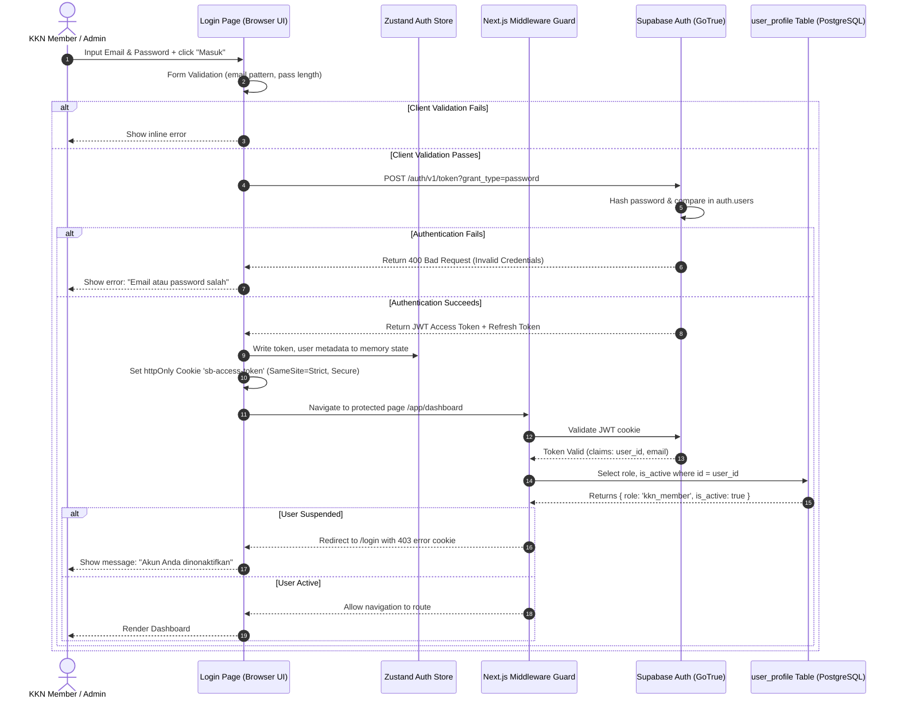

### 2.2 Logout Flow

1.  **User Action:** User taps "Keluar" on the sidebar or mobile bottom drawer.
2.  **State Check:** App checks Zustand `offlineQueueStore`. If count > 0, display a confirmation dialog warning the user that logging out will prevent automatic background syncing of their queued offline data.
3.  **Authentication Revocation:** If confirmed, call Supabase `signOut()`.
4.  **Local Cleaning:** Clears Zustand auth state, deletes the httpOnly cookie from the browser, and removes temporary drafts from `localStorage`.
5.  **Redirect:** Reroutes to `/login` and renders a clean login form.

### 2.3 User Profile Update Flow

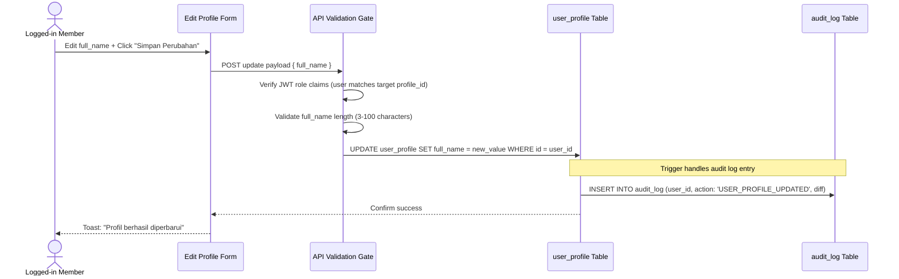

---

## 3. Survey Data Flow

The complete lifecycle of survey data, documenting step-by-step progress from doorstep collection to database replication.

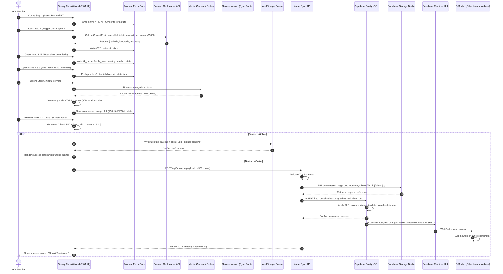

---

## 4. GIS Data Flow

How spatial coordinates migrate from the device geolocation sensor to visual Leaflet pins and QGIS exports.

```mermaid
flowchart TD
    subgraph CAPTURE["Capture & Validation"]
        A["Device Geolocation API\n(watchPosition / getCurrentPosition)"] -->|1. coordinates object| B["Client-side Precision Rounding\n(NUMERIC 10,7 formatting)"]
        B -->|2. Latitude/Longitude check| C{"Zod Range Validation\n(Lat: -90..90, Lng: -180..180)"}
    end

    subgraph STORAGE["Database Storage"]
        C -->|3. Validated JSON Payload| D["API Insert transaction"]
        D -->|4. SQL INSERT| E["household table (latitude, longitude, gps_accuracy)"]
    end

    subgraph VISUALIZATION["Leaflet Mapping (UI)"]
        E -->|5. Realtime DB trigger| F["Supabase Realtime WebSocket Stream"]
        F -->|6. Push update payload| G["Zustand Map Store (append coordinate)"]
        G -->|7. Bind array [lat, lng]| H["Leaflet Marker Pin Component"]
        
        I["Map Filters (Zustand: rt_id, status)"] -->|8. Filter check| H
        H -->|9. Render visible state| J["Interactive Map (Leaflet Base Canvas)"]
    end

    subgraph EXPORT["GIS Export"]
        E -->|10. GET /api/reports/geojson| K["JSON to GeoJSON Transformer"]
        K -->|11. Map fields| L["Download GeoJSON / KML file"]
        L -->|12. Manual Import| M["Desktop GIS Tool (QGIS / Google Earth)"]
    end

    C -->|Invalid| N["Throw GPS Validation Error"]
```

### 4.1 GeoJSON Transformation Mapping

When exporting coordinate data, the API proxy transforms PostgreSQL relational records into GeoJSON features:

| Database Column | GeoJSON Target Field | Transformation Applied |
|---|---|---|
| `household.longitude` | `geometry.coordinates[0]` | Cast to float, format to 7 decimal places |
| `household.latitude` | `geometry.coordinates[1]` | Cast to float, format to 7 decimal places |
| `household.kk_name` | `properties.kk_name` | Mask PII names for public exports (e.g. "Bpk. S***") |
| `household.survey_status`| `properties.status` | Maps database enum to status string |
| `household.rt_id` | `properties.rt` | Look up `rt_number` from parent `rt` table |

---

## 5. Documentation Flow

How media files (photos, PDFs, reports) move from device memory to private storage buckets and the public gallery.

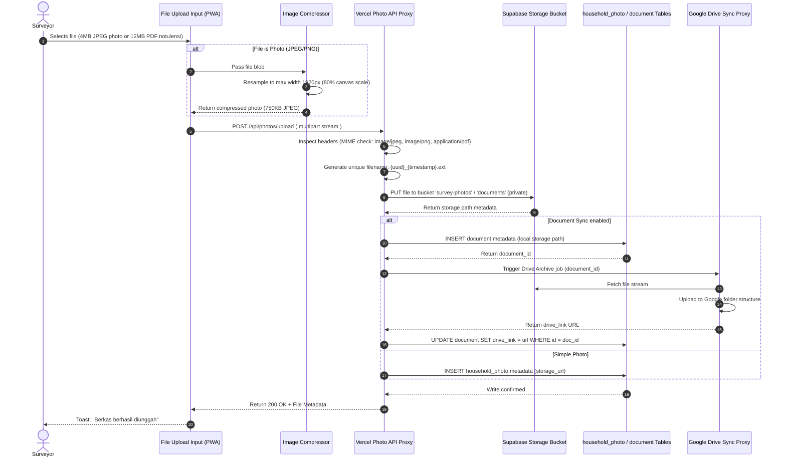

---

## 6. Google Drive Flow

The folder creation, naming standards, duplication prevention, and archiving flow for documents syncing to the shared Google Drive.

### 6.1 Folder Scoping and Sync Sequence

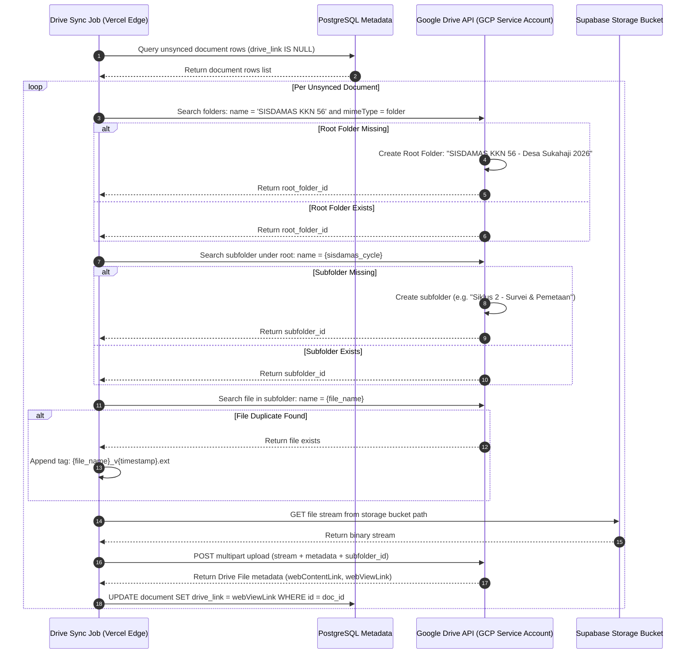

---

## 7. Google Calendar Flow

How schedule events, meetings, and program milestones flow from the app UI to the shared calendar.

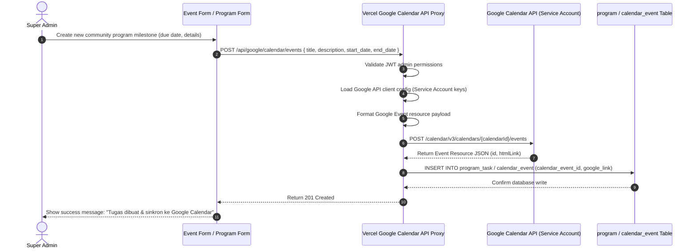

### 7.1 Calendar Data Validation Mapping
*   **Timezone:** Hardcoded to `Asia/Jakarta` (WIB) since KKN Desa Sukahaji is in West Java, Indonesia.
*   **All-Day Events:** Program milestones are set as all-day events (`start.date` and `end.date` in YYYY-MM-DD format).
*   **Time-Specific Events:** Community meetings (rembug warga) are set as timed events (`start.dateTime` and `end.dateTime` in ISO 8601 format).

---

## 8. Dashboard Flow

How widgets, statistics cards, activity logs, and progress indicators pull and refresh their data.

### 8.1 Realtime Dashboard Pipeline

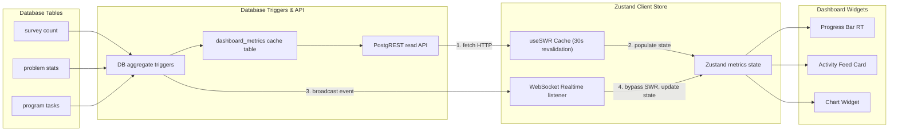

### 8.2 Dashboard Widgets Specifications

*   **Total Surveys Completed:** Query: `SELECT COUNT(id) FROM survey WHERE deleted_at IS NULL`.
*   **RT Coverage Progress:** Query: `SELECT rt_id, COUNT(id) FROM household WHERE survey_status = 'complete' GROUP BY rt_id`.
*   **Recent Activity Feed:** Query: `SELECT user_name, action, created_at FROM audit_log ORDER BY created_at DESC LIMIT 10`. Broadcasts inserts via WebSockets.
*   **Problem Category Chart:** Query: `SELECT category, COUNT(id) FROM problem GROUP BY category`. Renders dynamically using Recharts.

---

## 9. Report Flow

Data flow sequence for generating and exporting survey statistics (Excel, PDF, GeoJSON).

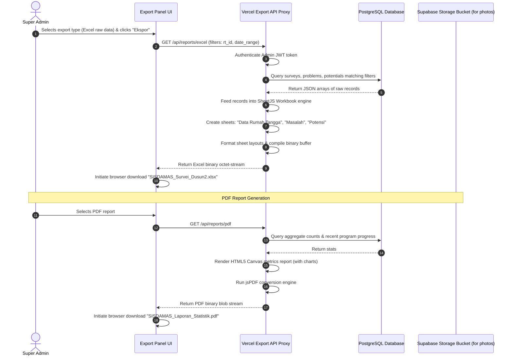

---

## 10. Offline Synchronization Flow

Data structures and queuing rules for managing offline forms, media, and conflict resolution during field surveys.

### 10.1 Offline Queue Payload Structure

Offline data is written as a JSON record in `localStorage` under the key `sisdamas_offline_queue`:

```json
{
  "client_uuid": "f47ac10b-58cc-4372-a567-0e02b2c3d479",
  "type": "survey_submission",
  "payload": {
    "rt_id": "9b1deb4d-3b7d-4bad-9bdd-2b0d7b3dcb6d",
    "kk_name": "Bpk. Ahmad Junaedi",
    "family_size": 4,
    "housing_status": "own",
    "housing_condition": "moderate",
    "latitude": -6.847123,
    "longitude": 107.452345,
    "problems": [
      { "category": "Infrastruktur", "description": "Saluran pembuangan air tersumbat" }
    ],
    "potentials": [
      { "category": "Ekonomi", "description": "UMKM kerajinan bambu" }
    ]
  },
  "created_at": "2026-07-14T07:33:00.000Z",
  "status": "pending"
}
```

### 10.2 Conflict Resolution and Idempotent Sync Flow

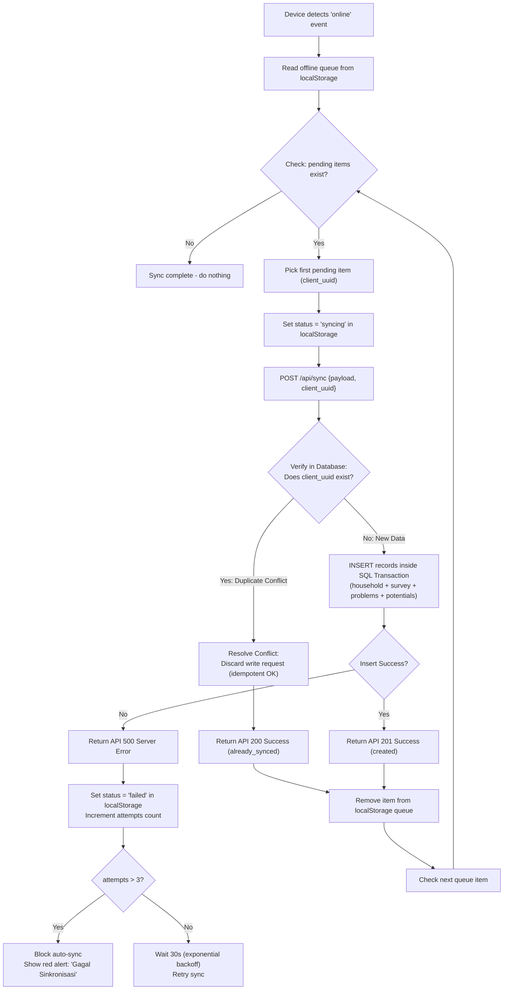

---

## 11. Validation Flow

All validation checkpoints across client, API, database, and storage boundaries.

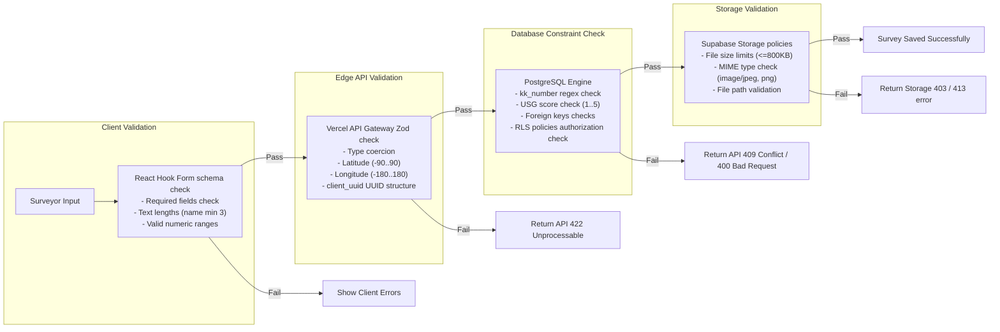

---

## 12. Error Recovery Flow

Detailed recovery workflows for common field failure scenarios.

### 12.1 GPS Failure Pathway

```mermaid
flowchart TD
    A["Initiate GPS Capture in Survey Form"] --> B{"watchPosition returns?"}
    B -->|Location Success| C{"Check accuracy <= 30m?"}
    C -->|Yes| D["Auto-populate Lat/Lng fields\nShow Green GPS Badge"]
    C -->|No| E["Show Yellow Warning Pill\n'Akurasi Rendah'\nContinue search"]
    B -->|Timeout (15 seconds)| F["Show Red GPS Badge\n'GPS Tidak Tersedia'"]
    B -->|User Denies Permission| G["Show Overlay:\n'Izin Lokasi Diperlukan'"]
    
    F --> H["Render Fallback Coordinate Fields\n(Make Latitude/Longitude inputs editable)"]
    G --> H
    E --> H
    
    H --> I["Surveyor enters coordinates manually\n(From paper maps / nearby reference)"]
    I --> J["Set coordinate_source = 'manual' in payload"]
    J --> K["Form submission allowed"]
```

### 12.2 Photo Upload Failure Pathway
1.  **Form Submission:** Surveyor submits survey containing photo payload.
2.  **Network Timeout:** Image upload fails or times out.
3.  **Local Storage Cache:** Image stream remains in browser local cache (indexedDB/localStorage).
4.  **Database Write (Partial):** System writes the core survey fields and sets the household status to `complete`. The corresponding photo URL record in `household_photo` is written with the value `'pending_upload'`.
5.  **UI Banner:** Render a red banner on the dashboard: `"1 Foto gagal diunggah. Ketuk untuk mengulang."`
6.  **Recovery Event:** When internet speed improves, the user taps the banner. The app reads the cached photo blob and retries the upload to Supabase Storage, updating the database record on success.

---

## 13. Notification Flow

The lifecycle of internal notifications, alerts, and system triggers.

### 13.1 Notification State Machine

```
[System Trigger Event] 
        │
        ▼
   [State: Queued] ➔ Database Write to notifications table (user_id, message, is_read: false)
        │
        ▼
 [State: Delivered] ➔ WebSocket push to target client (Zustand state append)
        │
        ├────────────────────────────(User clicks close / reads notification)
        ▼                                          │
   [State: Read] ➔ UPDATE notifications           │
   SET is_read = true WHERE id = uuid             │
        │                                          ▼
        ├────────────────────────────────(Auto-Archive Trigger)
        ▼
  [State: Archived] ➔ Soft deleted after 30 days
```

### 13.2 System Triggers for Notifications

*   **RT Progress Alert:** Run nightly database trigger. If `survey_status = 'pending'` is > 50% for any RT on Day 6 of KKN ➔ Insert warning notification for Super Admin.
*   **Program Task Due:** Daily cron job queries tasks where `due_date = current_date + 1 day` and `status != 'done'` ➔ Insert alert notification for KKN member PIC.
*   **Sync Error Alert:** If client sync retry attempts > 3 ➔ Insert critical notification for Admin to review user's local queue.

---

## 14. Audit Flow

How edits, deletions, and admin configurations are tracked across the database schema.

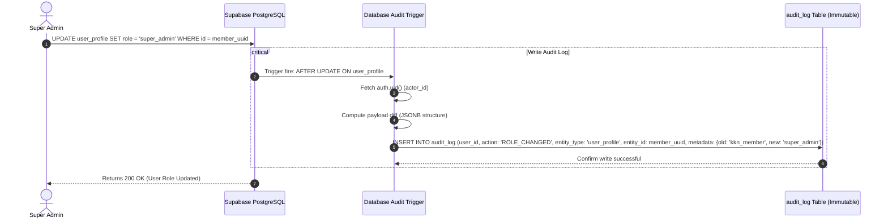

**Security Auditing Constraints:**
*   The `audit_log` table is **read-only** to all users (even Super Admins).
*   Any query attempting to `UPDATE` or `DELETE` rows inside the `audit_log` table will fail due to PostgreSQL RLS rules.

---

## 15. Privacy Flow

How data is categorized and sanitized across public and internal screens.

```
+-----------------------------------------------------------------------------------+
|                              DATA PRIVACY ISOLATION                               |
+-----------------------------------------------------------------------------------+
|  [ RESTRICTED AREA (Admin only) ]                                                 |
|  - Raw audit logs, user credentials, database metrics                             |
|  - Action: Only decrypted & queryable by Super Admin session                       |
+-----------------------------------------------------------------------------------+
|  [ INTERNAL AREA (Authenticated KKN Members) ]                                    |
|  - Precise GPS coordinates (10,7 numeric format)                                  |
|  - Head of household names (kk_name) & KK card numbers (kk_number)                |
|  - House condition photos                                                         |
|  - Action: Accessible only via JWT session checks; RLS enforced                   |
+-----------------------------------------------------------------------------------+
|  [ PUBLIC AREA (Village & General Public) ]                                       |
|  - Aggregated numbers (RT survey progress bars)                                   |
|  - Anonymized Map markers (shifted coordinates, PII removed)                      |
|  - Program timelines (Cycle 4 milestones)                                         |
|  - Action: Filtered public API views; no authentication required                  |
+-----------------------------------------------------------------------------------+
```

### Anonymization Transformation Logic (Public Map)

Before rendering data on the public map page `/peta` (unauthenticated):
1.  Query retrieves households where `survey_status = 'complete'`.
2.  Precision reducer: Latitude/Longitude rounded from 7 decimals to 3 decimals (shifts precise location by ~110 meters, preventing identification of individual homes).
3.  PII stripper: `kk_name` is replaced with standard text (e.g. "Keluarga RT 01").
4.  Photos are excluded entirely from public map tooltips.

---

## 16. Performance Analysis

Key database bottleneck locations and caching opportunities.

### 16.1 Potential Bottlenecks and Mitigations

*   **Map Marker Loading:** Fetching detailed JSON shapes for hundreds of markers will cause page lag on low-end Android phones.
    *   *Mitigation:* The API coordinates retrieval returns only four columns: `id, latitude, longitude, survey_status`. Detailed household summaries, photos, and problem lists are requested lazily only when a user clicks a marker pin.
*   **Photo Upload Bandwidth:** Uploading raw camera images (4MB+) under village cellular signal will cause request timeouts.
    *   *Mitigation:* Enforce client-side photo downsampling in the browser canvas before transmission. The file size is compressed to ≤800KB before the upload stream starts.

### 16.2 Caching Strategy Matrix

| Data Type | Cache Location | Caching Strategy | Revalidation Interval (TTL) |
|---|---|---|---|
| **OSM Map Tiles** | Service Worker cache | Cache-First | 7 Days |
| **Static Assets (CSS/JS)** | PWA asset cache | Cache-First | 30 Days |
| **Geographic Master Data** | Zustand client state | Immutable (no refresh) | Session |
| **Dashboard Metrics** | Browser SWR Cache | Stale-While-revalidate | 30 Seconds |
| **Realtime Map Pin Drops** | WebSocket connection | Bypass cache (live update) | Realtime |

---

## 17. Recommendations

For the API design and deployment teams:

1.  **Idempotency Enforcements:** Enforce `client_uuid` in the API schema validation layer for all survey creation endpoints to protect data integrity during offline synchronizations.
2.  **Compressive Canvas Pipeline:** Ensure client-side image compression parameters (80% JPEG quality, max 1920px width) are locked in the UX code to prevent Vercel payload size limit exceptions.
3.  **Realtime Subscription Limits:** Set up the Supabase Realtime channel filters to subscribe only to changes in the active `household` table (not the log table) to reduce WebSocket traffic on low-end smartphones.
4.  **Google Drive Queue limit:** Limit Drive uploads to asynchronous batches run during low-traffic periods (Phase 2), preventing Google API rate limits from blocking surveyor work in the field.

---

*This Data Flow Specification is derived from `07_DATA_FLOW_SPECIFICATION_PROMPT.md` and is subordinate to `00_PROJECT_FOUNDATION.md`, `02_SYSTEM_BLUEPRINT.md`, `03_PRD.md`, `04_UX_SPECIFICATION.md`, `05_TECHNICAL_SPECIFICATION.md`, and `06_DATABASE_SPECIFICATION.md`. No REST API routes or server endpoint paths are generated in this document.*

---

**Would you like to revise this Data Flow Specification before we proceed to generate the API Specification (`08_API_SPECIFICATION.md`)?**
