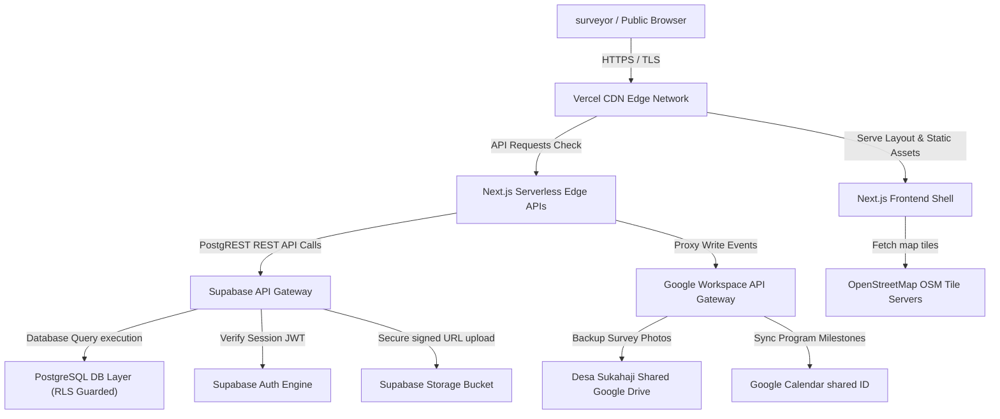

# SISDAMAS Digital Platform
## Deployment & Operations Guide

| | |
|---|---|
| **Document** | 13 — Deployment & Operations Guide |
| **Version** | 1.0 |
| **Status** | Draft — Pending Review |
| **Predecessors** | 00_PROJECT_FOUNDATION s.d. 12_TEST_PLAN |
| **Prepared By** | Enterprise DevOps Team (Principal DevOps, Cloud Architect, Site Reliability Engineer, Release Manager, Security Specialist, Supabase Expert, Vercel Specialist, Google Workspace Integration Specialist) |
| **Platform** | SISDAMAS Digital Platform — KKN Kelompok 56, UIN Sunan Gunung Djati Bandung |
| **Target Infrastructure** | Vercel (Frontend & Serverless) + Supabase (Database, Auth, Storage) + Google Workspace API |
| **Constraints** | Solo developer · Zero budget · No Dockerfiles or CI/CD scripts in spec · Strict MVP alignment |

> **Document role:** This Deployment & Operations Guide outlines the deployment strategy, production architecture, environment configuration variables, manual service configurations, backup policies, disaster recovery steps, and KKN field operational routines. In accordance with the prompt constraints, **no Dockerfile configurations, GitHub Actions workflows, or CI/CD script files are generated in this document.**

---

## Table of Contents

1. [Deployment Strategy & DevOps Principles](#1-deployment-strategy--devops-principles)
2. [Production Architecture](#2-production-architecture)
3. [Environment Setup & Variables Matrix](#3-environment-setup--variables-matrix)
4. [Supabase Production Setup](#4-supabase-production-setup)
5. [Google Integration Setup](#5-google-integration-setup)
6. [Map Configuration & Tile Caching](#6-map-configuration--tile-caching)
7. [Deployment Process & Rollback Guide](#7-deployment-process--rollback-guide)
8. [Monitoring Plan](#8-monitoring-plan)
9. [Backup Strategy](#9-backup-strategy)
10. [Disaster Recovery Plans](#10-disaster-recovery-plans)
11. [Maintenance Guide](#11-maintenance-guide)
12. [KKN Operation Mode (Field Daily Checklist)](#12-kkn-operation-mode-field-daily-checklist)
13. [Production Readiness Checklist](#13-production-readiness-checklist)
14. [Final Operations Review](#14-final-operations-review)

---

## 1. Deployment Strategy & DevOps Principles

The SISDAMAS Digital Platform is deployed and maintained under these core DevOps principles:

### 1.1 Infrastructure as Code Mindset
All database definitions, table structures, Row Level Security rules, and function triggers are maintained in the git repository as SQL migration scripts located under the `/supabase/migrations/` directory. No changes are applied to production without being recorded in version control first.

### 1.2 Repeatable Deployment
The hosting infrastructure on Vercel is linked directly to the GitHub repository, ensuring that every merge to the stable `main` branch builds and deploys an identical replica of the application.

### 1.3 Secure Configuration
Secret keys, Google Service Account JSON keys, and Supabase service role keys are never committed to git. They are injected exclusively via Vercel and Supabase cloud consoles as environment variables.

### 1.4 Minimal Downtime & Easy Rollback
Next.js deployments on Vercel utilize immutable builds. If an issue is identified in production, rolling back to the previous stable release takes under 10 seconds via the Vercel Dashboard, avoiding code compilation overhead.

### 1.5 Monitoring & Backup Strategy
The solo developer monitors service quotas, API error rates, and storage consumption daily. Database table backups are generated daily and stored in separate Google Drive folders.

---

## 2. Production Architecture

The platform uses a serverless, decoupled Jamstack architecture designed to fit within the free tier limits of Vercel and Supabase:



---

## 3. Environment Setup & Variables Matrix

Two environments are maintained: **Development** (local testing) and **Production** (live).

### 3.1 Environment Variable Keys

| Key Name | Dev Environment Value | Production Environment Value | Secret? | Purpose |
| :--- | :--- | :--- | :--- | :--- |
| `NEXT_PUBLIC_SUPABASE_URL` | `http://localhost:54321` | `https://[project-id].supabase.co` | No | Supabase API connection target. |
| `NEXT_PUBLIC_SUPABASE_ANON_KEY` | Mock Anon JWT Key | Production Anon JWT Key | No | Public schema read permissions key. |
| `SUPABASE_SERVICE_ROLE_KEY` | Mock Service JWT | Production Service Role JWT | Yes | Admin API access key (restricted to backend routes). |
| `GOOGLE_SERVICE_ACCOUNT_KEY` | Local path to `gcp-key.json` | JSON string of Private Key | Yes | GCP credentials key. |
| `GOOGLE_DRIVE_FOLDER_ID` | Mock folder ID | Shared Drive folder UUID | Yes | Root target folder ID for backups. |
| `GOOGLE_CALENDAR_ID` | Mock calendar ID | Shared Calendar ID email | Yes | Calendar sync target email account. |
| `NEXT_PUBLIC_APP_URL` | `http://localhost:3000` | `https://sisdamas-kkn56.vercel.app` | No | Next.js host URL. |

---

## 4. Supabase Production Setup

Follow these manual steps to configure the production Supabase instance:

### 4.1 Project Creation & Extension List
1.  Log in to the [Supabase Console](https://supabase.com).
2.  Click **New Project** and select the organization. Name the project `Sisdamas Sukahaji Kelompok 56`.
3.  Choose the region **Singapore (ap-southeast-1)** to minimize connection latency from Indonesia.
4.  Set a strong database password and copy the connection string.
5.  Navigate to **Database** ➔ **Extensions** and ensure these extensions are active:
    *   `uuid-ossp` (generates primary keys).
    *   `pgcrypto` (handles hashing utilities).

### 4.2 Storage Buckets
1.  Navigate to **Storage** ➔ **New Bucket**.
2.  Name the bucket `survey-photos`.
3.  Set the toggle to **Private** (mandatory to protect resident privacy).
4.  Navigate to **Policies** ➔ select `survey-photos` bucket, and define these policies:
    *   *SELECT:* Allow read to role `authenticated` only.
    *   *INSERT:* Allow write to role `authenticated` only, and enforce maximum file size checks.

### 4.3 Database Migration Execution
Apply database schemas via the Supabase SQL Editor:
1.  Open the SQL Editor panel.
2.  Copy and run the contents of [06_DATABASE_SPECIFICATION.md](file:///d:/KKN/Platform%20Digital%20KKN%20Sisdamas%20Kelompok%2056%20Desa%20Sukahaji%20Official%20-%20Claude/docs/06_DATABASE_SPECIFICATION.md) to initialize the tables (`project`, `household`, `survey`, `problem`, `potential`, `sticky_note`, `audit_log`, etc.).
3.  Verify that Row Level Security (RLS) is enabled on all tables by running:
    ```sql
    ALTER TABLE household ENABLE ROW LEVEL SECURITY;
    ALTER TABLE survey ENABLE ROW LEVEL SECURITY;
    ```

---

## 5. Google Integration Setup

To connect Next.js serverless functions to Google APIs without user OAuth prompts:

### 5.1 GCP Project & Service Account Setup
1.  Open the [Google Cloud Console](https://console.cloud.google.com).
2.  Create a new project named `Sisdamas KKN 56`.
3.  Navigate to **APIs & Services** ➔ **Library**, and enable:
    *   **Google Drive API**
    *   **Google Calendar API**
4.  Navigate to **IAM & Admin** ➔ **Service Accounts**. Click **Create Service Account**.
5.  Name the account `sisdamas-sync-agent`. Copy the generated service email (e.g., `sisdamas-sync-agent@[project].iam.gserviceaccount.com`).
6.  Navigate to the service account details ➔ **Keys** tab ➔ **Add Key** ➔ **Create New Key** ➔ Select **JSON**. Save the key file to a secure local path.

### 5.2 Google Drive Shared Folder Setup
1.  Open Google Drive using the village's shared Google account.
2.  Create a folder named `KKN 56 Desa Sukahaji - Sisdamas Archive`.
3.  Right-click the folder ➔ **Share** ➔ Invite the Service Account email. Set permissions to **Editor** (required to write folders and upload photos).
4.  Copy the Folder ID from the URL (the string after `folders/` in the browser address bar). Save it in the Vercel dashboard environment variable `GOOGLE_DRIVE_FOLDER_ID`.

---

## 6. Map Configuration & Tile Caching

The GIS interactive map component relies on Leaflet.js and OpenStreetMap:

### 6.1 Tile Provider Configuration
*   **Tile URL:** `https://{s}.tile.openstreetmap.org/{z}/{x}/{y}.png`.
*   **Attribution:** `&copy; OpenStreetMap contributors`.
*   **Default View bounds:** Set map center coordinates to `-6.8471, 107.4523` (representing Central Desa Sukahaji) with a zoom level of 16.

### 6.2 Service Worker Offline Caching
*   Configure the PWA config variables inside `next.config.js` to cache image file extensions and OSM map tiles.
*   The Service Worker caches map tile requests in the local browser Cache Storage, allowing map renders to function offline for areas already navigated.

---

## 7. Deployment Process & Rollback Guide

### 7.1 Initial Deployment Steps on Vercel
1.  Log in to the [Vercel Dashboard](https://vercel.com).
2.  Click **Add New** ➔ **Project**.
3.  Import the GitHub repository `Sisdamas-Kelompok-56-Sukahaji`.
4.  Under **Framework Preset**, select **Next.js**.
5.  Expand the **Environment Variables** panel and input the complete keys defined in Section 3.1. Note: Paste the Google Service Account JSON file contents as a single-line string into `GOOGLE_SERVICE_ACCOUNT_KEY`.
6.  Click **Deploy**. Once complete, Vercel provides a public production domain `https://sisdamas-kkn56.vercel.app`.

### 7.2 Incremental Deployment Steps
*   All bug fixes and UI updates are committed to the `develop` branch.
*   Commits automatically trigger a **Preview Deployment** on Vercel. Developer verifies the preview layout on mobile devices.
*   Once verified, the developer creates a Pull Request to merge `develop` into `main`. The merge triggers the automated release build, publishing updates to the production url.

### 7.3 Instant Rollback Guide
If a deployment error breaks active field survey inputs:
1.  Open the **Vercel Dashboard** ➔ Go to the project page ➔ click **Deployments** tab.
2.  Locate the previous stable deployment (typically the second deployment in the list).
3.  Click the three dots icon next to the build card ➔ select **Instant Rollback**.
4.  Confirm the rollback. Within 10 seconds, Vercel redirects web traffic to the previous stable build.

---

## 8. Monitoring Plan

Since resources are limited to free tiers, monitoring is key to preventing system outages:

### 8.1 Key Metrics & Quotas
*   **Supabase Database Disk Usage:** Check dashboard storage limits weekly. Ensure database size remains well below the 500MB free quota.
*   **Supabase Storage Quota:** Monitor bucket consumption. Photos must be archived to Google Drive, and old files purged if size approaches 1GB.
*   **API Response Times:** Review Vercel Edge API executions. Serverless API route runs must not exceed 10 seconds.
*   **Auth Failures:** Check Supabase GoTrue authentication error logs weekly to identify potential brute-force attempts.

---

## 9. Backup Strategy

To prevent data loss from accidental database modification:

### 9.1 Database Backup Commands
Use the PostgreSQL utility `pg_dump` to generate a database dump:
```bash
# Execute local database backup (replace placeholders with actual credential strings)
pg_dump -h db.[project-id].supabase.co -U postgres -d postgres -F c -b -v -f "sisdamas_backup_$(date +%F).dump"
```
*   **Backup Frequency:** Generated daily at 21:00 WIB after survey submissions have completed.
*   **Backup Target:** Dump files are uploaded to the `Google Drive Archive` under the backup folder.
*   **Retention:** Keep database dump files for 30 days.

---

## 10. Disaster Recovery Plans

### 10.1 Database Corruption Recovery
1.  **Stop Traffic:** Set the Vercel environment variable `MAINTENANCE_MODE = true` and redeploy. This displays a maintenance card, blocking incoming surveyor writes.
2.  **Clean Schema:** Open the Supabase SQL Editor and run `DROP SCHEMA public CASCADE; CREATE SCHEMA public;`.
3.  **Restore DB:** Execute the database restore command using the latest backup file:
    ```bash
    pg_restore -h db.[project-id].supabase.co -U postgres -d postgres -v "sisdamas_backup_[date].dump"
    ```
4.  **Verification:** Test login and verify household numbers match the status prior to corruption. Disable maintenance mode.

### 10.2 Google Drive API Failures
If Next.js logs show Google API quota limit errors:
1.  Navigate to the Admin Panel ➔ Toggle **Auto-Sync to Google Drive** to `Disabled`.
2.  All surveyors continue uploads to Supabase storage private bucket as fallback.
3.  Once the Google quota reset occurs (daily reset cycle), the administrator triggers a batch sync to copy photos from Supabase storage back to Google Drive folders.

---

## 11. Maintenance Guide

Operational maintenance tasks are divided by frequency:

### 11.1 Daily Tasks
*   Verify that the nightly database backup has run and the dump file is in Google Drive.
*   Check the Supabase storage quota dashboard.
*   Address any bug reports in the defect queue.

### 11.2 Weekly Tasks
*   Run database index optimization scans if map rendering times exceed 3 seconds.
*   Verify that RLS policies are active on all tables.
*   Update active program tasks.

### 11.3 Post-KKN Handover Tasks
*   Export all table rows to CSV formats. Save files to Google Drive.
*   Revoke developer access tokens. Update database passwords.
*   Transfer ownership of the Supabase project and Vercel hosting setup to village representatives.

---

## 12. KKN Operation Mode (Field Daily Checklist)

To ensure coordination during field survey campaigns, the team follows a structured daily routine:

```
07:30 - Persiapan Pagi ➔ 08:00 - Survei Lapangan ➔ 17:00 - Sinkronisasi Data ➔ 21:00 - Backup Malam
```

### 12.1 Morning Preparation (07:30 - 08:00 WIB)
*   **Objectives:** Ensure all surveyor mobile devices are configured and ready.
*   **Responsible Person:** KKN Team Leader.
*   **Required Tools:** surveyors' mobile devices, battery power banks.
*   **Checklist:**
    *   [ ] Verify screen locks are enabled.
    *   [ ] Clear browser cache on device browsers.
    *   [ ] Log in to the application dashboard.
    *   [ ] Test GPS location capture accuracy.
*   **Expected Output:** All 15 surveyors have active sessions and are ready to survey.

### 12.2 Survey Day Operations (08:00 - 16:00 WIB)
*   **Objectives:** Execute interviews and capture household details.
*   **Responsible Person:** KKN Team Members.
*   **Required Tools:** Mobile browser with GPS active.
*   **Checklist:**
    *   [ ] Obtain verbal consent from residents.
    *   [ ] Capture coordinates at the doorstep.
    *   [ ] Take exterior home photo (verify compression).
    *   [ ] Save survey as draft if signal drops.
*   **Expected Output:** Form entries and photos saved to the queue.

### 12.3 Data Synchronization (16:00 - 18:00 WIB)
*   **Objectives:** Upload and sync all pending surveys to the Supabase database.
*   **Responsible Person:** KKN Team Members.
*   **Required Tools:** Stable cellular signal (or community hall WiFi).
*   **Checklist:**
    *   [ ] Connect device to stable network.
    *   [ ] Open survey dashboard sync panel.
    *   [ ] Click Sync Drafts.
    *   [ ] Verify the sync progress reaches 100%.
*   **Expected Output:** All local drafts synced to the server.

### 12.4 Evening Review & Backup (20:00 - 21:00 WIB)
*   **Objectives:** Verify data integrity and run database backup.
*   **Responsible Person:** Super Administrator (Solo Developer).
*   **Required Tools:** Supabase console, Google Drive dashboard.
*   **Checklist:**
    *   [ ] Verify total household count on dashboard matches targets.
    *   [ ] Run manual database dump.
    *   [ ] Verify dump file is uploaded to the Google Drive backup folder.
    *   [ ] Check for any duplicate coordinate pins on the map view.
*   **Expected Output:** verified database backup stored on Google Drive.

---

## 13. Production Readiness Checklist

Before launching the platform for the first survey cycle:

*   [ ] **Repository Ready:** All changes merged to the `main` branch. Environment key templates are saved in `env.example`.
*   [ ] **Supabase Setup:** Row Level Security (RLS) is active on all tables.
*   [ ] **Auth Ready:** Default admin credentials verified, user invite flow configured.
*   [ ] **Google Ready:** Google Service Account email invited to the shared Drive folder as an Editor.
*   [ ] **Storage Ready:** Photo bucket set to Private, and access policies restrict read permissions to authenticated users.
*   [ ] **Map Ready:** OpenStreetMap tile urls are bound to Leaflet layers, and coordinates default to Central Sukahaji bounds.
*   [ ] **Testing Passed:** 100% of Must-Have test cases in the Test Plan (12) are verified.
*   [ ] **Backup Created:** Baseline database backup dump successfully generated and stored.

---

## 14. Final Operations Review

The deployment architecture is simple, cost-effective, and designed to meet the time constraints of a solo developer. By utilizing Vercel and Supabase cloud-managed free services, maintenance overhead is minimal. Enforcing RLS on the database layer and restricting Google integrations to GCP Service Account scopes provides robust security while keeping the platform simple to deploy and operate.

---

*This Deployment & Operations Guide is derived from `13_DEPLOYMENT_OPERATIONS_GUIDE_PROMPT.md` and is fully subordinate to `00_PROJECT_FOUNDATION.md`, `02_SYSTEM_BLUEPRINT.md`, `03_PRD.md`, `04_UX_SPECIFICATION.md`, `05_TECHNICAL_SPECIFICATION.md`, `06_DATABASE_SPECIFICATION.md`, `07_DATA_FLOW_SPECIFICATION.md`, `08_API_SPECIFICATION.md`, `09_SECURITY_SPECIFICATION.md`, `10_DEVELOPMENT_ROADMAP.md`, `11_ARCHITECTURE_DECISION_RECORDS.md`, and `12_TEST_PLAN.md`.*

---

**Would you like to revise this Deployment & Operations Guide before we proceed to generate the User Manual (`14_USER_MANUAL.md`)?**
