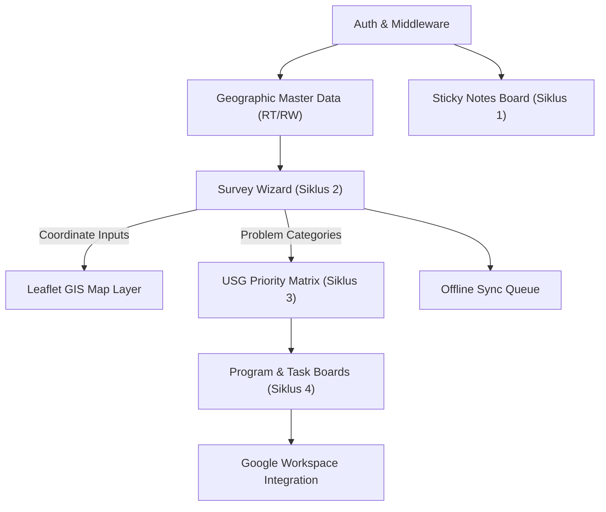

# SISDAMAS Digital Platform
## Implementation Plan

| | |
|---|---|
| **Document** | 15 — Implementation Plan |
| **Version** | 1.0 |
| **Status** | Draft — Pending Review |
| **Predecessors** | 00_PROJECT_FOUNDATION s.d. 14_USER_MANUAL |
| **Prepared By** | Software Delivery Team (Principal Software Architect, Technical Lead, Full Stack Developer, GIS Engineer, Database Architect, DevOps, QA Lead, Product Manager, Scrum Master) |
| **Platform** | SISDAMAS Digital Platform — KKN Kelompok 56, UIN Sunan Gunung Djati Bandung |
| **Execution Window** | 7-day pre-KKN sprint + 40-day active KKN deployment window |
| **Constraints** | Solo developer · Zero budget · No script generation in plan · Strict MVP alignment |

> **Document role:** This Implementation Plan details the development phases, sprint tasks, feature execution order, dependency diagrams, module-level checklists, and release quality gates. It acts as the final actionable guide for building the SISDAMAS Digital Platform. In accordance with the prompt constraints, **no source code files, directory structures, or configurations are generated in this document.**

---

## Table of Contents

1. [Implementation Principles](#1-implementation-principles)
2. [Development Phases](#2-development-phases)
3. [Sprint Planning](#3-sprint-planning)
4. [Feature Implementation Order](#4-feature-implementation-order)
5. [Module Dependency Diagram](#5-module-dependency-diagram)
6. [Database Implementation Plan](#6-database-implementation-plan)
7. [API Implementation Plan](#7-api-implementation-plan)
8. [Frontend Implementation Plan](#8-frontend-implementation-plan)
9. [Backend Implementation Plan](#9-backend-implementation-plan)
10. [GIS Implementation Plan](#10-gis-implementation-plan)
11. [Offline Sync Strategy](#11-offline-sync-strategy)
12. [Quality Control Plan](#12-quality-control-plan)
13. [Risk Management Plan](#13-risk-management-plan)
14. [Release Readiness Checklist](#14-release-readiness-checklist)
15. [Project Memory & AI Context Synchronization](#15-project-memory--ai-context-synchronization)

---

## 1. Implementation Principles

The development workflow adheres to these core engineering principles to guarantee launch readiness:

### 1.1 Build Incrementally
*   **Rationale:** Complex features are sliced into vertical, independently verifiable components. For instance, the survey form is developed and tested with text inputs first before camera sensor or offline sync codes are introduced.
*   **Value:** Avoids the "big bang" integration risks.

### 1.2 Mobile-First Development
*   **Rationale:** Since KKN surveyors use personal smartphones, all page layouts, touch targets, and asset loads are designed and optimized for mobile screens first.
*   **Value:** Guarantees usability in village environments.

### 1.3 API-First Mindset
*   **Rationale:** Database schemas and RESTful routes (08) are locked and verified before frontend page UI development begins.
*   **Value:** Prevents payload structure changes from blocking UI development.

### 1.4 Security by Default
*   **Rationale:** Row Level Security (RLS) is enabled on all tables, and access control check cookies are set before database writes are exposed.
*   **Value:** Prevents data leaks.

### 1.5 Database-First Approach
*   **Rationale:** The database schema is the foundation of the platform. Table creation, index maps, and check constraints are established and seeded before API routes are coded.
*   **Value:** Guarantees data normalization.

### 1.6 Component Reusability
*   **Rationale:** Shared UI elements (like form fields, map containers, and stats cards) are built as reusable React components.
*   **Value:** Reduces code duplication and speeds up development.

### 1.7 Simplicity Over Complexity
*   **Rationale:** We prioritize simple, maintainable code structures over complex setups.
*   **Value:** Minimizes bug density.

### 1.8 Continuous Testing
*   **Rationale:** Code changes are verified on staging environments on actual mobile devices after every iteration.
*   **Value:** Minimizes regression risks.

### 1.9 Documentation-First Development
*   **Rationale:** Design contracts (00-14) are locked in before writing code.
*   **Value:** Keeps the implementation aligned with project goals.

---

## 2. Development Phases

The implementation timeline is split into five logical phases:

### 2.1 Phase 1: Project Initialization & Core (Day -7 to -5)
*   **Objectives:** Initialize repository, deploy Vercel boilerplate, configure Supabase database, and setup landing page layout.
*   **Dependencies:** None.
*   **Deliverables:** Next.js project skeleton live on Vercel, Supabase schemas active.
*   **Risks:** Vercel deployment issues. (Mitigation: Deploy minimal project on Day 1).
*   **Definition of Done:** Next.js application is live, database schema is migrated, and the login page renders.

### 2.2 Phase 2: Authentication & Profiles (Day -4 to -3)
*   **Objectives:** Configure Supabase Auth, middleware route guards, and user session cookies.
*   **Dependencies:** Phase 1 database tables.
*   **Deliverables:** Auth APIs, middleware, user profile pages.
*   **Risks:** Cookie session timeouts. (Mitigation: Configure refresh token checks).
*   **Definition of Done:** Users can log in, view their profiles, and are blocked from dashboard paths when logged out.

### 2.3 Phase 3: Survey & GPS Module (Day -2 to Day 1)
*   **Objectives:** Build the survey form wizard, GPS location hook, canvas image downsampling, and offline queue.
*   **Dependencies:** Phase 2 authentication profiles.
*   **Deliverables:** Survey form page, camera uploads, localStorage queue.
*   **Risks:** Geolocation capture timeouts on older Android phones. (Mitigation: Implement manual pin fallback).
*   **Definition of Done:** Surveyor can save drafts offline and sync data to Supabase database.

### 2.4 Phase 4: GIS Interactive Map (Day 2 to Day 4)
*   **Objectives:** Build Leaflet map view with RT filters and public map obfuscation.
*   **Dependencies:** Phase 3 survey database.
*   **Deliverables:** Map page at `/app/map` and public map page `/peta`.
*   **Risks:** Hydration errors when loading Leaflet server-side. (Mitigation: Use `ssr: false` client imports).
*   **Definition of Done:** Completed survey pins render at correct coordinates, and guest view rounds coordinates to 3 decimals.

### 2.5 Phase 5: Dashboard & Google Sync (Day 5 to Day 8)
*   **Objectives:** Build statistics charts, program task checklists, and Google Service Account Drive sync API.
*   **Dependencies:** Phase 4 GIS map.
*   **Deliverables:** Dashboard stats, program task boards, Google Drive edge proxy.
*   **Risks:** Google API quota exhaustion. (Mitigation: Run Drive syncs in manual admin batches).
*   **Definition of Done:** Program tasks update in database, and files upload to village shared Drive folder.

---

## 3. Sprint Planning

Implementation is structured into three execution sprints:

### 3.1 Sprint 1: Setup & Auth (Day -7 to -4)
*   **Sprint Goal:** Deploy the Next.js shell and verify secure user authentication.
*   **Features:** Next.js skeleton, shadcn/ui library, Supabase Client setup, JWT secure cookie middleware, profile page.
*   **Estimated Complexity:** Low.
*   **Dependencies:** None.
*   **Acceptance Criteria:** Users can log in, redirect to profile dashboard, and log out.
*   **Deliverables:** Repository on GitHub, live Vercel url, secure auth routes.
*   **Risks:** Auth cookie validation errors.
*   **Expected Duration:** 3 Days.

### 3.2 Sprint 2: Survey, GPS & Map (Day -3 to Day 1)
*   **Sprint Goal:** Launch the door-to-door survey wizard and interactive map.
*   **Features:** Step-by-step survey form, Geolocation sensor hook, canvas compression, offline queue, Leaflet map with RT filters, coordinate obfuscation logic.
*   **Estimated Complexity:** High.
*   **Dependencies:** Sprint 1 authentication.
*   **Acceptance Criteria:** Surveyor can capture coordinates, compress photo, save draft offline, sync data to server, and view completed survey pin on the map.
*   **Deliverables:** Survey form at `/app/surveys/new` and map at `/app/map`.
*   **Risks:** Local storage queue data loss if cache is cleared.
*   **Expected Duration:** 4 Days.

### 3.3 Sprint 3: Program Planning & Google Sync (Day 2 to Day 6)
*   **Sprint Goal:** Build dashboards, prioritization matrices, program trackers, and Google API backup tools.
*   **Features:** Dashboard stats, USG priority matrix inputs, task lists, Google Service Account sync proxy, SheetJS Excel export API.
*   **Estimated Complexity:** Medium.
*   **Dependencies:** Sprint 2 survey database.
*   **Acceptance Criteria:** Admin can score problems, assign tasks, download Excel data, and archive files to Google Drive.
*   **Deliverables:** Priority page at `/app/priority` and Excel exports API.
*   **Risks:** Google API credentials validation failures.
*   **Expected Duration:** 5 Days.

---

## 4. Feature Implementation Order

Features are built in a strict, bottom-up order to manage dependencies:

```
Next.js Shell & Supabase DB Setup
      └── Auth & Middleware Guards
            └── Sticky Notes Board (Siklus 1)
                  └── Geolocation & Camera Inputs
                        └── Survey Form Wizard & Offline Queue
                              └── Leaflet Map Pin Layer
                                    └── USG Priority Table
                                          └── Task Management
                                                └── Excel & PDF Reports
                                                      └── Google Drive Sync
```

*   **Rationale:** Schemas and authentication must exist before data entry screens are built. Geolocation and camera sensors are validated before integration into the survey wizard. Survey data must be populated before prioritizations and program tasks can be assigned.

---

## 5. Module Dependency Diagram

The system modules have the following technical dependencies:



---

## 6. Database Implementation Plan

The database migrations follow a strict schema migration order:

### 6.1 Schema Migration Sequence
1.  **Project Table:** `project`.
2.  **Geographic Tables:** `dusun`, `rw`, `rt` (Seed master values for Dusun 2, RW 01-03, RT 01-09).
3.  **Authentication Profiles:** `user_profile`.
4.  **Survey Tables:** `household`, `survey`, `problem`, `potential`, `household_photo`.
5.  **Sticky Note Tables:** `sticky_board`, `sticky_column`, `sticky_note`.
6.  **Priority & Program Tables:** `priority_matrix`, `priority_item`, `program`, `program_task`.
7.  **Audit Logs Table:** `audit_log`.

### 6.2 Database Configuration Rules
*   **Indexes:** Add indexes on search columns: `household(kk_number)`, `survey(rt_id)`, and `sticky_note(board_id)`.
*   **RLS Policies:** Apply SELECT, INSERT, and UPDATE policies to all tables, mapping access permissions to surveyor roles.
*   **Audit Triggers:** Set database triggers on write operations to log payload changes to the `audit_log` table.

---

## 7. API Implementation Plan

API route implementation matches the database schema structure:

### 7.1 API Route Ordering
1.  `/api/auth/login` & `/api/auth/logout`: Manage session cookies.
2.  `/api/geography`: Retrieve master RT/RW/Dusun list values.
3.  `/api/surveys`: Handle household survey reads and writes.
4.  `/api/surveys/sync`: Processes batch offline array syncs.
5.  `/api/maps/public`: Returns anonymized map pins (coords rounded to 3 decimals).
6.  `/api/priority`: Update USG scores.
7.  `/api/reports/excel`: SheetJS Excel file download api.
8.  `/api/sync/drive`: Archive photos to Google Drive.

*   **Dependencies:** Auth middleware must validate the JWT cookie before allowing requests to survey, map, and priority API endpoints.

---

## 8. Frontend Implementation Plan

The user interface layouts are built in order of priority:

1.  **Landing Page `/`:** Basic index template with a login card link.
2.  **Login `/login`:** Credentials form with error toast alerts.
3.  **Dashboard `/app/dashboard`:** Progress bars, stats cards, and charts.
4.  **Sticky Notes `/app/sticky-notes`:** Columns grid layout with realtime sync.
5.  **Survey Wizard `/app/surveys/new`:** Multi-step form container.
6.  **GIS Map `/app/map`:** Map container loading Leaflet markers.
7.  **Settings `/app/settings`:** Password edit form.
8.  **Reports `/app/reports`:** Admin export panels.

---

## 9. Backend Implementation Plan

Backend service functions handle data validation and third-party integrations:

1.  **Authentication Service:** Set and verify httpOnly session cookies.
2.  **Zod Validation Service:** Validate latitude/longitude coordinates and data parameters.
3.  **Canvas Compression Service:** Downsample image dimensions and quality before saving to Supabase.
4.  **Google Integration Service:** Connect GCP Service Account client to Drive folders.
5.  **Offline Sync Service:** Process batch array arrays, checking for duplicate client UUID keys.

---

## 10. GIS Implementation Plan

The mapping features are developed in three steps:

1.  **Leaflet Component:** Import dynamically with SSR disabled to prevent hydration errors.
2.  **GPS Capture Hook:** Poll browser coordinates, capture accuracy metadata, and display manual fallback pin.
3.  **Marker Layer Filters:** Filter marker pins by RT and category, and obfuscate public view pins by rounding to 3 decimals.

---

## 11. Offline Sync Strategy

Offline support is handled via browser storage:

*   **Offline Queue:** Unsent surveys are saved to `localStorage` under the `survey_drafts` key.
*   **Sync Logic:** When a connection is active, the app pushes the drafts array to `/api/surveys/sync`.
*   **Conflict Resolution:** If a survey UUID already exists in the database, the API rejects the request, preventing duplicate entries.
*   **Recovery:** If the browser crashes, the app restores the form input fields using the draft saved in local cache.

---

## 12. Quality Control Plan

Quality gates are established after each phase to verify code correctness:

*   **Phase 1 Gate:** Code compiles on Next.js, and Vercel staging deployment url is active.
*   **Phase 2 Gate:** Middleware successfully blocks unauthenticated access to `/app/*`.
*   **Phase 3 Gate:** GPS captures coordinates, and Zod validates inputs.
*   **Phase 4 Gate:** Leaflet renders pins, and guest view rounds coordinates to 3 decimals.
*   **Phase 5 Gate:** Excel exports download successfully, and photos sync to Google Drive.

---

## 13. Risk Management Plan

Mitigation strategies for key implementation risks:

*   **Supabase Free Tier Size Limit (500MB DB, 1GB Storage):**
    *   *Mitigation:* Compress photos to ≤800KB client-side. Export and archive audit logs to Google Drive after 90 days.
*   **Edge API Timeout (10 seconds):**
    *   *Mitigation:* Keep API tasks simple. Process uploads directly to storage buckets instead of routing through Vercel memory buffers.
*   **GPS accuracy limits in dense areas:**
    *   *Mitigation:* Allow manual coordinate selection fallback in the map view.

---

## 14. Release Readiness Checklist

Before moving the platform to production, the following checks must pass:

*   [ ] Repository clean, all changes merged to `main` branch.
*   [ ] Supabase database schemas migrated, and master RT/RW tables seeded.
*   [ ] Row Level Security (RLS) policies enabled on all tables.
*   [ ] Signed URLs configuration set to 15-minute expiration.
*   [ ] Google Service Account client verified, and shared Drive folder ID set in environment variables.
*   [ ] Leaflet coordinates default to Central Sukahaji bounds.
*   [ ] All Must-Have functional test cases verified.
*   [ ] Database dump baseline generated and stored.

---

## 15. Project Memory & AI Context Synchronization

To ensure that the agentic code generator (such as Claude Code) maintains a consistent understanding of all architectural decisions and constraints:

### 15.1 Core Memory Registry Synced
The files inside `ai/memory/` and `ai/context/` have been updated with the following decisions:
*   **PROJECT_CONTEXT.md:** Configured for Dusun 2, Desa Sukahaji Kelompok 56, using Next.js 14 and Supabase.
*   **USER_PERSONAS.md:** Strictly defines the 3-role access model (Super Admin, Surveyor, Public Visitor).
*   **DECISIONS.md:** Registry of 9 core choices (no warga table, Numeric coordinates, client compression, Google Service Account, RLS policies, httpOnly cookies, daily ops loops).
*   **LESSONS_LEARNED.md:** Records lessons regarding layout simplicity, verbal consent protocols, and evening deployment isolation rules.

This complete implementation plan is ready to guide development.

---

*This Implementation Plan is derived from `15_IMPLEMENTATION_PLAN_PROMPT.md` and is fully subordinate to `00_PROJECT_FOUNDATION.md`, `02_SYSTEM_BLUEPRINT.md`, `03_PRD.md`, `04_UX_SPECIFICATION.md`, `05_TECHNICAL_SPECIFICATION.md`, `06_DATABASE_SPECIFICATION.md`, `07_DATA_FLOW_SPECIFICATION.md`, `08_API_SPECIFICATION.md`, `09_SECURITY_SPECIFICATION.md`, `10_DEVELOPMENT_ROADMAP.md`, `11_ARCHITECTURE_DECISION_RECORDS.md`, `12_TEST_PLAN.md`, `13_DEPLOYMENT_OPERATIONS.md`, `14_USER_MANUAL.md`, and `99_PROJECT_REVIEW.md`.*

---

**Do you approve this final Implementation Plan? Once approved, the platform specification sequence is complete and ready for code execution.**
